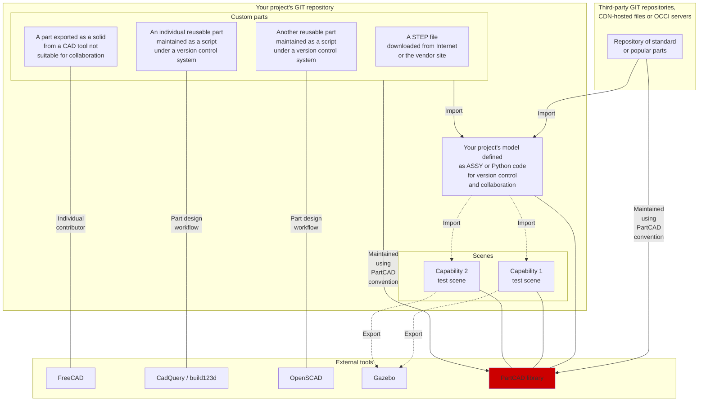

# PartCAD <!-- omit in toc -->

[](./LICENSE.txt)

[](https://github.com/openvmp/partcad/actions/workflows/python-test.yml)
[](https://github.com/openvmp/partcad/actions/workflows/python-build.yml)
[](https://github.com/openvmp/partcad/actions/workflows/python-deploy.yml)
[](https://partcad.readthedocs.io/en/latest/?badge=latest)
<a href="https://discord.gg/AXbP47zYw5"></a>

PartCAD is the first package manager for CAD models
and a framework for managing assemblies.
It complements Git with everything necessary to substitute
commercial Product Lifecycle Management (PLM) tools.

PartCAD maintains information about mechanical parts and
how they come together to form larger assemblies.
The same parts are reused in multiple assemblies and multiple projects.
And all of that is supercharged by the ultimate versioning and collaboration features of Git.

Find [more documentation here](https://partcad.readthedocs.io/en/latest/?badge=latest) and visit [our website](https://partcad.org/).

## Installation

### Extension for Visual Studio Code

This extension can be installed by searching for `PartCAD` in VS Code extension search form, or by browsing [its VS Code marketplace page](https://marketplace.visualstudio.com/items?itemName=OpenVMP.partcad).

### Command-Line Interface

The recommended method to install PartCAD CLI tools for most users is:

```shell
pip install -U partcad-cli
```

For contributors:

```shell
git clone https://github.com/openvmp/partcad.git
cd partcad
python3 -m pip install -U -e ./partcad
python3 -m pip install -U -e ./partcad-cli
```

PartCAD works best when [conda](https://docs.conda.io/) is installed.
If that doesn't help (e.g. MacOS+arm64) then try ``mamba``.
On Windows, PartCAD requires at least a `conda` environment.
On Ubuntu, try `apt install libcairo2-dev` if `pip install` fails to install `cairo`.

## Architecture


## Tools for Mechanical Engineering

Here is an overview of the open-source tools to maintain
mechanical projects. It demonstrates where this framework fits
in the modern mechanical development workflows.



[CadQuery]: https://github.com/CadQuery/cadquery
[build123d]: https://github.com/gumyr/build123d
[STEP]: https://en.wikipedia.org/wiki/ISO_10303
[OpenCASCADE]: https://www.opencascade.com/
