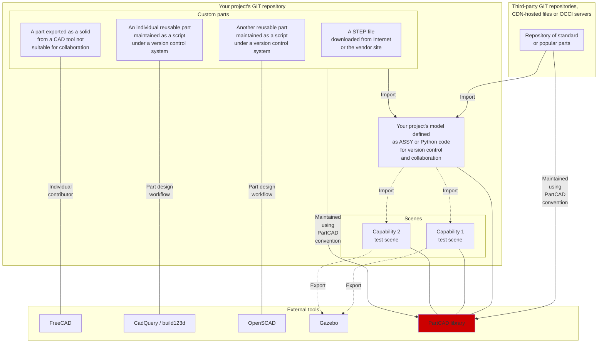

# PartCAD <!-- omit in toc -->

[](./LICENSE.txt)

PartCAD is the first package manager for CAD models,
and a Python package to consume these packages in CAD scripts ([`cadquery`][CadQuery] and [`build123d`][build123d]).
It brings the same power to CAD scripting
as [pip](https://pypi.org/) to Python,
[npm](https://www.npmjs.com/) to JavaScript,
[maven](https://maven.apache.org/) to Java etc.
Though it aims to achieve the integrity and security properties of
[bazel](https://bazel.build/) which makes PartCAD quite distinct from `pip` and `npm`.

[Join our Discord channel!](https://discord.gg/AXbP47zYw5)

PartCAD allows to maintain information about mechanical parts,
how they come together to form larger assemblies,
and to reuse the same parts in multiple assemblies, multiple projects.
The implementation of parts can change over time
(e.g. optimize or migrate to [CadQuery] from [STEP]) without the need to update
all of the consumers.

- [Installation](#installation)
- [Browse models published to PartCAD](#browse-models-published-to-partcad)
- [Consume PartCAD models](#consume-partcad-models)
- [Create PartCAD models](#create-partcad-models)
  - [Parts](#parts)
  - [Assemblies](#assemblies)
  - [Packages](#packages)
  - [Troubleshooting](#troubleshooting)
  - [Render your project](#render-your-project)
  - [Publishing](#publishing)
- [Export](#export)
  - [Images](#images)
  - [Other modelling formats](#other-modelling-formats)
  - [Purchasing / Bill of materials](#purchasing--bill-of-materials)
- [Security](#security)
- [Tools for mechanical engineering](#tools-for-mechanical-engineering)
- [History](#history)

## Installation

The recommended method to install PartCAD for most users is:

```shell
pip install partcad
```

For contributors:

```shell
git clone https://github.com/openvmp/partcad.git
cd partcad
python3 -m pip install -e .
```

PartCAD works best when [conda](https://docs.conda.io/) is installed.
Moreover, on Windows it is recommended to run and build PartCAD from within a `conda`
environment.

## Browse models published to PartCAD

To browse the public PartCAD repository from the command line:

```sh
$ pc init # to initialize new PartCAD package in the current folder
$ pc list # to list all available packages
$ pc list-parts -r # to list all parts in all available packages
$ pc list-assemblies -r # to list all assemblies in all available packages
```

The web UI to browse the public PartCAD repository is not yet published.

## Consume PartCAD models

As PartCAD has no implicit dependencies built in, the current directory needs to be initialized as a PartCAD package and a dependency on the public PartCAD repository needs to be registered.

```sh
# Initialize new PartCAD package in the current folder
$ pc init
```

Alternatively, manually create `partcad.yaml` with the following content:

```yaml
# partcad.yaml
import:
  partcad-index: # Standard public PartCAD repository (needs to be explicitly referenced to be used)
    type: git
    url: https://github.com/openvmp/partcad-index.git
```

After this, PartCAD python module can be used to retrieve any model.
The exact way to do this depends on the CAD framework used in your project:

<table>
<tr>
<td>
<code># CadQuery
import cadquery as cq
import partcad as pc
part = pc.get_part(
     # Part name
     "fastener/screw-buttonhead",
     # Package name
     "standard-metric-cqwarehouse",
).get_cadquery()
...
show_object(part)</code>
</td>
<td>
<code># build123d
import build123d as b3d
import partcad as pc
part = pc.get_part(
     # Part name
     "fastener/screw-buttonhead",
     # Package name
     "standard-metric-cqwarehouse",
).get_build123d()
...
show_object(part)</code>
</td>
<!--
<td>
<code># No framework, standalone
import partcad as pc
part = pc.get_part(
     # Part name
     "fastener/screw-buttonhead",
     # Package name
     "standard-metric-cqwarehouse",
).get_build123d()
...
pc.finalize(part)</code>
</td>
-->
</tr>
</table>


## Create PartCAD models

This frameworks allows to create large models and scenes, one part at a time,
while having parts and assemblies often maintained by third parties.

### Parts

PartCAD allows to define parts using any of the following methods:

<table>
<tr>
<th>Method</td>
<th>Example</td>
<th>Result</td>
</tr>
<tr>
<td><a href="https://en.wikipedia.org/wiki/ISO_10303">STEP</a></td>
<td>
<code># partcad.yaml
parts:
    bolt:
        type: step</code>

<br/>
Store the model in "bold.step"
</td>
<td></td>
<tr>
<tr>
<td><a href="https://github.com/CadQuery/cadquery">CadQuery</a></td>
<td>
<code># partcad.yaml
parts:
    cube:
        type: cadquery</code>
<br/>
<br/>
Place the CadQuery script in "cube.py"
</td>
<td></td>
<tr>
https://github.com/openvmp/partcad/blob/main/examples/assembly_logo/logo.png?raw=true
<tr>
<td><a href="https://github.com/gumyr/build123d">build123d</a></td>
<td>
<code># partcad.yaml
parts:
    cube:
        type: build123d</code>

<br/>
Place the build123d script in "cube.py"
</td>
<td></td>
<tr>
</table>

Other methods to define parts are coming in soon (e.g. SCAD).

### Assemblies

Assemblies are defined as parametrized instructions how to put parts and other
assemblies together.

Currently, PartCAD allows to define parts only using ASSY (Assembly YAML):

<table>
<tr>
<th>Example</td>
<th>Result</td>
</tr>
<tr>
<td>
<code># partcad.yaml
assemblies:
    logo:
        type: assy</code>

<br/>
<code># logo.assy
links:
  - part: bone
    package: example_part_cadquery_logo
    location: [[0,0,0], [0,0,1], 0]
  - part: bone
    package: example_part_cadquery_logo
    location: [[0,0,-2.5], [0,0,1], -90]
  - part: head_half
    package: example_part_cadquery_logo
    name: head_half_1
    location: [[0,0,27.5], [0,0,1], 0]
  - part: head_half
    package: example_part_cadquery_logo
    name: head_half_2
    location: [[0,0,25], [0,0,1], -90]
  - part: bolt
    package: example_part_step
    location: [[0,0,7.5], [0,0,1], 0]</code>
</td>
<td></td>
<tr>
</table>

### Packages

Each project that produces or consumes PartCAD models is a separate PartCAD package.
Each package may export parts, assemblies and scenes.
Each package may import parts, assemblies and scenes from its dependencies
(other PartCAD packages).

| Method                                                                   | Example                                                                                                                                                                                                                                                        |
| ------------------------------------------------------------------------ | -------------------------------------------------------------------------------------------------------------------------------------------------------------------------------------------------------------------------------------------------------------- |
| Local files<br/>(present in<br/>your own<br/>source code<br/>repository) | import:<br/>&nbsp;&nbsp;other_directory<br/>&nbsp;&nbsp;&nbsp;&nbsp;type:&nbsp;local<br/>&nbsp;&nbsp;&nbsp;&nbsp;path:&nbsp;../../other                                                                                                                        |
| External GIT<br/>repository<br/>(HTTPS, SSH)                             | import:<br/>&nbsp;&nbsp;other_directory<br/>&nbsp;&nbsp;&nbsp;&nbsp;type:&nbsp;git<br/>&nbsp;&nbsp;&nbsp;&nbsp;url:&nbsp;https://github.com/openvmp/partcad                                                                                                    |
| External tar ball<br/>(HTTPS)                                            | import:<br/>&nbsp;&nbsp;other_directory<br/>&nbsp;&nbsp;&nbsp;&nbsp;type:&nbsp;tar<br/>&nbsp;&nbsp;&nbsp;&nbsp;url:&nbsp;[https://github.com/openv...090ca.tar.gz](https://github.com/openvmp/partcad/archive/7544a5a1e3d8909c9ecee9e87b30998c05d090ca.tar.gz) |

The full syntax is below:

```yaml
import:
    <package-name>:
        desc: <(optional) textual description>
        type: <git|tar|local>
        path: <(local only) relative-path>
        url: <(git|tar only) url-of-the-package>
        relPath: <(git|tar only) relative-path-within-the-repository>
        web: <(optional) package or maintainer's url>
        poc: <(optional) maintainer's email>
        pythonVersion: <(optional) python version for sandboxing if applicable>
```

### Troubleshooting

At the moment, the best way to troubleshoot PartCAD is to use VS Code with `OCP CAD Viewer`.
Any part or assembly can be displayed in `OCP CAD Viewer` by running `pc show <part> [<package>]` or `pc show -a <assembly> [<package>]` in a terminal view.

```sh
# Create a temporary folder
mkdir /tmp/test_show && cd /tmp/test_show

# Initialize a package with the default dependency on public PartCAD repository
pc init

# Show one of available parts in 'OCP CAD Viewer'
pc show fastener/screw-buttonhead standard-metric-cqwarehouse
```

### Render your project

Use `pc render` to render PartCAD parts and assemblies
in the current package (the current directory).

```sh
git clone https://github.com/openvmp/partcad-cqwarehouse.git
cd partcad-cqwarehouse
pc render
```

### Publishing

It is very simple to publish your package to the public PartCAD repository.

First, you need to publish your own package which defines the models you want to publish.
Then create a pull request in [the public PartCAD repo](https://github.com/openvmp/partcad) to add a reference to your package.

## Export

### Images

Individual parts, assemblies and scenes can be rendered and exported into the
following formats:

- PNG
- [STL](https://en.wikipedia.org/wiki/STL_(file_format)) (not yet)
- [STEP] (not yet)
- ...

### Other modelling formats

Additionally, assemblies and scenes can be exported into the following formats:

- [SDF](http://sdformat.org/) (not yet / in progress)
- [FreeCAD](https://www.freecad.org/) project (not yet / in progress)
- ...

### Purchasing / Bill of materials

The bill of materials for each assembly can be produced using the following
formats:

- [CSV](https://en.wikipedia.org/wiki/Comma-separated_values) (not yet / in progress)
- [Markdown](https://en.wikipedia.org/wiki/Markdown) (not yet / in progress)

## Security

PartCAD is capable of rendering scripted parts
([CadQuery] and [build123d] use Python) in sandboxed environments.

While at the moment it is only useful from dependency management perspective,
in the future PartCAD aims to achieve security isolation of the sandboxed
environments. That will fundamentally change the security implications of using
scripted models shared online.

## Tools for mechanical engineering

Here is an overview of the open source tools to maintain
mechanical projects. It shows where does this framework fit
in the modern mechanical development workflows.



## History

PartCAD is the evolution of the modelling framework that was once used
internally in [OpenVMP](https://github.com/openvmp/openvmp-models).
It is now being maintained separately as a generic tool.

The motivation behind this framework is to build a packaging and dependency
tracking layer on top of both [CadQuery]/[build123d] and traditional CAD tools to
enable version control and other features required for effective collaboration. 

This framework currently uses [build123d] and, thus, [OpenCASCADE] under the hood.
However this may change in the future, if the python C bindings for [OpenCASCADE]
remain a blocker for unlocking multithreaded performance.

[CadQuery]: https://github.com/CadQuery/cadquery
[build123d]: https://github.com/gumyr/build123d
[STEP]: https://en.wikipedia.org/wiki/ISO_10303
[OpenCASCADE]: https://www.opencascade.com/
