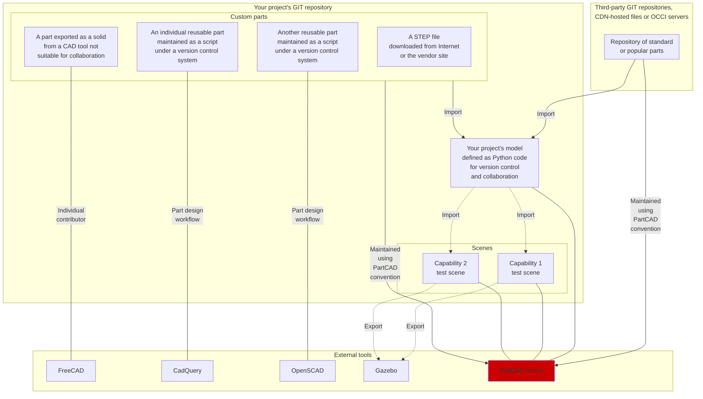

# PartCAD <!-- omit in toc -->

PartCAD is a framework for maintaining information about mechanical parts and
how they come together to form larger models.

- [Modelling](#modelling)
  - [Parts](#parts)
  - [Assemblies](#assemblies)
  - [Scenes](#scenes)
  - [Projects](#projects)
- [Export](#export)
  - [Visualization](#visualization)
  - [Other modelling formats](#other-modelling-formats)
  - [Purchasing / Bill of materials](#purchasing--bill-of-materials)
- [Tools for mechanical engineering](#tools-for-mechanical-engineering)
- [History](#history)

## Modelling

This frameworks allows to create large models and scenes, one part at a time,
while having parts and assemblies often maintained by third parties.

### Parts

PartCAD allows to define parts using any of the following methods:

| Method                                              | Example | Result |
| --------------------------------------------------- | ------- | ------ |
| STEP file                                           | TODO    | TODO   |
| STL file                                            | TODO    | TODO   |
| Original CadQuery Gateway Interface     | TODO    | TODO   |
| Extension for parametrized CadQuery scripts | TODO    | TODO   |

### Assemblies

Assemblies are defined as parametrized instructions how to put parts and other
assemblies together.
Assembly parameters can be of two kinds: build time and run time.

Assembly instances with different build time parameters are different
assemblies, different models.

Assembly instances with different run time parameters are the same assembly,
just visualized in a different state (e.g. different motion state).

### Scenes

Scenes are defined as parametrized instructions how to place assemblies
relative to each other for visualization purposes.

| Example                            | Result |
| ---------------------------------- | ------ |
| TODO robot on a tree               | TODO   |
| TODO two robots next to each other | TODO   |

Scenes are intended to be used for visualization, simulation, validation and
testing purposes. Scenes are not intended to be used outside of the project
where they are defined.

### Projects

PartCAD uses projects to package parts, assemblies and scenes:

| Method                                                                   | Example | Result |
| ------------------------------------------------------------------------ | ------- | ------ |
| Local files (present in your own source code repository) | TODO    | TODO   |
| External GIT repository (HTTPS, SSH)                             | TODO    | TODO   |
| External tar ball (HTTPS)                                            | TODO    | TODO   |

## Export

### Visualization

Individual parts, assemblies and scenes can be rendered and exported into the
following formats:

- PNG
- STL

### Other modelling formats

Additionally, assemblies and scenes can be exported into the following formats:

- SDF (not yet / in progress)
- FreeCAD project (not yet / in progress)

### Purchasing / Bill of materials

The bill of materials for each assembly can be produced using the following
formats:

- CSV
- Markdown

## Tools for mechanical engineering

Here is an overview of the open source tools to maintain
mechanical projects. It shows where does this framework fit
in the modern mechanical development workflows.

## History

PartCAD is the evolution of the modelling framework that was once used
internally in [OpenVMP](https://github.com/openvmp/openvmp-models).
It is now being maintained separately as a generic tool.

The motivation behind this framework is to build a packaging and dependency
tracking layer on top of CadQuery and traditional CAD tools to enable
version control and other features required for effective collaboration. 

This framework currently uses CadQuery and, thus, OpenCASCADE under the hood.
However this may change in the future if the python C bindings for OpenCASCADE
remain a blocker for unlocking multithreaded performance.
