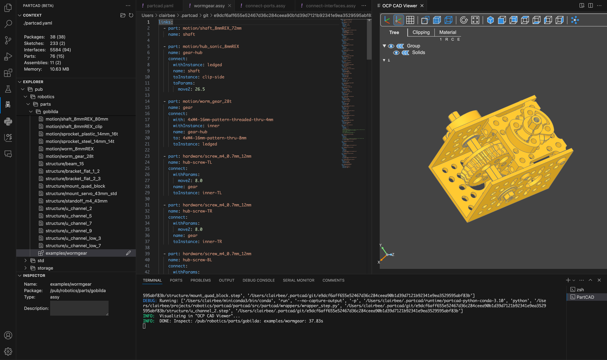

# PartCAD <!-- omit in toc -->

[](./LICENSE.txt)

[](https://github.com/partcad/partcad/actions/workflows/test.yml?query=event%3Aschedule)
[](https://github.com/partcad/partcad/actions/workflows/build.yml?query=event%3Aschedule)
[](https://github.com/partcad/partcad/actions/workflows/deploy.yml)
[](https://partcad.readthedocs.io/en/latest/?badge=latest)
<a href="https://discord.gg/h5qhbHtygj"></a>

Browse [our documentation] and visit [our website]. Watch our 💥💥[demos](https://youtube.com/@PartCAD)💥💥.

## What is PartCAD?

[PartCAD] is the programming language for things.

It is the standard for documenting manufacturable physical products. It comes with a set of tools to maintain
product information and to facilitate efficient and effective workflows at all product lifecycle phases.

PartCAD is more than just a traditional CAD tool for drawing. In fact, it’s **not for drawing at all**. The letters
“CAD” in PartCAD stand for “computer-aided design” in a more generic sense, where “design” stands for the process of
getting from an idea to **a clear and deterministic specification of a manufacturable physical product** using a
computer (including the use of AI models). While PartCAD started as **the first package manager for hardware**, it is
now **the next-generation CAD** that can turn a single visionary individual into a one person corporation, or make one
future Product Manager as productive (**and much faster!**) as 10 corporate engineering departments of the past.

PartCAD is constantly evolving, with new features and integrations being added all the time.
**[Contact us](https://calendly.com/partcad-support/30min) to discuss how PartCAD can revolutionize your product
development process.**

## PartCAD packages

[PartCAD] includes tools to package product information:

- Optional (but highly recommended) **high-level requirements** (texts and drawings)
- Optional **detailed design** (mechanical outline, PCB schematics, software architecture)
- Implementation (**mechanical CAD files, PCB layout, software artifacts**)
- Optionally, the following data can be provided to augment or complement the output:

  - Additional manufacturing process requirements and instructions
  - Additional product validation instructions
  - **Maintenance instructions**

- Or any other product related metadata

Such packages are **modular and reusable**, allowing one to build not only on top of the CAD files of previous products,
but to **build on top of their manufacturing processes** as well.

## PartCAD outputs

As a result of maintaining the product information using PartCAD, the following outputs can be generated and, if
necessary, collected and managed using PartCAD tools:

- **Product documentation** (markdown, html or PDF)
- Design validation results
- Product **bill of materials** (mechanical, electronics, software)
- Sourcing information **for all components**
- Manufacturing **process specification** (including required equipment if any)
- Manufacturing **instructions** (sufficiently documented to be reproduced by anyone without inquiring any additional
  information)
- Product **validation** instructions
- Product validation **results** (given access to an experimental product and the required tools)
- Input data for software components to visualize the product on your website, with a 3D viewer, a configurator,
  manufacturing/assembly instructions and more

## Product development and testing

Once product information is packaged, it can be versioned and used for iterative improvements or to produce PartCAD
outputs either by human or AI actors. To achieve that, PartCAD integrates with third-party tools. Below are just some
examples of what third-party integrations can be used for:

- AI tools can be used to **update the mechanical design and implementation automatically** based on the current state
  of the requirements
- A legacy CAD tool can be used manually to update the implementation
- AI tools can be used to validate the design and implementation to identify product requirement or best practices (e.g.
  to reduce manufacturing complexity) violations
- **A web interface of an online store or an API of an additive manufacturer** can be used to source and manufacture
  parts
- Simulation tools (potentially in conjunction with AI tools) can be used to validate that the product design matches
  the product requirements
- AI tools can be used to review the product implementation for correctness, safety or compliance
- Manufacturing processes are **verified for completeness** (e.g. tools requirements are specified for all operations)
- Manufacturing instructions are **verified for correctness** (e.g. the provided manufacturing steps can actually be
  successfully and safely performed, and fit within the capabilities of the selected manufacturing tools)

Some of the iterative improvements or tests can be achieved using PartCAD built-in features. However, the use of
third-party tools is **recommended for unlocking cutting edge innovations and features**.

## Operations using PartCAD

PartCAD also works on the following supplementary products to enable (if needed) operations without any use of
third-party tools:

- A CRM for part manufacturing and assembly shops for businesses of any size (from skilled individuals working in their
  garage to the biggest factories) to **immediately start taking orders** for manufacturable products maintained using
  PartCAD
- An inventory tool to manage the list of parts and final products in stock, as well as to track and manage all
  in-progress or completed orders, to **immediately bring supply chains up and to scale them up while keeping all data
  private on-prem** and not incurring any costs (for cloud services and alike)

## Supply chains based on PartCAD

By letting the user easily switch between third-party engineering tools or manufacturers without having to migrate
product data, PartCAD creates a competitive environment for service providers to **drive the costs down**.

Whenever you select third-party tools (if any) to use in your workflows, you ultimately decide (and make it transparent
or auditable) **how secure your supply chain is and how exposed your product information is**. If you opt for on-prem
tools only, all your product information remains on-prem too. It makes PartCAD an ultimate solution for achieving data
sovereignty for those willing to keep their product data private. **In the age of cloud data harvesting (especially for
AI training), it makes PartCAD a better alternative to any cloud-based PDM, PLM or BOM solution**.

## Join us!

Stay informed and share feedback by joining [our Discord server](https://discord.gg/h5qhbHtygj). <br/>

Subscribe on [LinkedIn], [YouTube], [TikTok], [Facebook], [Instagram], [Threads] and [Twitter/X].

[](https://marketplace.visualstudio.com/items?itemName=PartCAD.partcad-official)

## Features

- Multiple OSes supported
  - [x] Windows
  - [x] Linux
  - [x] macOS
- Workflow acceleration by caching rendered models (including OpenSCAD, CadQuery, build123d and Chili3D)
  - [x] In memory
  - [x] On disk
  - [x] A memcached server shared by a team or a CI fleet (`cacheRemote`)
  - [x] An S3 bucket that outlives both (`cacheS3`)
- Collaboration on designs
  - [x] Versioning of CAD designs using `Git` _(like it's 2025 for real)_
    - [x] Mechanical
    - [x] Electronics
    - [x] Software — firmware images, binaries and disk images shipped as objects of a package,
          reproducible by vendor and SKU, by file, or by `fileHash`
  - [x] Automated generation of `Markdown` documentation
  - [x] Parametric (hardware and software) bill of materials
  - [x] Publish models online on PartCAD.org
  - [ ] Publish models online on your website _(in progress)_
  - [ ] Publish configurable parts and assemblies online _(in progress)_
  - [ ] Purchase of assemblies and parts online, both marketplace and SaaS _(in progress)_
  - [x] Automated purchase of parts via CLI
- Assembly models (3D)
  - [x] Using specialized `Assembly YAML` format
    - [x] Automatically maintaining the bill of materials
    - [x] Generating user-friendly visual assembly instructions (`PDF` and `HTML` instruction books)
  - [x] Using `URDF`, with links, joints and physics
  - [x] Using `MJCF`, the format `MuJoCo` describes a model in
  - [x] Using a `STEP` file that stays the source
- Scenes (3D) — placed arrangements of objects: a workcell, a table, a simulation world
  - [x] Stating where things are, rather than how they got there
  - [x] Exporting to a `Gazebo` world (SDFormat), and opening it in Gazebo
  - [x] Exporting to `MJCF`, and opening it in `MuJoCo`
- Simulation — what an object is supposed to do once the world is switched on
  - [x] `simulate:` on a part or an assembly: a scene, where in it the object goes, and the condition that
        says whether it went as it should
  - [x] `pc sim`, which runs it and validates the result
  - [x] Simulation plugins, declared the way export and render implementations are — a scene goes in,
        `before` and `after` come out
- Part models (3D)
  - Using scripting languages
    - [x] [CadQuery]
    - [x] [build123d]
    - [x] [Chili3D]
    - [x] [OpenSCAD]
    - [x] [SDF]
  - Using legacy CAD files
    - [x] `STEP`
    - [x] `BREP`
    - [x] `STL`
    - [x] `3MF`
    - [x] `OBJ`
  - Using file formats of third-party tools
    - [x] `KiCad EDA` (PCB)
  - Using a part type the package defines itself (`partTypes`)
- Part and interface blueprints (2D)
  - Using scripting languages
    - [x] [CadQuery]
    - [x] [build123d]
  - Using legacy file formats:
    - [x] `DXF`
    - [x] `SVG`
- Tooling for AI agents doing mechanical design
  - [x] Agent Skills any `SKILL.md`-aware coding agent can load ([`ai-agents/`](./ai-agents/README.md)),
        installed by `pc init`, and distributed as the `pc` plugin
    - [x] Generate a part, an assembly or a 2D sketch (`/pc:gen`, `/pc:gen-part`, `/pc:gen-assembly`,
          `/pc:gen-sketch`) -- the agent authors the CAD script and validates it by rendering
    - [x] Describe an existing object (`/pc:describe`), search the catalog (`/pc:search`), add interfaces
          (`/pc:add-interfaces`)
    - [x] Set a project up (`/pc:init`, `/pc:setup`)
  - [x] `--no-ansi` output on every command, so an agent parses plain text rather than progress bars
  - [x] Free-form `comment:` context in `Assembly YAML`, written for whoever reads the assembly next
- Other features
  - Object-Oriented Programming approach to maintaining part interfaces and mating information
  - Live preview of 3D models while working in Visual Studio Code, with the bill of materials, the assembly
    instructions and supplier quotes on tabs beside the 3D view
  - Open an object in the application that made it (`pc open`): `FreeCAD`, `Blender`, `Gazebo`, `MuJoCo`,
    `KiCad` —
    installed locally, or run in a container when it is not; an object `Blender` cannot read is converted to
    a mesh on the way, and a scene `MuJoCo` cannot read to `MJCF`
  - Render 2D projections, from any viewing angle (`--view`, or an arbitrary one), with the connection
    ports and interfaces drawn on top if asked
    - [x] `SVG`
    - [x] `PNG`
    - [x] `JPEG`
    - [x] `DXF`
  - Generate documents
    - [x] `Markdown` package and assembly documents
    - [x] `PDF` and `HTML` assembly instruction books
  - Export 3D models to CAD files
    - [x] `STEP`
    - [x] `BREP`
    - [x] `STL`
    - [x] `3MF`
    - [x] `ThreeJS`
    - [x] `OBJ`
    - [x] `IGES`
    - [x] `glTF`
    - [x] `URDF`
    - [x] `Gazebo` world (SDFormat)
    - [x] `MJCF` (MuJoCo)
  - Output types a package implements itself, for both `render:` and `export:`

## Installation

Note, it's not required but highly recommended that you have [conda] installed. If you experience any difficulty
installing or using any PartCAD tool, then make sure to install [conda].

That applies to the Python packages below. The standalone command line tools, the snap and the PartCAD IDE
carry a conda of their own and need none installed — they use yours when you have one.

### Plugin for Claude Code

Already using [Claude Code](https://claude.com/claude-code)? This is the shortest way in, and it installs
everything else for you. The `pc` plugin adds skills that generate parts, assemblies and 2D sketches, describe
and search what a package already has, and set up the tools themselves:

```shell
/plugin marketplace add partcad/partcad@plugin-dist
/plugin install pc@partcad
```

Then `/pc:setup` puts the command line tools on the machine -- and, when it is run from a Visual Studio Code
or VSCodium terminal, the extension below into that editor -- `/pc:init` starts a package, and
`/pc:gen a mounting bracket with four M4 holes` writes the CAD script, renders four views of what came out and
checks them against what was asked. The skills drive the same `pc` commands documented below, so nothing they
produce is locked to the agent that produced it.

This repository *is* the marketplace -- there is no hosted catalog to search. The `plugin-dist` branch above
carries the latest release, symlink-free so that it installs the same way on Windows. Two alternatives:
`/plugin marketplace add partcad/partcad` installs straight from the source tree (git has to be able to create
symlinks, which on Windows means `git config core.symlinks true`), and every
[release](https://github.com/partcad/partcad/releases) carries a `pc-<version>.zip` that
`claude --plugin-url <url>` loads for a single session, to try one version without installing it.

The skills are plain [Agent Skills](https://code.claude.com/docs/en/skills), so any `SKILL.md`-aware agent can
read them out of [`ai-agents/`](./ai-agents/README.md) without the plugin. They also ship inside the `partcad`
wheel, and `pc init` installs them into the repository it creates a package in: the plugin for Claude Code, and
`pc-`-prefixed skills for Cursor. Pass `--no-skills` to skip it, or `--skills-only` to install them into a
repository that has a package already.

### PartCAD IDE

The whole thing in one application: the editor, the PartCAD extension, and the command line tools. No Python,
no extensions to pick, no environment to set up. It opens in the PartCAD workbench, and the first time it
starts it creates a package for you and opens that -- so there is something to render before there is anything
to read.

```shell
curl -fsSL https://raw.githubusercontent.com/partcad/partcad/main/install.sh | sh -s -- --ide
```

On Windows, download and run `partcad-ide-<version>-windows-x86_64-setup.exe` from the
[releases](https://github.com/partcad/partcad/releases); on macOS there is a `.dmg` there too. See
[Installation](https://partcad.readthedocs.io/en/latest/installation.html) for the details.

### Extension for Visual Studio Code

Already using Visual Studio Code? Install the extension into it instead of the IDE above.

This extension can be installed by searching for `PartCAD` in the VS Code extension search form, or by browsing
[its VS Code marketplace page](https://marketplace.visualstudio.com/items?itemName=PartCAD.partcad-official). From a
terminal it is `code --install-extension PartCAD.partcad-official`.

Every [release](https://github.com/partcad/partcad/releases) also carries the packaged extension as
`partcad-<version>.vsix`, to pin a version or to install where the marketplace is not reachable:
`code --install-extension partcad-<version>.vsix`. On VSCodium it comes from [Open VSX](https://open-vsx.org/)
-- the gallery VSCodium ships with, and where PartCAD publishes the extension for it, the Visual Studio
Marketplace's terms restricting that one to Microsoft's own products:
`codium --install-extension PartCAD.partcad-official`.

`/pc:setup` above does this for you when it is run from a terminal inside the editor.

Make sure to have Python configured and a [conda] environment set up in VS Code before using PartCAD.

### Add-on for FreeCAD

The `PartCAD` workbench browses packages, parts and assemblies inside FreeCAD, asks for an object's parameters,
and imports the result into the open document. Copy or link
[`cad/freecad`](./cad/freecad/README.md) into FreeCAD's `Mod` folder as `PartCAD` and restart
FreeCAD:

```shell
ln -s "$PWD/cad/freecad" ~/.local/share/FreeCAD/Mod/PartCAD
```

No Python setup is needed: the add-on uses the standalone PartCAD service, downloading it on first use if no
standalone installation is present.

### Command-Line Interface

The recommended method to install PartCAD CLI tools for most users is:

```shell
pip install -U partcad
```

That one package is everything: the `pc` command line tool, the Python module, and
the JSON-RPC service the editor extensions talk to. `partcad-cli` still installs
and still works — it is now a thin package that pulls `partcad` in.

- On **Windows**, install `Miniforge3` using `Register Miniforge3 as my default Python X.XX` and use this Python
  environment for PartCAD. Also set `LongPathsEnabled` to 1 at
  `HKEY_LOCAL_MACHINE\SYSTEM\CurrentControlSet\Control\FileSystem` using `Registry Editor`.
- On **Ubuntu**, try `apt install libcairo2-dev python3-dev` if `pip install` fails to install `cairo`.
- On **macOS**, make sure XCode and command lines tools are installed. Also, use `mamba` should you experience
  difficulties on macOS with the ARM architecture.

### Command-Line Interface without Python

If Python is not installed, or you would rather not maintain a Python environment for PartCAD, install the
standalone build instead. It is the same `pc` and `partcad` commands, packaged with their own interpreter:

```shell
curl -fsSL https://raw.githubusercontent.com/partcad/partcad/main/install.sh | sh
```

It installs into `~/.local/share/partcad` and links the commands into `~/.local/bin`, without `sudo`. See
[Installation](https://partcad.readthedocs.io/en/latest/installation.html) for the options, for Windows, and for
uninstalling.

### PartCAD development

Refer to the [Quick Start] guide for step-by-step instructions on setting up your development environment, adding
features, and running tests.

## Getting Started

See the tutorials for [PartCAD command line tools](https://partcad.readthedocs.io/en/latest/tutorial.html#command-line)
or [PartCAD Visual Studio Code extension](https://partcad.readthedocs.io/en/latest/tutorial.html#vs-code-extension).

## Have you read this page this far?

Give us a star for our hard work!

[PartCAD]: https://partcad.org/
[our website]: https://partcad.org/
[our documentation]: https://partcad.readthedocs.io/en/latest/?badge=latest
[LinkedIn]: https://linkedin.com/company/partcad
[YouTube]: https://youtube.com/@PartCAD
[TikTok]: https://tiktok.com/@partcad
[Facebook]: https://www.facebook.com/profile.php?id=61568171037701
[Instagram]: https://instagram.com/partcadofficial
[Twitter/X]: https://x.com/PartCAD
[Threads]: https://threads.net/@partcadofficial
[conda]: https://docs.conda.io/
[CadQuery]: https://github.com/CadQuery/cadquery
[build123d]: https://github.com/gumyr/build123d
[Chili3D]: https://github.com/xiangechen/chili3d
[OpenSCAD]: https://openscad.org/
[SDF]: https://github.com/fogleman/sdf
[STEP]: https://en.wikipedia.org/wiki/ISO_10303
[BREP]: https://en.wikipedia.org/wiki/Boundary_representation
[OpenCASCADE]: https://www.opencascade.com/
[KiCad EDA]: https://www.kicad.org/
[Quick Start]: https://partcad.github.io/partcad/development/quick-start/
