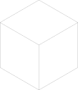

# PartCAD <!-- omit in toc -->

[](./LICENSE.txt)

PartCAD is the first package manager for CAD models,
and a Python package to consume these packages in CAD scripts (`cadquery` and `build123d`).
It brings the same power to CAD scripting
as `pip` to Python, `npm` to JavaScript, `maven` to Java etc.

[Join our Discord channel!](https://discord.gg/AXbP47zYw5)

PartCAD allows to maintain information about mechanical parts,
how they come together to form larger assemblies,
and to reuse the same parts in multiple assemblies, multiple projects.
The implementation of parts can change over time
(e.g. optimize or migrate to CadQuery from STEP) without the need to update
all of the consumers.

- [Installation](#installation)
- [Usage](#usage)
  - [Create new package](#create-new-package)
  - [Add a dependency](#add-a-dependency)
  - [Create a basic assembly](#create-a-basic-assembly)
  - [Render your project](#render-your-project)
- [Modelling](#modelling)
  - [Parts](#parts)
  - [Assemblies](#assemblies)
  - [Scenes](#scenes)
  - [Packages](#packages)
- [Export](#export)
  - [Visualization](#visualization)
  - [Other modelling formats](#other-modelling-formats)
  - [Purchasing / Bill of materials](#purchasing--bill-of-materials)
- [Tools for mechanical engineering](#tools-for-mechanical-engineering)
- [History](#history)

## Installation

The recommended method to install PartCAD for most users is:

```shell
pip install partcad
```

For contributors:

```shell
git clone https://github.com/openvmp/partcad.git
cd partcad
python3 -m pip install -e .
```

## Usage

### Create new package

Initialize new PartCAD package in the current
directory (create the default `partcad.yaml`):

```shell
pc init
```

### Add a dependency

Use the following command to import parts from another package:

```shell
pc add <alias> <url-or-local-path>
```

### Create a basic assembly

Here is an example that uses PartCAD to create a sample
assembly.

```yaml
# partcad.yaml
import:
  partcad-index:
    type: git
    url: https://github.com/openvmp/partcad-index.git
assemblies:
  assembly_01:  # declare an assembly object
```

```python
# assembly_01.py
import partcad as pc

assy = pc.Assembly()  # create an empty assembly
pc.finalize(assy)     # this is the object produced by this PartCAD script
```

### Render your project

Use the following shell command to render PartCAD parts and assemblies
in the current package (the current directory):

```shell
pc render
```

If you are using VS Code then you can simply run your PartCAD script
while having `OCP CAD Viewer` view open.

## Modelling

This frameworks allows to create large models and scenes, one part at a time,
while having parts and assemblies often maintained by third parties.

### Parts

PartCAD allows to define parts using any of the following methods:

| Method                                                       | Example                                                                  | Result                                         |
| ------------------------------------------------------------ | ------------------------------------------------------------------------ | ---------------------------------------------- |
| STEP file                                                    | parts:<br/>&nbsp;&nbsp;bolt:<br/>&nbsp;&nbsp;&nbsp;&nbsp;type:&nbsp;step |                |
| CadQuery<br/>Gateway<br/>Interface<br/>(including build123d) | parts:<br/>&nbsp;&nbsp;cube:                                             |  |

<!--
| Extension for<br/>parametrized<br/>CadQuery scripts | TODO                                                                | TODO   |
-->

Other methods to define parts are coming in soon (e.g. OpenSCAD).

### Assemblies

Assemblies are defined as parametrized instructions how to put parts and other
assemblies together.


```python
import partcad as pc

if __name__ != "__cqgi__":
    from cq_server.ui import ui, show_object

bolt = pc.get_part("example_part_step", "bolt")
bone = pc.get_part("example_part_cadquery_logo", "bone")
head_half = pc.get_part("example_part_cadquery_logo", "head_half")

model = pc.Assembly()
model.add(bone, loc=pc.Location((0, 0, 0), (0, 0, 1), 0))
model.add(bone, loc=pc.Location((0, 0, -2.5), (0, 0, 1), -90))
model.add(head_half, pc.Location((0, 0, 27.5), (0, 0, 1), 0))
model.add(head_half, pc.Location((0, 0, 25), (0, 0, 1), -90))
model.add(bolt, loc=pc.Location((0, 0, 7.5), (0, 0, 1), 0))
pc.finalize(model, show_object)
```


Assembly parameters can be of two kinds: build time and run time.

Assembly instances with different build time parameters are different
assemblies, different models.

Assembly instances with different run time parameters are the same assembly,
just visualized in a different state (e.g. different motion state).

### Scenes

Scenes are defined as parametrized instructions how to place assemblies
relative to each other for visualization purposes.

<!--
| Example                            | Result |
| ---------------------------------- | ------ |
| TODO robot on a tree               | TODO   |
| TODO two robots next to each other | TODO   |
-->

Scenes are intended to be used for visualization, simulation, validation and
testing purposes. Scenes are not intended to be used outside of the package
where they are defined.

### Packages

Each PartCAD project is a separate package.
Each package may export parts, assemblies and scenes.
Each package may import parts, assemblies and scenes from its dependencies
(other PartCAD packages).

| Method                                                                   | Example                                                                                                                                                                                                                                                        |
| ------------------------------------------------------------------------ | -------------------------------------------------------------------------------------------------------------------------------------------------------------------------------------------------------------------------------------------------------------- |
| Local files<br/>(present in<br/>your own<br/>source code<br/>repository) | import:<br/>&nbsp;&nbsp;other_directory<br/>&nbsp;&nbsp;&nbsp;&nbsp;type:&nbsp;local<br/>&nbsp;&nbsp;&nbsp;&nbsp;path:&nbsp;../../other                                                                                                                        |
| External GIT<br/>repository<br/>(HTTPS, SSH)                             | import:<br/>&nbsp;&nbsp;other_directory<br/>&nbsp;&nbsp;&nbsp;&nbsp;type:&nbsp;git<br/>&nbsp;&nbsp;&nbsp;&nbsp;url:&nbsp;https://github.com/openvmp/partcad                                                                                                    |
| External tar ball<br/>(HTTPS)                                            | import:<br/>&nbsp;&nbsp;other_directory<br/>&nbsp;&nbsp;&nbsp;&nbsp;type:&nbsp;tar<br/>&nbsp;&nbsp;&nbsp;&nbsp;url:&nbsp;[https://github.com/openv...090ca.tar.gz](https://github.com/openvmp/partcad/archive/7544a5a1e3d8909c9ecee9e87b30998c05d090ca.tar.gz) |

The full syntax is below:

```yaml
import:
    <package-name>:
        desc: <(optional) textual description>
        type: <git|tar|local>
        path: <(local only) relative-path>
        url: <(git|tar only) url-of-the-package>
        relPath: <(git|tar only) relative-path-within-the-repository>
        web: <(optional) package or maintainer's url>
        poc: <(optional) maintainer's email>
```


## Export

### Visualization

Individual parts, assemblies and scenes can be rendered and exported into the
following formats:

- PNG
- STL (not yet)

### Other modelling formats

Additionally, assemblies and scenes can be exported into the following formats:

- SDF (not yet / in progress)
- FreeCAD project (not yet / in progress)

### Purchasing / Bill of materials

The bill of materials for each assembly can be produced using the following
formats:

- CSV (not yet / in progress)
- Markdown (not yet / in progress)

## Tools for mechanical engineering

Here is an overview of the open source tools to maintain
mechanical projects. It shows where does this framework fit
in the modern mechanical development workflows.


## History

PartCAD is the evolution of the modelling framework that was once used
internally in [OpenVMP](https://github.com/openvmp/openvmp-models).
It is now being maintained separately as a generic tool.

The motivation behind this framework is to build a packaging and dependency
tracking layer on top of CadQuery and traditional CAD tools to enable
version control and other features required for effective collaboration. 

This framework currently uses CadQuery and, thus, OpenCASCADE under the hood.
However this may change in the future if the python C bindings for OpenCASCADE
remain a blocker for unlocking multithreaded performance.
