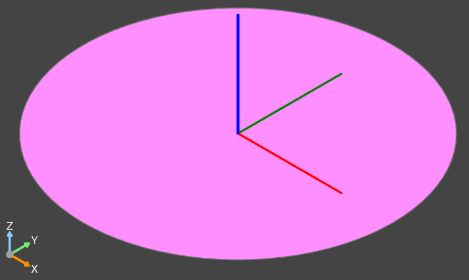
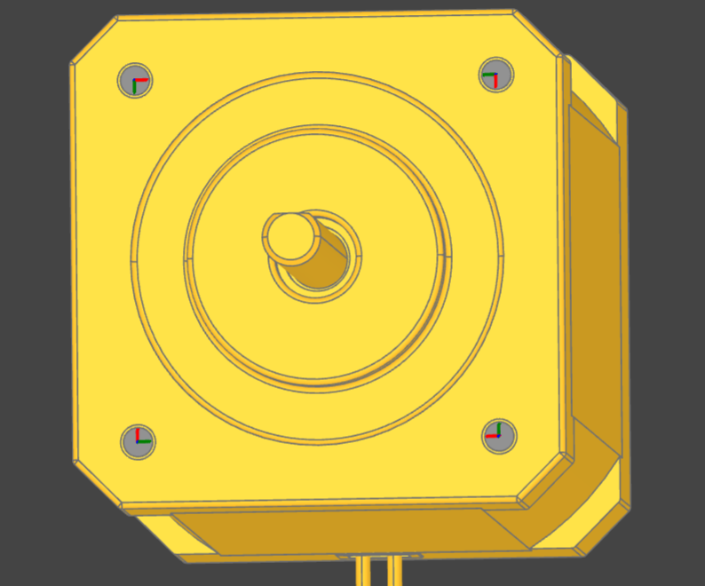
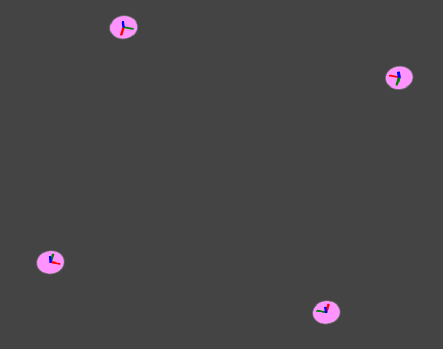

Configuration
#############

Most users need to create a single package, containing one or more parts, and maybe an assembly.
That is achieved by creating a configuration file (``partcad.yaml``) that defines the package and
declares all parts and assemblies it contains.
PartCAD aims to maintain three ways to manage the configuration files:

- Manual configuration file edits.

  PartCAD aims to maintain a simple and intuitive syntax for configuration files.
  It is currently expected that PartCAD users edit the configuration file manually
  immediately or after a few hours of using PartCAD, as the other ways to maintain
  the configuration files are not mature enough yet to meet the needs of advanced users.

- Command line interface.

  PartCAD aims to provide a command line interface for all possible configuration changes
  to any section or field.
  However, there is currently a very limited set of commands implemented: mostly the very
  first operations a new PartCAD user would need.

- Graphical user interface.

  PartCAD aims to provide a Visual Studio Code plugin with a graphical interface to
  allow changes to any configuration file sections or fields.
  However, there is currently a very limited set of operations implemented: mostly the very
  first operations a new PartCAD user would need.

The complete syntax of configuration files is described below.

========
Packages
========

The package is defined using the configuration file ``partcad.yaml`` placed
in the package folder.
Besides the package properties and, optionally, a list of imported dependencies,
``partcad.yaml`` declares parts and assemblies contained in this package.

.. code-block:: yaml

  name: <(optional) for advanced users, the assumed package path for standalone development>
  desc: <(optional) description>
  url: <(optional) package or maintainer's url>
  poc: <(optional) point of contact, maintainer's email>
  partcad: <(optional) required PartCAD version spec string>
  pythonVersion: <(optional) python version for sandboxing if applicable>
  pythonRequirements: <(python scripts only) the list of dependencies to install>

  import:
      <dependency-name>:
          desc: <(optional) textual description>
          type: <(optional) git|tar|local, can be guessed by path or url>
          path: <(local only) relative path to the package>
          url: <(git|tar only) URL of the package>
          relPath: <(git|tar only) relative path within the repository>
          revision: <(git only) the exact revision to import>
          includePaths: <(optional) Jinja2 include path>

  parts:
      <part declarations, see below>

  assemblies:
      <assembly declarations, see below>

============
Dependencies
============

Here are some examples of references to imported packages:

.. role:: raw-html(raw)
    :format: html

+--------------------+-------------------------------------------------------------------------------------------------------+
| Method             | Example                                                                                               |
+====================+=======================================================================================================+
|| Local files       | .. code-block:: yaml                                                                                  |
|| (in the same      |                                                                                                       |
|| source code       |   import:                                                                                             |
|| repository)       |     other_directory:                                                                                  |
|                    |       path: ../../other                                                                               |
+--------------------+-------------------------------------------------------------------------------------------------------+
| GIT repository     | .. code-block:: yaml                                                                                  |
| :raw-html:` ` |                                                                                                       |
| (HTTPS, SSH)       |   import:                                                                                             |
|                    |     other_repo:                                                                                       |
|                    |         url: https://github.com/openvmp/partcad                                                       |
|                    |         relPath: examples  # where to "cd"                                                            |
+--------------------+-------------------------------------------------------------------------------------------------------+
| Hosted tar ball    | .. code-block:: yaml                                                                                  |
| :raw-html:` ` |                                                                                                       |
| (HTTPS)            |   import:                                                                                             |
|                    |     other_archive:                                                                                    |
|                    |       url: https://github.com/openvmp/partcad/archive/7544a5a1e3d8909c9ecee9e87b30998c05d090ca.tar.gz |
+--------------------+-------------------------------------------------------------------------------------------------------+

========
Sketches
========

Sketches are declared in ``partcad.yaml`` using the following syntax:

.. code-block:: yaml

  sketches:
    <sketch-name>:
      type: <basic|dxf|svg>
      desc: <(optional) textual description>
      path: <(optional) the source file path, "{sketch name}.{ext}" otherwise>
      <... type-specific options ...>

Basic
-----

The basic sketches are defined using the following syntax:

.. code-block:: yaml

  sketches:
    <sketch-name>:
      type: basic
      desc: <(optional) textual description>
      # The below are mutualy exclusive options
      circle: <(optional) radius>
      circle:  # alternative syntax
        radius: <radius>
        x: <(optional) x offset>
        y: <(optional) y offset>
      square: <(optional) edge size>
      square:  # alternative syntax
        side: <edge size>
        x: <(optional) x offset>
        y: <(optional) y offset>
      rectangle: <(optional)>
        side-x: <x edge size>
        side-y: <y edge size>
        x: <(optional) x offset>
        y: <(optional) y offset>

There must be only one field ``circle``, ``square`` or ``rectangle``.

DXF
---

A sketch can be defined using a `DXF <https://en.wikipedia.org/wiki/AutoCAD_DXF>`_ file.
Such sketches are declared using the following syntax:

.. code-block:: yaml

  sketches:
    <sketch-name>:
      type: dxf
      desc: <(optional) textual description>
      path: <(optional) filename> # otherwise "<sketch-name>.dxf"
      tolerance: <(optional) tolerance used for merging edges into wires>
      include: <(optional) a layer name or a list of layer names to import>
      exclude: <(optional) a layer name or a list of layer names not to import>

SVG
---

A sketch can be defined using an `SVG <https://en.wikipedia.org/wiki/SVG>`_ file.
Such sketches are declared using the following syntax:

.. code-block:: yaml

  sketches:
    <sketch-name>:
      type: svg
      desc: <(optional) textual description>
      path: <(optional) filename> # otherwise "<sketch-name>.svg"
      use-wires: <(optional) boolean>
      use-faces: <(optional) boolean>
      ignore-visibility: <(optional) boolean>
      flip-y: <(optional) boolean>

==========
Interfaces
==========

Interfaces are declared in ``partcad.yaml`` using the following syntax:

.. code-block:: yaml

  interfaces:
    <interface name>:
      abstract: <(optional) whether the interface is abstract>
      desc: <(optional) textual description>
      path: <(optional) the source file path, "{interface name}.{ext}" otherwise>
      inherits: # (optional) the list of other interfaces to inherit from
        <parent interface name>: <instance name>
        <other interface name>: # instance name is implied to be empty ("")
        <yet another interface>:
          <instance name>: <OCCT Location object> # e.g. [[0,0,0], [0,0,1], 0]
      ports:  # (optional) the list of ports in addition to the inherited ones
        <port name>: <OCCT Location object> # e.g. [[0,0,0], [0,0,1], 0]
        <other port name>: # [[0,0,0], [0,0,1], 0] is implied
        <another port name>:
          location: <OCCT Location object> # e.g. [[0,0,0], [0,0,1], 0]
          sketch: <(optional) name of the sketch used for visualization>
      parameters:
        moveX: # (optional) offset along X
          min: <(optional) min value>
          max: <(optional) max value>
          default: <(optional) default value>
        moveY: [<min>, <max>, <(optional) default>] # alternative syntax
        moveZ: ... # (optional) offset along Z
        turnX: ... # (optional) rotation around X
        turnY: ... # (optional) rotation around Y
        turnZ: ... # (optional) rotation around Z
        <custom parameter name>: # (optional) offset or rotation with an arbitrary direction vector
          min: ...
          max: ...
          default: ...
          type: <move (default)|turn>
          dir: [<x>, <y>, <z>] # the vector to move along or rotate around

Abstract interfaces
-------------------

Abstract interfaces can't be implemented by parts directly.
They also can't be used for mating with other interfaces.
They are a convinence feature so that a property can be implemented once
but inherited mutiple times by all child interfaces.

Port visualization
------------------

When a part or an assembly is rendered (in a GUI or when exported to a file),
the ports can be visualized.
When ports are visualized, each port looks like a coordinate system (3D location, direction and rotation)
and, optionally, as a 2D image of an alleged "boundary" (or "siluette") of the port.

It is recommended to define the port boundary at all times.
Here is an example how to define the port boundary using a primitive sketch:

.. code-block:: yaml

  sketches:
    m3:
      type: basic
      circle: 3.0
  interfaces:
    m3:
      ports:
        m3:
          sketch: m3

Here is how it will get visualized:

Port matching
-------------

Each port has the coordinates of the logical center of the port and the
direction (orientation) of the port.
Whenever two ports are meant to connect without any offset or angle
(e.g. male and female connectors), their coordinates should match
and their directions should be opposite (rotated 180 degrees around [1, 1, 0]).
The suggested convention is to use the Z-axis (blue) as the main direction.
Male ports should have the Z-axis pointing outwards, while female ports should
have the Z-axis pointing inwards.

Matching multiple ports
-----------------------

Sometimes there are multiple interchangeable ports within one interface.
For example, take a look at the NEMA-17 mounting ports:

It is desired that any mounting port of the motor can be connected to any
mounting port of the bracket.
That can be achieved by orienting the ports in a circular direction.
See how the X-axis (red) is pointing to the next port clockwise (right-hand rule).
If any pair of ports is aligned then all three other port pairs are aligned too.

Interface parameters
--------------------

Each interface may declare parameters to allow parametrized mating
(e.g. a slotted hole allows for a mating at an offset within the size of the slot).
There is a list of predefined parameters that are easy to use:

  - moveX, moveY, moveZ: offset along X, Y, and Z axes
  - turnX, turnY, turnZ: rotation around X, Y, and Z axes

.. code-block:: yaml

  interfaces:
    <interface name>:
      parameters:
        moveX: # (optional) offset along X
          min: <(optional) min value>
          max: <(optional) max value>
          default: <(optional) default value>

However custom parameters can be defined to use an arbitrary direction vector
and an arbitary offset or rotation.

.. code-block:: yaml

  interfaces:
    <interface name>:
      parameters:
        <custom parameter name>:
          min: ...
          max: ...
          default: ...
          type: <move (default)|turn>
          dir: [<x>, <y>, <z>] # the vector to move along or rotate around

When the interface is inherited or used to connect parts, the parameter values
get resolved and applied as inheritance or connection coordinate offsets.

.. code-block:: yaml

  # Interface inheritance with parameters
  interfaces:
    <interface name>:
      ...
      inherits: # (optional) the list of other interfaces to inherit from
        <parent interface name>:
          <instance name>:
            params:
              moveX: 10

  # Interface implementation with parameters
    parts:
    <part name>:
      ...
      implements: # (optional) the list of other interfaces to inherit from
        <interface name>:
          <instance name>:
            params: { moveX: 10 }

  # Assembly YAML connection example
  links:
    - part: <target part>
    - part: <source part>
      connect:
        name: <target part>
        toParams:
          turnZ: 1.57

Interface examples
------------------

See the `feature_interfaces` example for more information.

=====
Parts
=====

Parts are declared in ``partcad.yaml`` using the following syntax:

.. code-block:: yaml

  parts:
    <part name>:
      type: <openscad|cadquery|build123d|ai-openscad|ai-cadquery|ai-build123d|step|stl|3mf>
      desc: <(optional) textual description, also used by AI>
      path: <(optional) the source file path, "{part name}.{ext}" otherwise>
      <... type-specific options ...>
      offset: <OCCT Location object, e.g. "[[0,0,0], [0,0,1], 0]">

      # The below syntax is similar to the one used for interfaces,
      # with the only exception being the word "implements" instead of "inherits".
      implements: # (optional) the list of interfaces to implement
        <interface name>: <instance name>
        <other interface name>: # instance name is implied to be be empty ("")
        <yet another interface>:
          <instance name>: <OCCT Location object> # e.g. [[0,0,0], [0,0,1], 0]
      ports: # (optional) the list of ports in addition to the inherited ones
        <port name>: <OCCT Location object> # e.g. [[0,0,0], [0,0,1], 0]
        <other port name>: # [[0,0,0], [0,0,1], 0] is implied
        <another port name>:
          location: <OCCT Location object> # e.g. [[0,0,0], [0,0,1], 0]
          sketch: <(optional) name of the sketch used for visualization>

Depending on the type of the part, the configuration may have different options.

CAD Scripts
-----------

Define parts with CodeCAD scripts using the following syntax:

.. code-block:: yaml

  parts:
    <part name>:
      type: <openscad|cadquery|build123d>
      cwd: <alternative current working directory>
      patch:
        <...regexp substitutions to apply...>
        "patern": "repl"
      pythonRequirements: <(python scripts only) the list of dependencies to install>
      parameters:
        <param name>:
          type: <string|float|int|bool>
          enum: <(optional) list of possible values>
          default: <default value>

+--------------------------------------------------------------------------------------+---------------------------+-------------------------------------------------------------------------------------------------------------------------+
| Example                                                                              | Configuration             | Result                                                                                                                  |
+======================================================================================+===========================+=========================================================================================================================+
|                                                                                      | .. code-block:: yaml      | .. image:: https://github.com/openvmp/partcad/blob/main/examples/produce_part_cadquery_primitive/cylinder.svg?raw=true  |
|| `CadQuery <https://github.com/CadQuery/cadquery>`_ or                               |                           |   :width: 128                                                                                                           |
|| `build123d <https://github.com/gumyr/build123d>`_ script                            |   parts:                  |                                                                                                                         |
|| in ``src/cylinder.py``                                                              |     src/cylinder:         |                                                                                                                         |
|                                                                                      |       type: cadquery      |                                                                                                                         |
|                                                                                      |       # type: build123d   |                                                                                                                         |
+--------------------------------------------------------------------------------------+---------------------------+-------------------------------------------------------------------------------------------------------------------------+
|| `OpenSCAD <https://en.wikipedia.org/wiki/OpenSCAD>`_ script                         | .. code-block:: yaml      | .. image:: https://github.com/openvmp/partcad/blob/main/examples/produce_part_openscad/cube.svg?raw=true                |
|| in ``cube.scad``                                                                    |                           |   :width: 128                                                                                                           |
|                                                                                      |   parts:                  |                                                                                                                         |
|                                                                                      |     cube:                 |                                                                                                                         |
|                                                                                      |       type: scad          |                                                                                                                         |
+--------------------------------------------------------------------------------------+---------------------------+-------------------------------------------------------------------------------------------------------------------------+

AI Generated CAD Scripts
------------------------

Generate CadQuery or OpenSCAD scripts with Generative AI using the following syntax:

.. code-block:: yaml

  parts:
    <part name>:
      type: <ai-openscad|ai-cadquery>
      provider: <google|openai|ollama, the model provider to use>
      tokens: <(optional) the limit of token context>
      top_p: <(optional, openai only) the top_p parameter>
      images: <(optional) contextual images as input for AI>
        - <image path>

+---------------------------+-------------------------------------------------------------------------------------------------------------------------+
| Example                   | Result                                                                                                                  |
+===========================+=========================================================================================================================+
| .. code-block:: yaml      | .. image:: https://github.com/openvmp/partcad/blob/main/examples/produce_part_ai_cadquery/cube.svg?raw=true             |
|                           |   :width: 128                                                                                                           |
|   parts:                  |                                                                                                                         |
|     cube:                 |                                                                                                                         |
|       type: ai-cadquery   |                                                                                                                         |
|       provider: google    |                                                                                                                         |
|       desc: A cube        |                                                                                                                         |
+---------------------------+-------------------------------------------------------------------------------------------------------------------------+

CAD Files
---------

Define parts with CAD files using the following syntax:

.. code-block:: yaml

  parts:
    <part name>:
      type: <step|stl|3mf>
      binary: <(stl only) use the binary format>

+--------------------------------------------------------------------------------------+---------------------------+-------------------------------------------------------------------------------------------------------------------------+
| Example                                                                              | Configuration             | Result                                                                                                                  |
+======================================================================================+===========================+=========================================================================================================================+
|| CAD file                                                                            | .. code-block:: yaml      | .. image:: https://github.com/openvmp/partcad/blob/main/examples/produce_part_step/bolt.svg?raw=true                    |
|| (`STEP <https://en.wikipedia.org/wiki/ISO_10303>`_ in ``screw.step``,               |                           |   :width: 128                                                                                                           |
|| `STL <https://en.wikipedia.org/wiki/STL_(file_format)>`_ in ``screw.stl``,          |   parts:                  |                                                                                                                         |
|| or `3MF <https://en.wikipedia.org/wiki/3D_Manufacturing_Format>`_ in ``screw.3mf``) |     screw:                |                                                                                                                         |
|                                                                                      |       type: step          |                                                                                                                         |
|                                                                                      |       # type: stl         |                                                                                                                         |
|                                                                                      |       # type: 3mf         |                                                                                                                         |
+--------------------------------------------------------------------------------------+---------------------------+-------------------------------------------------------------------------------------------------------------------------+

References
----------

It is also possible to declare new parts by referencing other parts that are
already defined elsewhere.

+---------+----------------------------------------+----------------------------+
| Method  | Configuration                          | Description                |
+=========+========================================+============================+
| Alias   | .. code-block:: yaml                   || Create a shallow          |
|         |                                        || clone of the              |
|         |   parts:                               || existing part.            |
|         |     <alias-name>:                      || For example, to           |
|         |       type: alias                      || make it easier to         |
|         |       source: </path/to:existing-part> || reference it locally.     |
+---------+----------------------------------------+----------------------------+
| Enrich  | .. code-block:: yaml                   || Create an opinionated     |
|         |                                        || alternative to the        |
|         |   parts:                               || existing part by          |
|         |     <enriched-part-name>:              || initializing some of      |
|         |       type: enrich                     || its parameters, and       |
|         |       source: </path/to:existing-part> || overriding any of its     |
|         |       with:                            || properties. For           |
|         |         <param1>: <value1>             || example, to avoid         |
|         |         <param2>: <value2>             || passing the same set      |
|         |       offset: <OCCT-Location-obj>      || of parameters many times. |
+---------+----------------------------------------+----------------------------+

Other
-----

Other methods to define parts are coming soon (e.g. `SDF <https://github.com/fogleman/sdf>`_).
Please, express your interest in support for other formats by filing a corresponding issue on GitHub
or sending an email to `openvmp@proton.me <mailto:openvmp@proton.me>`_.

==========
Assemblies
==========

Assembly YAML
-------------

Assemblies are declared in ``partcad.yaml`` using the following syntax:

.. code-block:: yaml

  assemblies:
    <assembly name>:
      type: assy  # Assembly YAML
      path: <(optional) the source file path>
      parameters:  # (optional)
        <param name>:
          type: <string|float|int|bool>
          enum: <(optional) list of possible values>
          default: <default value>
      offset: <OCCT Location object, e.g. "[[0,0,0], [0,0,1], 0]">

Here is an example:

+---------------------------------------------------+-------------------------------------------------------------------------------------------------------------------------+
| Configuration                                     | Result                                                                                                                  |
+===================================================+=========================================================================================================================+
| .. code-block:: yaml                              | .. image:: https://github.com/openvmp/partcad/blob/main/examples/produce_assembly_assy/logo.svg?raw=true                |
|                                                   |   :width: 400                                                                                                           |
|   # partcad.yaml                                  |                                                                                                                         |
|   assemblies:                                     |                                                                                                                         |
|    logo:                                          |                                                                                                                         |
|      type: assy  # Assembly YAML                  |                                                                                                                         |
|                                                   |                                                                                                                         |
|   # logo.assy                                     |                                                                                                                         |
|   links:                                          |                                                                                                                         |
|   - part: /produce_part_cadquery_logo:bone        |                                                                                                                         |
|     location: [[0,0,0], [0,0,1], 0]               |                                                                                                                         |
|   - part: /produce_part_cadquery_logo:bone        |                                                                                                                         |
|     location: [[0,0,-2.5], [0,0,1], -90]          |                                                                                                                         |
|   - links:                                        |                                                                                                                         |
|     - part: /produce_part_cadquery_logo:head_half |                                                                                                                         |
|       name: head_half_1                           |                                                                                                                         |
|       location: [[0,0,2.5], [0,0,1], 0]           |                                                                                                                         |
|     - part: /produce_part_cadquery_logo:head_half |                                                                                                                         |
|       name: head_half_2                           |                                                                                                                         |
|       location: [[0,0,0], [0,0,1], -90]           |                                                                                                                         |
|     name: {{name}}_head                           |                                                                                                                         |
|     location: [[0,0,25], [1,0,0], 0]              |                                                                                                                         |
|   - part: /produce_part_step:bolt                 |                                                                                                                         |
|     location: [[0,0,7.5], [0,0,1], 0]             |                                                                                                                         |
+---------------------------------------------------+-------------------------------------------------------------------------------------------------------------------------+

The example above shows an assembly created using ``Assembly YAML``.
Other methods to define assemblies are coming soon (e.g. using ``CadQuery`` or ``build123d``).
The assembly file syntax is described in the ``Assembly YAML`` section of this documentation.

References
----------

It is also possible to declare assemblies by referencing other assemblies that are
already defined elsewhere. Unfortunately, ``enrich`` (documented in the `Parts` section) is not yet implemented for
assemblies.

+---------+--------------------------------------------+----------------------------+
| Method  | Configuration                              | Description                |
+=========+============================================+============================+
| Alias   | .. code-block:: yaml                       || Create a shallow          |
|         |                                            || clone of the              |
|         |   assemblies:                              || existing assembly.        |
|         |     <alias-name>:                          || For example, to           |
|         |       type: alias                          || make it easier to         |
|         |       source: </path/to:existing-assembly> || reference it locally.     |
+---------+--------------------------------------------+----------------------------+

==============
Common Options
==============

The following options are shared by all or some shapes: sketches, parts and assemblies.

Files
-----

For shape types that are defined using a source file, the default file path is
the name of the shape plus the extension of that file type.

An alternative file path (absolute or relative to the package path)
can be defined explicitly using the `path` parameter:

.. code-block:: yaml

  parts:
    part-name:
      type: step
      path: alternatative-path.step

When the source file is not present in the package source repository
but needs to be pulled from a remote location, the following options can be used:

.. code-block:: yaml

  fileFrom: url
  fileUrl: <url to pull the file from>
  # fileCompressed: <(optional) whether the file needs to be decompressed before use>
  # fileMd5Sum: <(optional) the MD5 checksum of the file>
  # fileSha1Sum: <(optional) the SHA1 checksum of the file>
  # fileSha2Sum: <(optional) the SHA2 checksum of the file>
