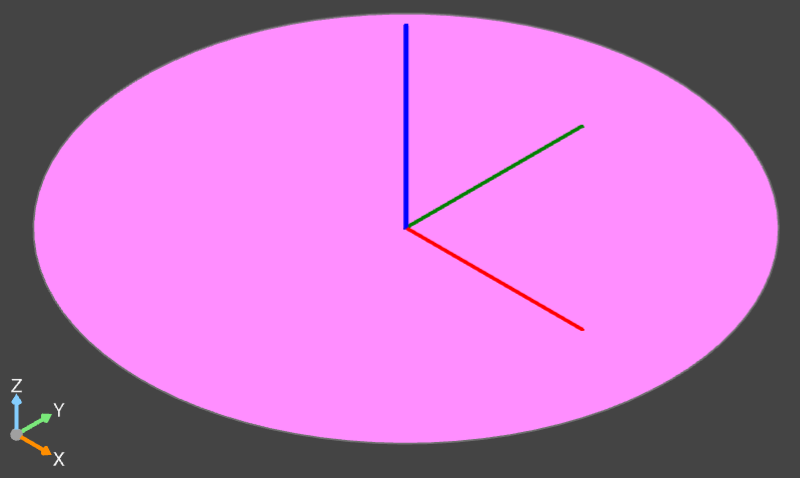
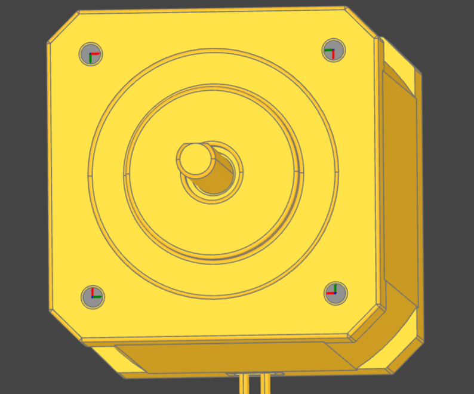
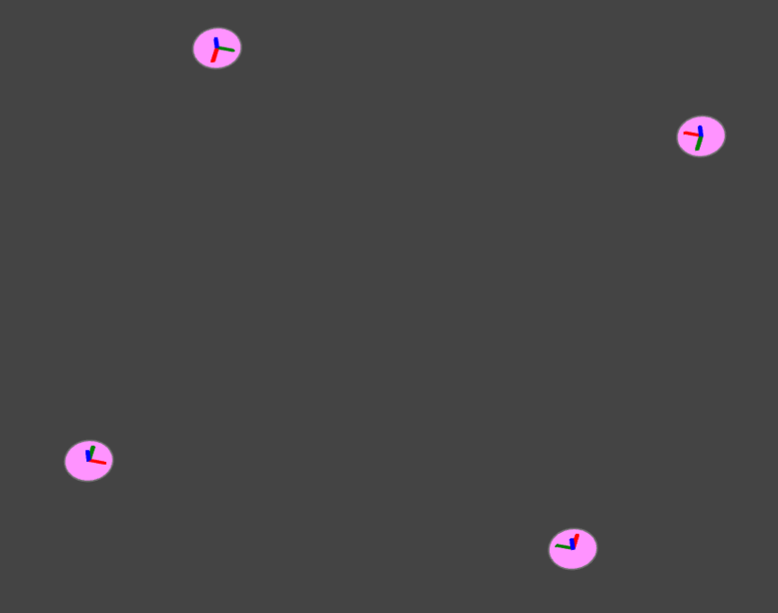

Configuration
#############

Most users need to create a single package, containing one or more parts, and maybe an assembly.
That is achieved by creating a configuration file (``partcad.yaml``) that defines the package and
declares all parts and assemblies it contains.
PartCAD aims to maintain three ways to manage the configuration files:

- Manual configuration file edits.

  PartCAD aims to maintain a simple and intuitive syntax for configuration files.
  It is currently expected that PartCAD users edit the configuration file manually
  immediately or after a few hours of using PartCAD, as the other ways to maintain
  the configuration files are not mature enough yet to meet the needs of advanced users.

- Command line interface.

  PartCAD aims to provide a command line interface for all possible configuration changes
  to any section or field.
  However, there is currently a very limited set of commands implemented: mostly the very
  first operations a new PartCAD user would need.

- Graphical user interface.

  PartCAD aims to provide a Visual Studio Code plugin with a graphical interface to
  allow changes to any configuration file sections or fields.
  However, there is currently a very limited set of operations implemented: mostly the very
  first operations a new PartCAD user would need.

The complete syntax of configuration files is described below.

.. _packages:

========
Packages
========

The package is defined using the configuration file ``partcad.yaml`` placed
in the package folder.
Besides the package properties and, optionally, a list of imported dependencies,
``partcad.yaml`` declares a list of :ref:`objects` contained in this package.

.. code-block:: yaml

  name: <(optional) the package path this package expects to be seen at; see "The package name" below>
  desc: <(optional) description>
  private: <(optional) boolean flag to mark the package as private>
  url: <(optional) package or maintainer's url>
  poc: <(optional) point of contact, maintainer's email>
  partcad: <(optional) required PartCAD version spec string>
  pythonVersion: <(optional) python version for sandboxing if applicable; defaults to the version PartCAD pins, not the one it runs on>
  pythonRequirements: <(python scripts only) the list of dependencies to install>
  javascriptVersion: <(optional) Node.js major version for sandboxing if applicable>
  javascriptRequirements: <(JavaScript scripts only) the list of npm dependencies to install>
  chili3dVersion: <(Chili3D parts only) the version of Chili3D to render with>
  unless: <(optional) the conditions this package does not work under; see "Tags" below>

  dependencies:
      <dependency-name>:
          desc: <(optional) textual description>
          type: <(optional) git|tar|local|external, can be guessed by path or url>
          path: <(local only) relative path to the package>
          url: <(git|tar only) URL of the package>
          relPath: <(git|tar only) relative path within the repository>
          revision: <(git only) the exact revision to import>
          plugin: <(external only) reference to the repository plugin that serves this package>
          subfolder: <(external only) location within the repository, for hierarchies>
          cacheVersion: <(external only) non-negative integer; bump to invalidate the on-disk cache>
          includePaths: <(optional) Jinja2 include path>

  suppliers:
      <(optional) the providers to consider for this package's objects; a bare
       name is one of this package's own, "../sibling:name" is one next door>

  parts:
      <part declarations, see below>

  assemblies:
      <assembly declarations, see below>

  repositories:
      <repository plugin declarations, see below>

The package name
----------------

A package is always addressed by its **location** -- the package path at which
it was loaded, derived from its parent. For example, a package in the
subfolder ``gobilda`` of the package ``//vendor`` is addressed as
``//vendor/gobilda`` regardless of what it declares about itself.

The optional ``name`` field declares the package's **identity**: the package
path at which the package expects to be seen. It only takes effect when the
package is loaded as the root (the top-most package of the current context) --
this lets a package be developed standalone using the very same package path
its consumers will see it at. In every other case ``name`` does not change
where the package is loaded; the location always wins.

This makes it safe to vendor a package -- copy it into your own package tree to
drop a dependency or to follow your own naming convention:

* The vendored copy is loaded at its location in your tree, not at the ``name``
  it declares. If the same package is vendored at two locations (even at two
  different versions), each is an independent instance, addressed at its own
  location, and the two never interact.
* References the package makes to itself using its declared ``name`` are
  automatically redirected to the location where the copy was actually loaded.
  A vendored copy therefore uses itself, instead of silently pulling in another
  copy from the package path it was originally taken from.

As a consequence, a vendored package cannot reference the original copy of
itself by its declared ``name``: that package path always resolves to the local
instance. This is intentional -- referencing two copies of the same package at
once is almost always a mistake, and the alternative would be an implicit,
easily-missed dependency on the upstream package.

.. _templates:

=========
Templates
=========

``partcad.yaml`` is a Jinja2 template rendered to YAML before it is parsed, so a
package can generate declarations rather than write every one out. These names
are available while it is being rendered:

.. list-table::
  :header-rows: 1
  :widths: 30 70

  * - Name
    - What it is
  * - ``package_name``
    - The package path this package is being loaded at.
  * - ``partcad_version``
    - The version of PartCAD doing the rendering, whole: ``"0.8.77"``.
  * - ``partcad_version_major``, ``partcad_version_minor``, ``partcad_version_build``
    - The same version as its three numbers.
  * - ``partcad_version_at_least(...)``
    - Whether that version is the one given or newer. Takes a string,
      ``partcad_version_at_least("0.8.77")``, or the numbers themselves,
      ``partcad_version_at_least(0, 8, 77)``.
  * - ``PI``/``M_PI``, ``SQRT_2``, ``SQRT_3``, ``SQRT_5``
    - The constants a CAD file keeps reaching for.
  * - ``INCH``/``INCHES``, ``FOOT``/``FEET``
    - Millimetres per imperial unit: 25.4 and 304.8.

Serving two PartCADs at once
----------------------------

A package that wants a feature this release has and the last one did not has a
choice: raise its ``partcad:`` requirement, which takes the package away from
everyone who has not updated, or write both forms and pick between them.

.. code-block:: jinja

  
  # ... declared the way this PartCAD can read ...
  
  # ... declared the way every PartCAD can ...
  

A PartCAD older than these names defines none of them, and a template that names
one there fails to render at all. So a package that has to work on those asks
first -- Jinja2's ``and`` short-circuits, so the call is never made where the
name is absent:

.. code-block:: jinja

  

The comparison is made one number at a time, which is the whole point of having
it: ``0.8.9`` is *older* than ``0.8.77``, and every comparison of the strings
says the opposite.

.. note::

  ``partcad_version_at_least`` is a function rather than a Jinja2 macro, which
  is what it looks like it should be. A macro always renders to *text*, so a
  false one comes back as the string ``"False"`` -- which is not empty, and so
  is true to ````. A comparison that reads as its own opposite is not a
  thing to leave lying in a template.

==========
Validation
==========

``partcad.yaml`` is checked against a JSON schema
(``src/partcad_utils/schema/partcad.json``) that describes everything below:
which sections exist, which fields each kind of declaration takes, and which of
them exclude or require one another.

Run the check over a package, or over the file alone:

  .. code-block:: shell

    pc lint                          # every check, over the package
    pc lint -f PartcadSchema         # this one only
    pc lint --file partcad.yaml      # no package, no daemon - just the file

Every finding names the line and column it came from. ``partcad.yaml`` is a
Jinja2 template rendered to YAML before it is parsed (see ``includePaths``
below), so the checker masks each template construct before parsing rather than
rendering the file, which would need the values the template is waiting for. It
is the same checker :doc:`ASSY files <assy>` go through, and the `PartCAD
extension for VS Code
<https://marketplace.visualstudio.com/items?itemName=PartCAD.partcad-official>`_ runs it
on the open document -- so a mistyped section is underlined as it is typed,
including in the file that is stopping the package from loading at all. Set
``partcad.lint.enabled`` to ``false`` to turn that off.

============
Dependencies
============

Here are some examples of a dependency declaration in ``partcad.yaml``:

.. role:: raw-html(raw)
    :format: html

+--------------------+-------------------------------------------------------------------------------------------------------+
| Method             | Example                                                                                               |
+====================+=======================================================================================================+
|| Local package     | .. code-block:: yaml                                                                                  |
|| (in the same      |                                                                                                       |
|| source code       |   dependencies:                                                                                       |
|| repository)       |     other_directory:                                                                                  |
|                    |       path: ../../other                                                                               |
+--------------------+-------------------------------------------------------------------------------------------------------+
| GIT repository     | .. code-block:: yaml                                                                                  |
| :raw-html:` ` |                                                                                                       |
| (HTTPS, SSH)       |   dependencies:                                                                                       |
|                    |     other_repo:                                                                                       |
|                    |         url: https://github.com/partcad/partcad                                                       |
|                    |         relPath: examples  # where to "cd"                                                            |
+--------------------+-------------------------------------------------------------------------------------------------------+
| Hosted tar ball    | .. code-block:: yaml                                                                                  |
| :raw-html:` ` |                                                                                                       |
| (HTTPS)            |   dependencies:                                                                                       |
|                    |     other_archive:                                                                                    |
|                    |       url: https://github.com/partcad/partcad/archive/7544a5a1e3d8909c9ecee9e87b30998c05d090ca.tar.gz |
+--------------------+-------------------------------------------------------------------------------------------------------+

Each dependency becomes a subpackage of the current package. All subfolders of the current package are considered
subpackages (of the type `local`) if they contain a ``partcad.yaml`` file. Subfolders do not need to be explicitly
declared as a dependency, but may be declared to provide a more detailed description.

External packages
-----------------

A dependency of type ``external`` is a package whose contents are served by a
**repository plugin** instead of being read from a folder (``local``) or a
remote archive (``git``, ``tar``). Its ``plugin`` field references a repository
declared in the ``repositories`` section (see :ref:`repositories`):

.. code-block:: yaml

  dependencies:
    example:
      type: external
      plugin: :my_repo    # a repository declared in this package

  repositories:
    my_repo:
      type: basic

The package's objects (parts, sketches, assemblies, ...), its child packages,
and its metadata are all fetched from the plugin on demand, rather than being
enumerated up front. This keeps loading cheap even when the repository is large
or remote: a part is fetched only when it is actually used.

An external package can host a hierarchy. When its children are listed, the
plugin reports child package names; each child is imported as another external
package backed by the same plugin, with a ``subfolder`` that scopes its
requests within the repository. In this way one plugin can serve an entire tree
of packages, each with its own sketches, parts, assemblies, providers and
further children.

Non-null responses from a plugin are cached on disk, keyed by the plugin
reference and the request; a request the plugin has no answer for is remembered
only for the run that made it, and is put to the plugin again after a restart.
The cache does not know when the plugin's code changes, so a plugin that starts
returning a new shape of data (for example, adding a field to every part it
serves) would keep being served the stale, pre-change entries. Set
``cacheVersion`` to a non-negative integer and bump it whenever the plugin's
output format changes: it is folded into the cache location, so bumping it moves
the whole repository (and every child in its hierarchy) to a fresh cache
namespace at once, invalidating the old entries. It defaults to ``0``
(unversioned).

See ``examples/plugin_repository_basic`` (a package backed by a local file),
``examples/plugin_repository_full`` (backed by an HTTP endpoint) and
``examples/plugin_repository_tree`` (a hierarchy of packages).

.. _objects:

=======
Objects
=======

PartCAD :ref:`packages` may contain the following objects:

- :ref:`sketches` are 2D objects that can be used to create 3D objects (e.g. using :ref:`extrude` or :ref:`sweep`),
  but can also be used to aid visualization of :ref:`interfaces` or to provide detailed instructions for AI actors.

- :ref:`interfaces` are abstract objects that describe the endpoint of a connection between parts and provide
  sufficient information to automatically determine the mating of parts.

- :ref:`parts` are 3D objects that are meant to be available for purchase or manufacturing.

- :ref:`assemblies` are instructions how to put parts and other assemblies together to be used as a single object.

- :ref:`scenes` are placed arrangements of objects - a workcell, a table, a simulation world - stating where things
  are and not how they got there.

- :ref:`software` is what the product ships with that is not geometry: a firmware image, a binary, a disk image.
  It is always a file.

- :ref:`providers` are implementations of a way to get parts and assemblies (to purchase them or to manufacture them).

===============
Common Metadata
===============

All :ref:`objects` in PartCAD may carry the following metadata:

.. _tags:

Tags
----

Not everything a package can be built out of exists everywhere. The KiCad
example is the case this was introduced for: KiCad publishes its official
container images for ``linux/amd64`` only, so the sandbox PartCAD runs
``kicad-cli`` in cannot be pulled on an Arm host at all. That is a property of
the design, not a fault in it, and the package saying so is better than every
consumer of it finding out at use.

A **tag** is a short string naming something that is true of *here*. Every
context carries the tags true of itself.

What the machine is:

* the CPU architecture -- ``x86_64`` and ``amd64`` on 64-bit Intel/AMD,
  ``arm64``, ``aarch64`` and ``arm`` on 64-bit Arm (all of them, so that a
  package need not know which spelling the host happens to report);
* the operating system -- ``linux``, ``macos`` (also ``darwin``), ``windows``;
* the operating system and its version, as ``<os>-<version>``. On Linux that is
  the distribution rather than the kernel, read from ``/etc/os-release``:
  ``ubuntu`` and ``ubuntu-24.04``, plus whatever ``ID_LIKE`` names (``debian``).
  On macOS, ``macos-26`` and ``macos-26.1``. On Windows, ``windows-11``.

How PartCAD is configured to work -- one tag per boolean option, carried in one
of two spellings, the option's name when it is on and that name prefixed with
``!`` when it is off:

* ``useDocker`` / ``!useDocker`` -- whether PartCAD may use Docker at all;
* ``useDockerPython`` / ``!useDockerPython``;
* ``useDockerKicad`` / ``!useDockerKicad``.

These report each option **as configured**, not as it ends up applying:
``useDocker`` is a master switch over the other two, so ``useDockerKicad`` and
``!useDocker`` can hold at once. Both spellings exist so that either answer can
be named -- a package that cares which way an option is set should not have to
guess what an absent tag meant. Note that ``!`` is part of a tag's name, not an
operator: a tag is matched, never evaluated, and ``!`` means nothing anywhere
else.

Anything PartCAD cannot work out for itself -- that this is the build machine,
that this host is behind a proxy -- is added by the user, through the ``tags``
user configuration option (``pc config`` shows it) or the ``PC_TAGS``
environment variable. ``pc system status`` prints the whole resolved set:

.. code-block:: console

  $ PC_TAGS="build-machine" pc system status
  INFO: Tags: aarch64, arm, arm64, build-machine, debian, linux, ubuntu, ubuntu-24.04, useDocker, useDockerKicad, !useDockerPython

Tags are matched case-insensitively, and are shown in the spelling PartCAD names
them by -- which is why ``useDocker`` is camelCase (it is an option name) and
``arm64`` is not.

A package, or any object of a package, may then declare the conditions it does
**not** work under, using ``unless``:

.. code-block:: yaml

  # The whole package is skipped on an Arm host that will run KiCad in a
  # container -- but not on one where KiCad has been configured to run natively
  unless: [[arm, useDocker, useDockerKicad]]

  parts:
    pcb:
      type: kicad
      # ... or just this one part, and on any Arm host
      unless: arm

``unless`` is a list of **clauses**, and *any one* of them excluding is enough
(OR). A clause is either a single tag, or a list of tags that must *all* hold
together (AND). Either level may be written as a bare tag when there is only
one, so all of these are valid:

.. code-block:: yaml

  unless: arm64                                   # one tag
  unless: [arm64, windows]                        # either one excludes
  unless: [[arm, useDocker], macos]               # both of the first, or macOS

An empty clause is refused rather than ignored: it would hold everywhere.

Wherever a clause holds, the declaration is skipped -- it is not enumerated, not
listed, and not instantiated -- and PartCAD says so once, at ``INFO``, naming
the clause that did it:

.. code-block::

  INFO: Skipping the package '//pub/examples/partcad/produce_part_kicad': excluded by 'unless' (arm and useDocker and useDockerKicad)

Skipping a package skips what it brings in: its subfolders and its declared
dependencies are not imported either.

Note that there is deliberately no inverse condition ("only on"). A declaration
is expected to work everywhere; naming the exceptions keeps the common case
unwritten, and keeps a platform that does not exist yet from silently excluding
everything written before it.

A reference to an object that was skipped does not resolve. An alias or an
``enrich`` built on an object excluded here has to carry the same ``unless``, or
it will be left pointing at nothing.

.. _requirements:

Requirements
------------

Objects may contain a list of requirements in free form (any YAML syntax works).
These requirements help describe the object in more detail.
They are not used by PartCAD itself, but by AI or human actors to create,
improve, or better understand the object.

The requirements are from the user’s perspective and serve to guide the design.
Once the design is complete, it may impose further requirements (for example,
on manufacturing), but those are not part of this section.
This section exclusively covers the requirements used to create the design.

.. code-block:: yaml

  parts:
    <part name>:
      requirements: |
        This part has to ...
        ...
        It also has to ...
        ...

.. code-block:: yaml

  parts:
    <part name>:
      requirements:
        - <requirement 1>
        - <requirement 2>
        - <requirement 3>

.. code-block:: yaml

  parts:
    <part name>:
      requirements:
        mechanical: |
          The outer dimensions of the part have to be ...
        electrical: |
          The part has to be able to withstand ...
        esthetic: |
          The part has to look like ...

.. _files:

Files
-----

For objects that are defined using a source file, the default file path is
the name of the object plus the extension of that file type.

An alternative file path (absolute or relative to the package path)
can be defined explicitly using the `path` parameter:

.. code-block:: yaml

  parts:
    part-name:
      type: step
      path: alternative-path.step # Instead of "part-name.step"

When the source file is not kept in the package source repository but has to be
pulled from a remote location (a STEP file published by the part vendor, for
example), declare where to get it from using ``fileFrom`` and ``fileUrl``:

.. code-block:: yaml

  parts:
    bolt:
      type: step
      path: bolt.step # (optional) where to place the file once it is downloaded
      fileFrom: url # "url" is the only source supported so far
      fileUrl: https://example.com/vendor/catalog/bolt.step

The file is fetched lazily: nothing is downloaded until the object is used for
the first time, and the downloaded file is reused afterwards. Since the file is
not expected to be a part of the package, PartCAD does not complain about it
being missing while the package is loaded.

``fileFrom`` and ``fileUrl`` must be declared together.
They are recognized in :ref:`parts`, :ref:`sketches`, :ref:`assemblies`
(an assembly's source file is pulled the same way, whether it is an ``.assy``
file or a CAD file), :ref:`scenes` and :ref:`software`.

.. _file-hash:

Pinning what is downloaded
^^^^^^^^^^^^^^^^^^^^^^^^^^

A URL serves whatever it serves at the moment it is fetched. The same
declaration can produce a different file tomorrow -- the vendor revises the
model, the branch moves, the host is not the one you thought. ``fileHash``,
beside ``fileUrl``, pins the bytes:

.. code-block:: yaml

  parts:
    bolt:
      type: step
      fileFrom: url
      fileUrl: https://example.com/vendor/catalog/bolt.step
      fileHash: sha256:2c26b46b68ffc68ff99b453c1d30413413422d706483bfa0f98a5e886266e7ae

The download is refused unless the file hashes to this, and the bytes that were
refused are deleted rather than left behind -- the next run skips the download
when the file is already there, and would otherwise reuse the file the hash had
just rejected.

Write it as ``<algorithm>:<digest>`` over ``md5``, ``sha1``, ``sha256`` or
``sha512``. A bare digest works too, and the algorithm is read from its length,
which is the form most vendors publish.

``fileHash`` is recognized wherever ``fileFrom`` is, and it is **optional but
required for reproducibility**. The schema never demands one, of any kind of
object, and nothing refuses to load, build or lint an object that omits it.
What such an object cannot do is promise that the next run produces the same
thing, and manufacturing is repetition -- so ``pc test`` refuses to call it
manufacturable (see :ref:`reproducibility`). Pull a vendor's model down and
never claim it can be made, and none of this touches you.

``pc add`` writes one for you. Given a URL instead of a path it fetches the file
once and records the hash of what came back, so an object added that way is
pinned from the moment it exists.

A file served by a repository plugin -- what PartCAD uses for a package with no
source tree of its own -- may carry a ``fileHash`` too, and it is verified the
same way. It is not yet required, because nothing has been put in place for such
a package to pin what its plugin serves.

This has nothing to do with the hashes PartCAD computes for itself -- a shape's
cache key, or the commit a package was read at. Those identify something PartCAD
built or fetched; ``fileHash`` states, in advance, which bytes a package is
asking for.

.. _reproducibility:

Reproducibility and manufacturability
^^^^^^^^^^^^^^^^^^^^^^^^^^^^^^^^^^^^^

Manufacturing is repetition: the run after this one has to produce the same
thing, so everything that goes into a product has to be gettable a second time
and be the same thing. There are three ways an object can promise that, and the
``manufacturability`` check of ``pc test`` fails one that offers none of them:

- **It is bought.** A ``vendor`` and an ``sku`` name a thing to order, and
  ordering it again is what "the same again" means for it -- whatever file the
  declaration also carries is a drawing of what arrives rather than the identity
  of it. Only :ref:`parts` and :ref:`assemblies` can say this; the schema gives
  ``vendor``/``sku`` to those two alone.
- **The package carries the file.** Its revision identifies the file exactly.
- **The file is pinned** with a ``fileHash``.

A :ref:`sketch <sketches>` cannot be bought, so for it the second and third are
the whole of it -- nothing manufactures a drawing, but a part extruded from one
is no more repeatable than the drawing was. :ref:`software` is the same case,
and for the same reason: a firmware image nobody can identify makes the bill of
materials that names it worthless.

.. code-block:: text

  Test failed: //robot:bracket: manufacturability: It is not reproducible: it is
  fetched with 'fileFrom: url', declares no 'fileHash', and names no vendor and
  SKU to order it by, so nothing says which one it is

The rule is about being *identified*, not about being available -- the file may
download perfectly well and still be a different file than it was last month.

Software is the one kind of object where a missing ``fileHash`` is reported by
``pc lint`` as well, before anything is built or fetched at all.

A file served by a repository plugin is exempt from all of this for now. A
``fileHash`` given for one is verified like any other; it is simply not required
yet, because nothing has been put in place for a plugin-backed package to pin
what its plugin serves.

Parameters
----------

Objects may declare parameters. Once parameters are declared, each use of such objects may be accompanied
by a set of parameter values. The parameter values are resolved and applied to the object to create a parametrized
variant of the object. The parametrized variant remains stored (e.g. at runtime) as a separate object in the same
package where the original object is declared. This allows for the same parametrized object to be used multiple times.

.. code-block:: yaml

  parts:
    <part name>:
      parameters:
        <param name>:
          type: <string|float|int|bool>
          enum: <(optional) list of possible values>
          default: <default value>

The short form ``<param name>: <default value>`` may be used whenever the type
can be inferred from the value.

Assemblies declare parameters the same way. Their values are passed to the
``.assy`` file as ``param_<param name>`` when its Jinja templates are resolved:

.. code-block:: yaml

  assemblies:
    <assembly name>:
      type: assy
      parameters:
        offset: 5.0

.. code-block:: yaml

  links:
    - part: //package:part
      location: [[0, 0, {{ param_offset }}], [0, 0, 1], 0]

Other
-----

There are other optional fields that are common to all objects:

- ``desc``: <text>

  Description of the object.

- ``offset``: <OCCT Location object>

  Defines the offset to apply to the CAD model when this object is used.

- ``cache``: <bool> (default: `True`)

  The value `false` indicates the intent to exclude this object from any caching behavior.
  It may be due to storage size or time considerations, or due to known issues with dependency tracking.
  It does not override any global caching settings.

.. _sketches:

========
Sketches
========

Sketches are declared in ``partcad.yaml`` using the following syntax:

.. code-block:: yaml

  sketches:
    <sketch-name>:
      type: <basic|dxf|svg|cadquery|build123d>
      desc: <(optional) textual description>
      path: <(optional) the source file path, "{sketch name}.{ext}" otherwise>
      fileFrom: <(optional) "url" to download the source file instead of keeping it in the package>
      fileUrl: <(fileFrom=url only) the URL to download the source file from>
      # ... type-specific options ...

Basic
-----

The basic sketches are defined using the following syntax:

.. code-block:: yaml

  sketches:
    <sketch-name>:
      type: basic
      desc: <(optional) textual description>
      # The below are mutually exclusive options
      circle: <(optional) radius>
      circle:  # alternative syntax
        radius: <radius>
        x: <(optional) x offset>
        y: <(optional) y offset>
      square: <(optional) edge size>
      square:  # alternative syntax
        side: <edge size>
        x: <(optional) x offset>
        y: <(optional) y offset>
      rectangle: <(optional)>
        side-x: <x edge size>
        side-y: <y edge size>
        x: <(optional) x offset>
        y: <(optional) y offset>
      slot: <(optional)>
        length: <overall length, measured over the rounded ends>
        width: <width, which is the diameter of those ends>
        x: <(optional) x of the centre of the first rounded end>
        y: <(optional) y of the centre of the first rounded end>
        angle: <(optional) degrees to turn it about that point, 0 = along X>
      inner: <(optional) the shapes cut out of the one above>
        circle: <(optional) radius>
           ...
        square: <(optional) edge size>
           ...
        rectangle: <(optional)>
           ...
        slot: <(optional)>
           ...
        circles: <(optional) several of them at once>
          - ...
        squares: ...
        rectangles: ...
        slots: ...

There must be only one field ``circle``, ``square``, ``rectangle`` or ``slot`` at the top level of the sketch.
Inside ``inner`` each shape may be given once by its own name, and several at a time in the plural list beside it.

A **slot** is a rectangle with semicircular ends -- two arcs and two lines --
which is what a slotted hole is. ``length`` is measured over those ends, the way
a drawing dimensions it, so a slot as long as it is wide is a circle rather than
an error.

Unlike the other shapes, a slot is placed by the centre of its **first** rounded
end rather than by its middle, and ``angle`` turns it about that point. That is
where a slot comes from: it is a hole that may also sit somewhere else, so it
starts where the plain hole would have been and runs ``length - width`` from
there. A port keeps its coordinates when the opening it marks is slotted, and
the freedom of movement that goes with it runs from zero rather than from half a
slot back. It is also the only one of these shapes whose direction is part of
what it is.

.. code-block:: yaml

  sketches:
    m4-slotted-30:
      desc: The boundary of an M4 hole that may sit anywhere in the next 26mm
      type: basic
      slot: { length: 30.0, width: 4.0 }

DXF
---

A sketch can be defined using a `DXF <https://en.wikipedia.org/wiki/AutoCAD_DXF>`_ file.
Such sketches are declared using the following syntax:

.. code-block:: yaml

  sketches:
    <sketch-name>:
      type: dxf
      desc: <(optional) textual description>
      path: <(optional) filename> # otherwise "<sketch-name>.dxf"
      tolerance: <(optional) tolerance used for merging edges into wires>
      include: <(optional) a layer name or a list of layer names to import>
      exclude: <(optional) a layer name or a list of layer names not to import>

SVG
---

A sketch can be defined using an `SVG <https://en.wikipedia.org/wiki/SVG>`_ file.
Such sketches are declared using the following syntax:

.. code-block:: yaml

  sketches:
    <sketch-name>:
      type: svg
      desc: <(optional) textual description>
      path: <(optional) filename> # otherwise "<sketch-name>.svg"
      use-wires: <(optional) boolean>
      use-faces: <(optional) boolean>
      ignore-visibility: <(optional) boolean>
      flip-y: <(optional) boolean>

CAD Scripts
-----------

See the "CAD Scripts" section in the "Parts" chapter below.

.. _interfaces:

==========
Interfaces
==========

Interfaces are declared in ``partcad.yaml`` using the following syntax:

.. code-block:: yaml

  interfaces:
    <interface name>:
      abstract: <(optional) whether the interface is abstract>
      desc: <(optional) textual description>
      path: <(optional) the source file path, "{interface name}.{ext}" otherwise>
      alias: <(optional) the interface this one is another name for>
      threadStep: <(optional) axial distance per full turn of a connection made through this interface, in mm>
      selfScrew: <(optional) whether this interface cuts its own thread instead of matching one>
      multiConnect: <(optional) whether one instance of this interface may take more than one object>
      inherits: # (optional) the list of other interfaces to inherit from
        <parent interface name>: <instance name>
        <other interface name>: # instance name is implied to be empty ("")
        <yet another interface>:
          <instance name>: <OCCT Location object> # e.g. [[x_off,y_off,z_off], [x_rot,y_rot,z_rot], rot_angle]
        <and another>:
          <instance name>:
            location: <OCCT Location object>
            sketch: <(optional) the boundary this instance's ports are drawn with>
      ports:  # (optional) the list of ports in addition to the inherited ones
        <port name>: <OCCT Location object> # e.g. [[x_off,y_off,z_off], [x_rot,y_rot,z_rot], rot_angle]
        <other port name>: # [[x_off,y_off,z_off], [x_rot,y_rot,z_rot], rot_angle] is implied
        <another port name>:
          location: <OCCT Location object> # e.g. [[x_off,y_off,z_off], [x_rot,y_rot,z_rot], rot_angle]
          sketch: <(optional) name of the sketch used for visualization>
          params: # (optional) the parameter values to build that sketch with
            <sketch parameter name>: <value or "%expression%">
      parameters:
        # The values this interface is built from, declared exactly as a part's
        # or a sketch's are, and set by a reference: "<interface>;<name>=<value>"
        <parameter name>:
          type: <string|int|float|bool>
          default: ...
        <other parameter name>: <value> # short form, same as for parts and sketches
        # ... and, in the same section, what a connection made through this
        # interface may still do:
        moveX: # (optional) offset along X
          min: <(optional) min value>
          max: <(optional) max value>
          default: <(optional) default value>
        moveY: [<min>, <max>, <(optional) default>] # alternative syntax
        moveZ: ... # (optional) offset along Z
        turnX: ... # (optional) rotation around X
        turnY: ... # (optional) rotation around Y
        turnZ: ... # (optional) rotation around Z
        <custom parameter name>: # (optional) offset or rotation with an arbitrary direction vector
          min: ...
          max: ...
          default: ...
          type: <move (default)|turn>
          dir: [<x>, <y>, <z>] # the vector to move along or rotate around
      motion: # (optional) what freedom of movement this connection allows
        type: <fixed|revolute|continuous|prismatic|planar|floating|ball|screw>
        axis: [<x>, <y>, <z>] # in the frame of this interface's port
        limits: # degrees for a turn, millimetres for a move
          lower: ...
          upper: ...
        softLimits: # (optional) limits a controller enforces before the hard ones
          lower: ...
          upper: ...
          kPosition: ...
          kVelocity: ...
        mimic: # (optional) a movement that follows another one
          joint: <the name of the connection it follows>
          multiplier: ...
          offset: ...
      physics: # (optional) what the connection costs
        maxEffort: ... # N*m for a turn, N for a move
        maxVelocity: ... # deg/s for a turn, mm/s for a move
        damping: ...
        friction: ...
        springStiffness: ...
        springReference: ...

Motion and physics
------------------

``motion`` and ``physics`` are a *record* of a connection, next to the
``parameters`` that make it move. Where a parameter is executable - naming it in
a connection places the parts - ``motion`` states what kind of joint the
connection is, about which axis, and between which limits, and ``physics``
states what a simulation needs to know about the cost of moving it.

Every property has a PartCAD name and a PartCAD unit, and the set of them is
closed: angles are degrees and lengths millimetres, as everywhere else in
PartCAD, and the rest is SI. Nothing is stored under the name of the format it
came from. A format that states something PartCAD has no property for fails the
import rather than tucking the value away, and a property PartCAD holds that a
target format cannot state is reported when it is exported - so the gap is
always visible in one direction or the other.

``pc convert assembly -t assy`` fills both sections in from a URDF's joints -
see :doc:`simulation` for the mapping.

Abstract interfaces
-------------------

Abstract interfaces can't be implemented by parts directly.
They also can't be used for mating with other interfaces.
They are a convenience feature so that a property can be implemented once
but inherited multiple times by all child interfaces.

Port visualization
------------------

When a part or an assembly is rendered (in a GUI or when exported to a file),
the ports can be visualized.
When ports are visualized, each port looks like a coordinate system (3D location, direction and rotation)
and, optionally, as a 2D image of an alleged "boundary" (or "siluette") of the port.

It is recommended to define the port boundary at all times.
Here is an example how to define the port boundary using a primitive sketch:

.. code-block:: yaml

  sketches:
    m3:
      type: basic
      circle: 3.0
  interfaces:
    m3:
      ports:
        m3:
          sketch: m3

Here is how it will get visualized:

The same two things are drawn on a rendered projection by
``pc render --with-ports`` and ``--with-interfaces`` (``--with-all`` for both):
a marker and a name at each port, and each interface instance named once with a
line out to every port that belongs to it, over the port boundaries above. On an
assembly or a :ref:`scene <scenes>` they walk everything inside it and place
each child's ports where it put the child, which is how a connection that did
not come out as intended is found. See :doc:`cli`, and `Drawing the ports and
the interfaces`_ for asking a package to keep such a drawing checked in.

Port matching
-------------

Each port has the coordinates of the logical center of the port and the
direction (orientation) of the port.
Whenever two ports are meant to connect without any offset or angle
(e.g. male and female connectors), their coordinates should match
and their directions should be opposite (rotated 180 degrees around [1, 1, 0]).
The suggested convention is to use the Z-axis (blue) as the main direction.
Male ports should have the Z-axis pointing outwards, while female ports should
have the Z-axis pointing inwards.

Matching multiple ports
-----------------------

Sometimes there are multiple interchangeable ports within one interface.
For example, take a look at the NEMA-17 mounting ports:

It is desired that any mounting port of the motor can be connected to any
mounting port of the bracket.
That can be achieved by orienting the ports in a circular direction.
See how the X-axis (red) is pointing to the next port clockwise (right-hand rule).
If any pair of ports is aligned then all three other port pairs are aligned too.

Interface parameters
--------------------

Each interface may declare parameters to allow parametrized mating
(e.g. a slotted hole allows for a mating at an offset within the size of the slot).
There is a list of predefined parameters that are easy to use:

  - moveX, moveY, moveZ: offset along X, Y, and Z axes
  - turnX, turnY, turnZ: rotation around X, Y, and Z axes

.. code-block:: yaml

  interfaces:
    <interface name>:
      parameters:
        moveX: # (optional) offset along X
          min: <(optional) min value>
          max: <(optional) max value>
          default: <(optional) default value>

However custom parameters can be defined to use an arbitrary direction vector
and an arbitrary offset or rotation.

.. code-block:: yaml

  interfaces:
    <interface name>:
      parameters:
        <custom parameter name>:
          min: ...
          max: ...
          default: ...
          type: <move (default)|turn>
          dir: [<x>, <y>, <z>] # the vector to move along or rotate around

When the interface is inherited or used to connect parts, the parameter values
get resolved and applied as inheritance or connection coordinate offsets.

.. code-block:: yaml

  # Interface inheritance with parameters
  interfaces:
    <interface name>:
      # ...
      inherits: # (optional) the list of other interfaces to inherit from
        <parent interface name>:
          <instance name>:
            params:
              moveX: 10

  # Interface implementation with parameters
    parts:
    <part name>:
      # ...
      implements: # (optional) the list of other interfaces to inherit from
        <interface name>:
          <instance name>:
            params: { moveX: 10 }

  # Assembly YAML connection example
  links:
    - part: <target part>
    - part: <source part>
      connect:
        name: <target part>
        toParams:
          turnZ: 1.57

.. _parametric_interfaces:

Parametric interfaces
---------------------

An interface can be declared once and asked for with values, exactly as a part
or a sketch is: the values go in ``parameters:``, and a reference names them
with the same ``;<name>=<value>`` suffix ``pc inspect cube;width=20`` uses.

.. code-block:: yaml

  interfaces:
    m-thru:
      desc: "%depth%mm thick through hole of %size%mm diameter"
      parameters:
        size: 3.0
        depth: 3.0
      ports:
        m:
          sketch: m
          params: { size: "%size%" }

.. code-block:: shell

  pc info -i m-thru                  # the defaults: a 3mm hole through 3mm
  pc info -i "m-thru;size=4,depth=2" # a 4mm hole through 2mm
  pc info -i m-thru -p size=4        # the same, said on the command line

Every set of values is one interface, whatever order they are written in and
however the numbers are spelled: ``m-thru;size=4,depth=2``,
``m-thru;depth=2,size=4`` and ``m-thru;depth=2.0,size=4.00`` are one object with
one name. That matters beyond tidiness -- an interface's name is what a mating
is registered under, so two objects for one set of values would be two halves of
a connection that never find each other.

One section, two kinds of parameter
^^^^^^^^^^^^^^^^^^^^^^^^^^^^^^^^^^^

``parameters:`` on an interface has meant `Interface parameters`_ -- the freedom
of movement a *made* connection keeps -- since interfaces existed. It now holds
both kinds, because "the same way as for a part" is the point and a second
section would be a second thing to learn. They are told apart by what each
declares rather than by where it is written, and the two vocabularies do not
overlap: a freedom-of-movement parameter states a range and an axis, a
construction parameter states a value type and a default.

.. code-block:: yaml

  interfaces:
    m-screw:
      parameters:
        size: 3.0                 # a value: a reference sets it
        length: 6.0               # a value
        moveZ:                    # freedom of movement: what the connection may still do
          min: 0
          max: "%length - 2%"     # ... in terms of the values above
          default: 0

An entry is a **freedom-of-movement** parameter when any of the following is
true, and a **construction** parameter otherwise:

- it is one of the six predefined names -- ``moveX``, ``moveY``, ``moveZ``,
  ``turnX``, ``turnY``, ``turnZ`` (or the hyphenated spellings a ``mates:``
  section uses);
- it is written in the short list form ``[min, max, default]``;
- it states ``min``, ``max`` or ``dir``, or ``type: move`` / ``type: turn``.

Every freedom-of-movement parameter PartCAD has ever accepted is caught by the
first or the third of those -- a custom name is *required* to state its ``dir``
-- so a declaration written before this existed keeps the meaning it had.

A part's or an assembly's ``parameters:`` is not split: for a shape that section
has only ever meant the values it is built from.

An interface's own freedom of movement takes precedence over the one it
inherits, so an interface narrows -- or widens -- what its parent allowed by
naming the same parameter again. ``m-screw`` above says how far *this* screw may
be driven in; ``m``, which it inherits, says only that a screw may move along
its axis at all.

.. note::

  Before this, the inherited declaration won and a child's was discarded, so an
  interface could not say anything about the freedom it was given. Packages that
  already declare one therefore start behaving as they read:
  ``//pub/std/metric/m`` has always said a screw may be driven in ``length - 2``,
  and now it is. A range that runs *backwards* -- which that same expression
  produces for the 1mm screws in its own list -- is reported and read as no
  movement, rather than handed to a solver as an interval with nothing in it.

Expressions
^^^^^^^^^^^

Wherever a declaration says something about the connection -- ``desc``,
``ports``, ``inherits``, ``implements``, ``mates``, ``alias``, ``parameters``
(its freedom-of-movement half), ``leadPort``, ``threadStep``, ``selfScrew``,
``multiConnect`` and ``motion`` -- a value may be written as an expression over
the interface's own values, between percent signs:

.. code-block:: yaml

  interfaces:
    m-square-pattern:
      desc: Four %size%mm holes on the corners of a %pitch%mm square
      parameters:
        size: 3.0
        pitch: 31.0
        depth: 3.0
      inherits:
        "m-thru;size=%size%,depth=%depth%":
          TL: [["%-pitch / 2%", "%pitch / 2%", 0], [0, 0, 1], 270]
          TR: [["%pitch / 2%", "%pitch / 2%", 0], [0, 0, 1], 180]
          BL: [["%-pitch / 2%", "%-pitch / 2%", 0], [0, 0, 1], 0]
          BR: [["%pitch / 2%", "%-pitch / 2%", 0], [0, 0, 1], 90]

A value that is *nothing but* an expression evaluates to the value itself, which
is what lets a coordinate be written as one; a value that merely contains an
expression gets it formatted in, which is what builds a name or a description.
Inside the delimiters is an ordinary arithmetic expression over the object's
parameters, with the usual functions available (``sqrt``, ``sin``, ``cos``,
``floor``, ``min``, ``max``, ``round``, ``pi``, ``INCH`` ...). Arithmetic,
comparisons, a conditional, indexing and the plain methods of a string or a
number (``index``, ``split``, ``replace``, ``startswith`` ...) are all of it: a
declaration is read whenever a package is loaded -- long before anything is
built and any CAD script runs -- so an expression may not call anything else,
reach into an object, or define one. An expression that cannot be evaluated is
reported by name and left standing as the text it was written as, so a
misspelling costs that one value rather than the package.

.. note::

  ``%...%`` rather than Jinja2's ``{{ ... }}``, and it is not an alternative to
  it. ``partcad.yaml`` is rendered as a Jinja2 template *before* it is parsed
  (see :ref:`templates`), which is one step too early for
  a value that depends on which instance of an object is being asked for: at
  that point there are no instances yet. The two do not collide -- Jinja2 never
  sees ``%...%``, and ``%...%`` is resolved long after Jinja2 has finished.
  The spelling is not new either: the names in an ``inherits:`` section have
  been written ``%moveX:value*2%`` since interfaces existed, and that form still
  means what it meant. Writing just ``%moveX%``, with no colon, is the part that
  is new -- the old resolver required the colon and failed without it.

Parametrized sketches on ports
^^^^^^^^^^^^^^^^^^^^^^^^^^^^^^

A port's sketch takes parameter values too, either in ``params:`` beside it or
spelled into its name (``sketch: "m;size=%size%"``) -- they are the same thing.
So one sketch draws the boundary of every size the interface family has, instead
of one pre-generated sketch per size:

.. code-block:: yaml

  sketches:
    m:
      type: basic
      circle: "%size / 2%" # the radius, from the diameter the interface asked for
      parameters:
        size: 3.0

A ``basic`` sketch has no script to hand its parameters to, so an expression is
how it reads them; a ``cadquery`` or ``build123d`` sketch gets them as build
parameters as usual.

Parametric ports on a part
^^^^^^^^^^^^^^^^^^^^^^^^^^

The same applies to the ``ports:`` and ``implements:`` sections of a part or an
assembly, over that shape's own ``parameters:``. A plate that is asked for by
thickness implements the through-hole of that thickness:

.. code-block:: yaml

  parts:
    plate:
      type: cadquery
      parameters:
        thickness: 3.0
      implements:
        "m-square-pattern;size=3,pitch=31,depth=%thickness%":

Nothing else in a shape's declaration is touched: ``desc`` is prose and
``fileUrl`` is a URL that may be percent-encoded, and neither is an expression.

.. _interface_alias:

The same opening, drawn differently
^^^^^^^^^^^^^^^^^^^^^^^^^^^^^^^^^^^

An inherited instance may restate the boundary its ports are drawn with. A
slotted hole *is* a through hole -- it inherits one, mates as one, and keeps its
port where the plain hole would have been -- and what tells them apart is the
outline and the freedom of movement:

.. code-block:: yaml

  interfaces:
    m-thru-slotted:
      desc: "%size%mm through hole, slotted %width%mm"
      parameters:
        size: 3.0
        width: 10.0
        moveX: [0, "%width - size%", 0]   # what slotting the hole is *for*
      inherits:
        "m-thru;size=%size%":
          "slotted-%width%":
            sketch: "m-slotted;size=%size%,width=%width%"

``sketch:`` is a reference like any other, so the values go in the name. It
replaces the boundary of every port that instance brings in; an instance that
says nothing about it keeps the boundary the inherited interface draws with.

Interface aliases
-----------------

``alias:`` declares that an interface *is* another one, under a different name.
A bare string is the short form of the same thing, the way it is for a sketch or
a part:

.. code-block:: yaml

  interfaces:
    m3-thru-3:
      alias: "m-thru;size=3,depth=3"
    m3-thru-4: "m-thru;size=3,depth=4" # the same, said shorter

The alias has the target's ports, under the target's port names -- not prefixed,
the way an ``inherits:`` instance name would prefix them -- it is a drop-in for
the target, so it mates with whatever the target mates with, and what it does
not declare for itself (its description, ``leadPort``, ``abstract``, ``motion``,
``physics``, ``threadStep`` ...) it takes from the target.

That is what lets a package make a family parametric without withdrawing the
names it has published. A package that spelled out ``m3-thru-3``,
``m3-thru-4``, ``m4-thru-3`` and several thousand more can declare the family
once and keep every one of those names as a one-line alias: a part that says
``implements: m3-thru-3`` goes on working, with the same ports under the same
names, and a part written today can say ``m-thru;size=3,depth=3`` instead. See
the ``//pub/std/metric/m`` package, which is exactly this.

Interface examples
------------------

See the `feature_interfaces` example for more information.

.. _parts:

=====
Parts
=====

Parts are declared in ``partcad.yaml`` using the following syntax:

.. code-block:: yaml

  parts:
    <part name>:
      type: <scad|cadquery|build123d|chili3d|sdf|step|brep|stl|3mf|obj|extrude|sweep>
      desc: <(optional) textual description>
      path: <(optional) the source file path, "{part name}.{ext}" otherwise>
      fileFrom: <(optional) "url" to download the source file instead of keeping it in the package>
      fileUrl: <(fileFrom=url only) the URL to download the source file from>
      # ... type-specific options ...
      offset: <(optional) OCCT Location object, e.g. "[[x_off,y_off,z_off], [x_rot,y_rot,z_rot], rot_angle]">

      # The below syntax is similar to the one used for interfaces,
      # with the only exception being the word "implements" instead of "inherits".
      implements: # (optional) the list of interfaces to implement
        <interface name>: <instance name>
        <other interface name>: # instance name is implied to be be empty ("")
        <yet another interface>:
          <instance name>: <OCCT Location object> # e.g. [[x_off,y_off,z_off], [x_rot,y_rot,z_rot], rot_angle]
      ports: # (optional) the list of ports in addition to the inherited ones
        <port name>: <OCCT Location object> # e.g. [[x_off,y_off,z_off], [x_rot,y_rot,z_rot], rot_angle]
        <other port name>: # [[x_off,y_off,z_off], [x_rot,y_rot,z_rot], rot_angle] is implied
        <another port name>:
          location: <OCCT Location object> # e.g. [[x_off,y_off,z_off], [x_rot,y_rot,z_rot], rot_angle]
          sketch: <(optional) name of the sketch used for visualization>

      # What the shape this part produces reports about itself. See "Properties".
      properties: # (optional)
        material: <(optional) the name of the material this shape is made of>
        color: <(optional) "#RRGGBB" or "#RRGGBBAA">

        physics: # (optional) physical properties
          mass: ... # kg
          centerOfMass: [<x>, <y>, <z>] # mm, in the shape's own frame
          inertiaOrientation: [<roll>, <pitch>, <yaw>] # (optional) degrees
          inertia: # kg*m^2, about 'centerOfMass'
            ixx: ...
            ixy: ...
            ixz: ...
            iyy: ...
            iyz: ...
            izz: ...
          friction: ...        # coefficient, along 'frictionDirection'
          friction2: ...       # coefficient, across it
          frictionDirection: [<x>, <y>, <z>]
          contactStiffness: ... # N/m
          contactDamping: ...   # N*s/m
          minContactDepth: ...  # mm
          maxContactVelocity: ... # mm/s
          restitution: ...     # 0 is a dead stop, 1 a perfect bounce
          maxContacts: ...
          velocityDamping: ...
          selfCollide: <true|false>
          gravity: <true|false>

      # What this part contributes to every connection it takes part in.
      connect: # (optional)
        hold: <(optional) name of an interface, or the list of them, to hold this part by>
        holdInstance: <(optional) instance of each interface listed in "hold", in the same order>
        holdForceMin: <(optional) least force to hold this part with, in N, default: 3>
        holdForceMax: <(optional) most force to hold this part with, in N, default: 7>
        holdForce: <(optional) sets both "holdForceMin" and "holdForceMax">

Depending on the type of the part, the configuration may have different options.

``multiConnect`` says whether one instance of an interface may take more than
one object. It is ``false`` by default, because most joints are made once: a
stud takes one brick, a bolt hole takes one bolt, and two objects connected to
the same instance is a mistake ``pc test`` reports. Set it on the joints that
are not made once - a shaft carrying several parts along its length, a rail, a
bus bar:

.. code-block:: yaml

  interfaces:
    shaft:
      multiConnect: true

The ``threadStep``, ``selfScrew`` and ``multiConnect`` fields of an interface are inherited by the
interfaces that inherit it, and by the connections made through it. Two
interfaces that are connected have to agree on their thread unless one of them
cuts its own. See :doc:`assy`.

The fields of the ``connect`` section are the defaults for the ``holdWith*`` and
``holdTo*`` fields of the ``how`` section of an Assembly YAML
``connect``/``connectPorts`` node. See :doc:`assy`.

The ``properties`` section says what the shape this part produces is, as opposed
to ``parameters``, which say what is asked of the type that produces it. See
:ref:`properties` below.

See :ref:`location` for more information on the OCCT Location object.

CAD Scripts
-----------

Define parts with CodeCAD scripts using the following syntax:

.. code-block:: yaml

  parts:
    <part name>:
      type: <scad|cadquery|build123d|chili3d|sdf>
      cwd: <alternative current working directory>
      showObject: <(optional) the name of the object to show using "show_object(...)">
      patch:
        # ...regexp substitutions to apply...
        "pattern": "repl"
      pythonRequirements: <(python scripts only) the list of dependencies to install>
      javascriptRequirements: <(JavaScript scripts only) the list of npm dependencies to install>
      javascriptVersion: <(JavaScript scripts only) Node.js major version, overriding the package's>
      chili3dVersion: <(Chili3D parts only) the version of Chili3D, overriding the package's>
      dependencies: # (optional) the list of filenames the caching logic checks for changes
        - <file1.py>
        - <file2.dat>
      parameters:
        <param name>:
          type: <string|float|int|bool>
          enum: <(optional) list of possible values>
          default: <default value>

+--------------------------------------------------------------------------------------+---------------------------+-------------------------------------------------------------------------------------------------------------------------+
| Example                                                                              | Configuration             | Result                                                                                                                  |
+======================================================================================+===========================+=========================================================================================================================+
|                                                                                      | .. code-block:: yaml      | .. image:: https://github.com/partcad/partcad/blob/main/examples/produce_part_cadquery_primitive/cylinder.svg?raw=true  |
|| `CadQuery <https://github.com/CadQuery/cadquery>`_ or                               |                           |   :width: 128                                                                                                           |
|| `build123d <https://github.com/gumyr/build123d>`_ script                            |   parts:                  |                                                                                                                         |
|| in ``src/cylinder.py``                                                              |     src/cylinder:         |                                                                                                                         |
|                                                                                      |       type: cadquery      |                                                                                                                         |
|                                                                                      |       # type: build123d   |                                                                                                                         |
+--------------------------------------------------------------------------------------+---------------------------+-------------------------------------------------------------------------------------------------------------------------+
|| `OpenSCAD <https://en.wikipedia.org/wiki/OpenSCAD>`_ script                         | .. code-block:: yaml      | .. image:: https://github.com/partcad/partcad/blob/main/examples/produce_part_openscad/cube.svg?raw=true                |
|| in ``cube.scad``                                                                    |                           |   :width: 128                                                                                                           |
|                                                                                      |   parts:                  |                                                                                                                         |
|                                                                                      |     cube:                 |                                                                                                                         |
|                                                                                      |       type: scad          |                                                                                                                         |
+--------------------------------------------------------------------------------------+---------------------------+-------------------------------------------------------------------------------------------------------------------------+

Chili3D scripts
^^^^^^^^^^^^^^^

`Chili3D <https://github.com/xiangechen/chili3d>`_ scripts are JavaScript, not
Python, and live in ``.chili`` files:

.. code-block:: yaml

  parts:
    cube:
      type: chili3d

A ``.chili`` file is an ES module. PartCAD runs it in a sandboxed Node.js with
the Chili3D API already loaded, and takes whatever the script hands back as the
part. These are available as globals:

``chili3d``
  the Chili3D module namespace (``Plane``, ``XYZ``, ...)

``shapeFactory``
  a ready-made ``new chili3d.ShapeFactory()``

``wasm``
  the OCCT WebAssembly kernel, for what the high-level API does not cover

``show(...)``
  declare a shape (or an array of them) to be the part's result

``show_object(...)``
  an alias of ``show``, so a script reads like its CadQuery counterpart

``parameters``
  the part's build parameters, also injected as globals by name

.. code-block:: javascript

  const { Plane, XYZ } = chili3d;

  const box = shapeFactory.box(Plane.XY, 10, 10, 10).value;
  const hole = shapeFactory.cylinder(XYZ.unitZ, new XYZ(5, 5, 0), 3, 10).value;

  show(shapeFactory.booleanCut([box], [hole]).value);

A script that does not call ``show()`` may instead export its result as
``default``, ``shape``, ``result`` or ``part``. Either way the shape may be a
raw ``TopoDS_Shape``, the ``Result`` the Chili3D API returns, or the ``IShape``
inside it - PartCAD unwraps all of them, and reports the error a failed
``Result`` carries rather than producing an empty part.

The script is evaluated inside the PartCAD sandbox, so ``import`` works the way
it does in any Node.js project: by name for anything the package declares under
``javascriptRequirements``, and relative for a file next to the script.

.. code-block:: yaml

  javascriptRequirements:
    - "seedrandom@3.0.5"

Choosing versions
~~~~~~~~~~~~~~~~~

``javascriptVersion`` names the Node.js major version to render on, and
``chili3dVersion`` the version of Chili3D to render with. Both may be set on the
package and overridden on an individual part:

.. code-block:: yaml

  javascriptVersion: "22"
  chili3dVersion: "1.1.2"

  parts:
    cube:
      type: chili3d
    older_cube:
      type: chili3d
      chili3dVersion: "1.0.20"

``chili3dVersion`` takes an exact version, or any range or tag npm accepts
(``"^1.1"``, ``"latest"``). Naming ``chili3d`` under ``javascriptRequirements``
does the same thing; where both are given the dedicated option wins, and a
part's choice wins over its package's. Note that not every Chili3D release
publishes the WebAssembly kernel PartCAD needs - one that does not fails with a
message naming the version.

Unlike the Python script types, where PartCAD pins CadQuery and build123d and
overrides a package that asks for a different version, this really is the
package's choice. A Node.js sandbox is identified by the set of dependencies it
holds, so a package on its own Chili3D gets an environment of its own and
changes nothing for any other package - or for another part of the same one.

Two notes on how this differs from the Python script types:

* ``patch`` expressions are JavaScript regular expressions rather than Python
  ones. The syntax is nearly identical, but the replacement follows JavaScript's
  rules: a capture group is referenced as ``$1`` where Python would write
  ``\1``, and a literal dollar sign is written ``$$``.
* Chili3D is an input format only. A part can be *defined* by a ``.chili``
  script and then exported to STEP, STL, 3MF and everything else PartCAD
  writes, but no exporter produces a ``.chili`` file.

CAD Files
---------

Define parts with CAD files using the following syntax:

.. code-block:: yaml

  parts:
    <part name>:
      type: <step|brep|stl|3mf|obj>
      binary: <(stl only) use the binary format>

A CAD file published elsewhere (in a vendor's catalog, for example) does not
have to be committed to the package: see :ref:`files` for how to have PartCAD
download it on demand.

+--------------------------------------------------------------------------------------+---------------------------+-------------------------------------------------------------------------------------------------------------------------+
| Example                                                                              | Configuration             | Result                                                                                                                  |
+======================================================================================+===========================+=========================================================================================================================+
|| CAD file                                                                            | .. code-block:: yaml      | .. image:: https://github.com/partcad/partcad/blob/main/examples/produce_part_step/bolt.svg?raw=true                    |
|| (`STEP <https://en.wikipedia.org/wiki/ISO_10303>`_ in ``screw.step``,               |                           |   :width: 128                                                                                                           |
|| `STL <https://en.wikipedia.org/wiki/STL_(file_format)>`_ in ``screw.stl``,          |   parts:                  |                                                                                                                         |
|| or `3MF <https://en.wikipedia.org/wiki/3D_Manufacturing_Format>`_ in ``screw.3mf``) |     screw:                |                                                                                                                         |
|                                                                                      |       type: step          |                                                                                                                         |
|                                                                                      |       # type: stl         |                                                                                                                         |
|                                                                                      |       # type: brep        |                                                                                                                         |
|                                                                                      |       # type: 3mf         |                                                                                                                         |
|                                                                                      |       # type: obj         |                                                                                                                         |
+--------------------------------------------------------------------------------------+---------------------------+-------------------------------------------------------------------------------------------------------------------------+

.. _extrude:

Extrude
-------

Define parts by extruding a sketch using the following syntax:

.. code-block:: yaml

  parts:
    <part name>:
      type: extrude
      sketch: <name of the sketch to extrude>
      depth: <depth of the extrusion>

+---------------------------+-------------------------------------------------------------------------------------------------------------------------+
| Example                   | Result                                                                                                                  |
+===========================+=========================================================================================================================+
| .. code-block:: yaml      | .. image:: https://github.com/partcad/partcad/blob/main/examples/produce_part_extrude/dxf.svg?raw=true                  |
|                           |   :height: 256                                                                                                          |
|   parts:                  |                                                                                                                         |
|     dxf:                  |                                                                                                                         |
|       type: extrude       |                                                                                                                         |
|       sketch: dxf_01      |                                                                                                                         |
|       depth: 10           |                                                                                                                         |
+---------------------------+-------------------------------------------------------------------------------------------------------------------------+

.. _sweep:

Sweep
-----

Define parts by sweeping a sketch using the following syntax:

.. code-block:: yaml

  parts:
    <part name>:
      type: sweep
      sketch: <name of the sketch to sweep>
      axis: [[0, 0, 10], [10, 0, 0]] # the sweep path defined as a list of vectors
      ratio: <(optional, >0.5, <1.0) the placement of additional points along the vectors for better approximation>

+---------------------------------------------------------------------------+-------------------------------------------------------------------------------------------------------------------------+
| Example                                                                   | Result                                                                                                                  |
+===========================================================================+=========================================================================================================================+
| .. code-block:: yaml                                                      | .. image:: https://github.com/partcad/partcad/blob/main/examples/produce_part_sweep/pipe.svg?raw=true                   |
|                                                                           |   :height: 256                                                                                                          |
|   parts:                                                                  |                                                                                                                         |
|     pipe:                                                                 |                                                                                                                         |
|       type: sweep                                                         |                                                                                                                         |
|       sketch: section                                                     |                                                                                                                         |
|       axis: [[0, 0, 20], [0, 0, 20], [20, 0, 0], [20, 20, 0], [0, 20, 0]] |                                                                                                                         |
+---------------------------------------------------------------------------+-------------------------------------------------------------------------------------------------------------------------+

References
----------

It is also possible to declare new parts by referencing other parts that are
already defined elsewhere.

+---------+----------------------------------------+----------------------------+
| Method  | Configuration                          | Description                |
+=========+========================================+============================+
| Alias   | .. code-block:: yaml                   || Create a shallow          |
|         |                                        || clone of the              |
|         |   parts:                               || existing part.            |
|         |     <alias-name>:                      || For example, to           |
|         |       type: alias                      || make it easier to         |
|         |       source: </path/to:existing-part> || reference it locally.     |
+---------+----------------------------------------+----------------------------+
| Enrich  | .. code-block:: yaml                   || Create an opinionated     |
|         |                                        || alternative to the        |
|         |   parts:                               || existing part by          |
|         |     <enriched-part-name>:              || initializing some of      |
|         |       type: enrich                     || its parameters, and       |
|         |       source: </path/to:existing-part> || overriding any of its     |
|         |       with:                            || properties. For           |
|         |         <param1>: <value1>             || example, to avoid         |
|         |         <param2>: <value2>             || passing the same set      |
|         |       offset: <OCCT-Location-obj>      || of parameters many times. |
+---------+----------------------------------------+----------------------------+

Both are references rather than parts of their own. An ``enrich`` resolves to
the *instance* of the object it points at that has the values it asks for --
the same object PartCAD produces for ``<name>;<param>=<value>`` -- so that
instance belongs to the package declaring the source, and one instance serves
every enrich, in any package, that asks for the same values. An ``alias``
resolves to the object itself.

That is also what the shape cache is keyed on: a reference takes the key of
what it points at, so the geometry is stored once however many references lead
to it rather than once per reference. A reference that moves or scales what it
points at hands back different geometry and so keys differently -- on the
source's key, plus what it adds.

Because asking for a value is asking for the instance that has it, and an
instance is named ``<name>;<param>=<value>,...``, a ``with:`` value may not
contain ``,``, ``;`` or ``=``: such a value could not be named. The same holds
for what a parameter declares as its ``default:`` or offers in its ``enum:``.

An enrich says which values it wants, and nothing about how the object is
built. ``path``, the requirements, the sandbox versions, the inputs of the
types that build one object out of another -- and ``parameters:``, which
``with:`` is the way to state -- belong to the declaration of the object
itself. Declaring one of them on an enrich is reported as ignored, and the
object it produces is the one it would have produced without it.

Both are available for :ref:`sketches` and :ref:`assemblies` too, spelled the
same way.

.. _part-types:

Part types the package defines itself
-------------------------------------

The types above are the ones PartCAD implements. A package can also declare a
type of its own, in a ``partTypes`` section, and then build parts with it. This
is worth doing when a family of parts is produced the same way every time --
generated from a table, fetched from a catalogue, built by a modelling helper
the package already has -- and the difference between them is a handful of
parameters rather than a script each.

.. code-block:: yaml

  partTypes:
    box:
      kind: wrapper
      path: box_wrapper.py

  parts:
    demo:
      type: ":box"
      parameters:
        size:
          type: float
          default: 12

``kind`` is ``wrapper``, which is the default and currently the only kind. Its
``path`` (``<name>.py`` if left out) is a Python script that PartCAD runs in the
sandbox once per part, with the part's ``request`` in its globals -- the
resolved ``parameters`` among them -- and which leaves the geometry in a global
``output``:

.. code-block:: python

  if __name__ == "__partcad_part__":
      from build123d import Box

      size = float(request["parameters"].get("size", 10))
      output = {"shape": Box(size, size, size).wrapped}

Because the script runs in a sandbox it may import OCP, build123d or CadQuery;
``pythonRequirements`` on the ``partType`` says what that sandbox needs, exactly
as it does for a package. This is the same mechanism as a custom output
implementation (see :ref:`output-files`), pointed at building a shape rather
than writing a file.

A ``type`` beginning with ``:`` names a ``partType`` of the part's own package
and is expanded to ``<package path>:<name>`` when the package is loaded. Write
the package path out to use another package's type, which is what makes these
shareable: a package that declares a ``partType`` is a package other people can
import and build parts with. A ``partType`` is listed like any other object but
is never a shape in its own right -- it is how parts are made, not one of them.

See ``examples/produce_part_wrapper`` for the whole of the example above.

Should PartCAD implement a type natively that you find yourself writing again
and again, please file an issue on GitHub or write to
`support@partcad.org <mailto:support@partcad.org>`_.

.. _parameters:

Parameters
----------

Parameters are **inputs**. They are a request made of the object type that
produces the part - the ``width`` a CadQuery script extrudes to, the
``tolerance`` a mesh is faceted at - and they only mean anything if that type
accepts them. Two parts that differ in a parameter are different shapes, so a
parameter is part of what the shape cache is keyed on.

What comes back out is :ref:`properties`, and the two are not the same thing
even where they share a name: ``parameters.material`` asks for a part to be made
of something, and ``properties.material`` states what the part that came out is
made of.

Most parameters are the part's own invention. A script may call one whatever it
likes, and nothing outside that script knows what it means, so PartCAD lets a
part declare any name it wants. A few are **object-type parameters** instead:
contributed by the part *type* rather than declared out of nothing, with a
meaning PartCAD itself acts on. They are therefore only available on the types
that can honour them. Today there are three - ``material``, ``color`` and
``tolerance``.

What decides which types accept them is whether the part is a single
homogeneous body - one solid, made of one thing - because that is what has to
be true for one ``material:``, one ``color:`` or one ``tolerance:`` to be true
of the whole part. A mesh is one body: an STL file is a surface with nothing
inside it to vary, and the only way it has a material at all is for somebody to
say so. So is a solid built by a script, and so is one extruded from a single
sketch. ``stl``, ``cadquery``, ``build123d``, ``sdf``, ``scad`` and ``extrude``
accept all three.

A STEP file is not one body. It can carry many solids, each already stating a
material and a colour of its own, and naming one for the file would be a claim
about a part the file itself describes better. ``step`` rejects them, and so
does ``kicad``, which is a STEP file behind a footprint. What such a part is
made of belongs under :ref:`properties`, where a shape says what it turned out
to be rather than what was asked of it. How precisely it has to be made is a
separate question and has an answer of its own, below: see
:ref:`tolerance-field`.

Every other part type rejects them too, but for a different reason: whether it
should accept them has not been decided yet, and answering "no" until somebody
decides leaves the question open rather than settling it by accident.

Declaring one of these under ``parameters:`` of a type that does not accept it
is an error, not a warning. It costs the package that one part - the rest of
the package loads and builds as usual - and the command that found it reports a
failure. No other parameter name is restricted anywhere: what is policed is the
handful of names PartCAD gives a meaning to, not the right to declare
parameters. It is the parameter's *name* that is policed, too, and not the
shape of its declaration - any parameter may carry ``color:`` and ``material:``
fields of its own describing what one of its values looks like, whatever the
part type.

``tolerance`` is the one of the three that has a default, ``0.0``: it reads
back as that on any type that accepts it, whether or not a part declares one.
The default is applied when the value is read and is never written into the
part's ``parameters:`` section, because that section is part of what the shape
cache is keyed on - writing a default in would move the cache key of every part
that never mentioned a tolerance, for a value nobody set. A tolerance somebody
did declare keys the cache like any other input, because it is one.

A tolerance of ``0.0`` means nobody said. It reads as a demand for perfect
precision, which is not something a manufacturer can be asked for, so
:doc:`pc test <cli>` fails a part that is going to be *made* and has no
tolerance - including a part reached through an assembly in the package. A part
that is bought rather than made is not asked: it comes as it comes.

A CadQuery or build123d script is handed every parameter the part declares, each
as a variable of the same name, and the script has to assign that name at its
own top level for the value to land anywhere - a parameter the script never
mentions is a parameter nobody will read, so naming one is an error and usually
a typo. Object-type parameters are the one exception, because the part may be
required to declare one the script has no use for: a script that assigns
``material`` still receives the declared material, and a script that does not
mention it is left alone rather than refused. Nothing else is forgiven. An SDF
script takes its parameters differently - they are prepended to it as
assignments - so this never arose there.

Each part may have a list of parameters that are passed into the scripts to
modify the part.
The parameters can be of types ``string``, ``float``, ``int`` and ``bool``.
The parameter values can be restricted by specifying the list of possible values
in ``enum``.
The initial parameter value is set using ``default``.

.. code-block:: yaml

  parts:
    <part name>:
      # ...
      parameters:
        <param name>:
          type: <string|float|int|bool>
          enum: <(optional) list of possible values>
          default: <default value>

There are several parameter names that are reserved for values used in
visualization, simulation calculations and, if applicable, manufacturing
(also referred to as ``MCFTT parameters`` using their first letters):

- ``material``

  Must point at an object of type ``material``, as ``<package>:<name>``.
  Some of them are defined in ``//pub/std/manufacturing/material``; see
  :ref:`materials` for declaring your own.
  This one is an object-type parameter, so it may only be declared on the part
  types listed above.
  When a request is made to a manufacturing API,
  a close enough material is selected from the materials provided by the
  manufacturer. The responsibility to select the right material is on the
  implementation of the manufacturing API (the ``provider`` object in PartCAD).

- ``color``

  This one is an object-type parameter too, with the same restriction.

  **Not implemented yet. Use color names for now.**

- ``finish``

  Optional. Can be omitted for no finish.

  **Not implemented yet.**

- ``texture``

  Optional. Can be omitted for no texture.

  **Not implemented yet.**

- ``tolerance``

  An object-type parameter as well, and the one with a default: omitting it is
  the same as writing ``0.0``, which is a claim to perfect precision and is
  what ``pc test`` rejects on a part that is to be manufactured. Give it a real
  value on anything you intend to have made.

  ``step`` and ``kicad`` parts state this as a ``tolerance:`` field instead of
  as a parameter, and their file may state it for them; see
  :ref:`tolerance-field`.

If the part has variable MCFTT parameters depending on the surface,
then either this part must be broken down into multiple parts,
or the values must be derived from CAD files/scripts (not implemented yet).
In the latter case the part will not be eligible for manufacturing features,
unless a specific manufacturing service provider recognizes (vendor,SKU) values
and have received corresponding manufacturing instructions out-of-band.

The MCFTT parameters are not required and have no impact on parts that have
``vendor`` and ``sku`` set and that are procured using providers of the type
``store``.

The MCFTT parameters are a request, and the request is a manufacturing one: they
say what the part should be made of, and how well, for the provider that will
make it. They are not a claim about a shape that exists. A part read from a STEP
file that already states its material does not answer them, and the answer is
not what an exporter writes into a file. That is :ref:`properties`, below.

.. _tolerance-field:

Tolerance on the types that state it in the file
------------------------------------------------

``step`` and ``kicad`` reject the ``tolerance`` *parameter*, for the reason
above, which would leave them with no way to say how precisely a part has to be
made and nothing to answer :doc:`pc test <cli>` with. They have one, because a
STEP file has somewhere of its own to say it: AP242 carries the whole of GD&T -
a plus/minus tolerance on a dimension, a flatness or a position tolerance on a
feature - so PartCAD reads the file.

Plenty of STEP files carry none of it. For them - and only on the types whose
file could have carried it - the part declaration takes a ``tolerance:``
**field** of its own:

.. code-block:: yaml

  parts:
    bracket:
      type: step
      manufacturing:
        method: subtractive
      tolerance: 0.1   # millimetres

It is a field rather than a parameter because it asks nothing of the type that
produces the shape: the file is read the same way whether or not it is there,
and nothing is built differently for it. It is accepted only on the types that
take it; declaring it anywhere else is the same per-object error that declaring
a rejected parameter is, and says ``field`` rather than ``parameter`` so that
the two are not confused. An ``alias`` or an ``enrich`` may carry it and
ignores it, like everything else it carries that describes how its source is
built.

There are then three places a part's tolerance can come from, and PartCAD reads
them in this order:

1. The ``tolerance:`` field, where the type takes one. It outranks the file: it
   is written precisely because the file did not say, and a file that later
   starts saying something else is a change to look at rather than one to adopt
   silently.
2. What the file itself states. A file that states one tolerance answers with
   it, whatever unit it is written in - a file in inches is read as inches.
3. The ``tolerance`` parameter, for the homogeneous types that accept it, with
   its default of ``0.0``.

A file that tolerances several features differently has no single tolerance, and
PartCAD does not invent one: the tightest overstates what most of the part
needs, the loosest understates what one of its features does, and an average is
true of nothing. It reads back as ``NaN`` instead, which means *tolerated,
feature by feature* - and ``pc test`` accepts it. Such a part does say how
precisely it has to be made, in more detail than one number holds, and the file
is what goes to the manufacturer.

What ``pc test`` rejects is still only a part that could have said and did not:
``0.0`` on a type that takes the field or the parameter. A part whose type takes
neither and whose file states nothing is reported differently again, naming the
type - that is a fact about the part type rather than about the declaration.

The geometric uncertainty every STEP file carries
(``UNCERTAINTY_MEASURE_WITH_UNIT``, typically ``1e-07`` mm) is deliberately not
read. It is the precision the geometry was written to, not a tolerance anybody
is being held to, and reading it would give every STEP file ever exported a
manufacturing tolerance no shop can work to.

.. _properties:

Properties
----------

Properties are **outputs**. They are what instantiating the object produced -
what the resulting shape reports about itself - and they are declared where the
shape cannot report them on its own. A mesh has no material and no mass, so the
only way a part read from an STL has either is to say so; a URDF import fills
this section in from what the file already stated.

.. code-block:: yaml

  parts:
    <part name>:
      # ...
      properties:
        material: <(optional) the name of the material this shape is made of>
        color: <(optional) "#RRGGBB" or "#RRGGBBAA">
        physics: # (optional)
          mass: ... # kg
          # ... see the full list under "Parts" above

Assemblies take the same section. Nothing in it takes part in the shape cache -
it says nothing about the geometry - which also means nothing notices when an
edit to the CAD invalidates it. It does travel with the shape: a property
declared on a part is carried on the shape that part produces, through the cache
and through every assembly that embeds it, so an export of a whole robot finds
each link's properties on the link. That is also where the properties inherit
the caching a name and a placement already have: an object's own are stamped on
from its configuration every time it is read, but the ones on the parts *inside*
a cached assembly are part of that assembly's cached tree, and editing them does
not invalidate it any more than renaming a part does. ``pc system reset``, or a
change to something the assembly does hash, is what picks them up.

Every ``physics`` property has a PartCAD name and a PartCAD unit, and the set of
them is closed. Lengths are millimetres and angles degrees, as everywhere else
in PartCAD; everything else is SI, so a mass is kilograms and an inertia tensor
kg·m². Nothing is stored under the name of the format it came from: a URDF
import reads ``<inertial>`` and the friction and contact settings of a
``<gazebo>`` block into these properties one value at a time, and a URDF export
writes each of them back into the element that states it. A URDF that says
something PartCAD has no property for stops the import instead of being carried
opaquely, and a property PartCAD holds that URDF cannot state is reported when
it is exported. See :doc:`simulation`.

A file type that has a way to state these declares ``properties: true`` in its
``export:`` section, and is handed them keyed by the full name of the shape they
belong to. URDF is the one built-in format that does.

Manufacturing methods
---------------------

The ``manufacturing.method`` field says how a part is made:

+------------------+-----------------------------------------------------------+
| Method           | Meaning                                                   |
+==================+===========================================================+
| ``additive``     | Built up, e.g. 3D printed                                 |
+------------------+-----------------------------------------------------------+
| ``subtractive``  | Cut away from stock, e.g. machined                        |
+------------------+-----------------------------------------------------------+
| ``forming``      | Shaped without adding or removing material                |
+------------------+-----------------------------------------------------------+
| ``pcbBasic``     | A printed circuit board (**not implemented yet**)         |
+------------------+-----------------------------------------------------------+

These are ways of making a **part**, and apply to parts only. An assembly is put
together rather than made, and has a single method of its own -- see
:ref:`manufacturing an assembly <assembly-manufacturing>` below.

A part that is bought rather than made carries ``vendor`` and ``sku`` instead of
a method.

.. _procurement:

Procurement
-----------

A part that can be bought off the shelf instead of being manufactured is
declared using the following syntax:

.. code-block:: yaml

  parts:
    <part name>:
      # ...
      vendor: <(optional) the name of the vendor selling the part>
      sku: <(optional) the vendor's stock keeping unit (SKU) of the part>
      count_per_sku: <(optional) the number of parts in one SKU, 1 by default>

- ``vendor``

  Optional. The vendor that sells the part.

- ``sku``

  Optional. The vendor's `stock keeping unit
  <https://en.wikipedia.org/wiki/Stock_keeping_unit>`_ identifying what is
  ordered from that vendor.

  Both ``vendor`` and ``sku`` must be set for the part to be considered
  purchasable. If either is missing, the part has to be manufactured instead,
  which relies on the MCFTT parameters described above.

- ``count_per_sku``

  Optional. Defaults to ``1``. Must be a positive integer.

  The number of parts that come in a single SKU, for the parts that are sold in
  packs: a bag of 25 nuts is one SKU that yields 25 parts. Providers use it to
  translate the number of parts requested into the number of SKUs to order, and
  the number of SKUs a store has in stock into the number of parts it can
  supply.

These values are passed on to providers of the type ``store`` as
``request["vendor"]``, ``request["sku"]`` and ``request["count_per_sku"]``
(see :ref:`providers`).

Note that ``count_per_sku`` is a property of how the part is packaged for sale,
not of the CAD model. If the same part is sold by several vendors in different
pack sizes, declare one part per (vendor, SKU) pair, for example using
``alias``.

.. code-block:: yaml

  parts:
    nut_m4_0_7mm:
      type: step
      vendor: gobilda
      sku: "2803-0004-0002"
      count_per_sku: 25  # sold in bags of 25

.. _assemblies:

==========
Assemblies
==========

Declare assemblies
------------------

Assemblies are defined using the ``partcad.yaml`` file in the package folder. The syntax for defining assemblies is as follows:

.. code-block:: yaml

  assemblies:
    <assembly name>:
      type: <assy|step|urdf>  # Assembly YAML, a STEP file with an assembly structure,
                              # or a URDF robot description. A format a plugin package
                              # implements is named through it: "sim-mujoco:mjcf".
      path: <(optional) the source file path>
      fileFrom: <(optional) "url" to download the source file instead of keeping it in the package>
      fileUrl: <(fileFrom=url only) the URL to download the source file from>
      parameters:  # (optional)
        <param name>:
          type: <string|float|int|bool>
          enum: <(optional) list of possible values>
          default: <default value>
      dependencies: # (optional) the list of filenames the caching logic checks for changes
        - <macros.j2>
        - <other.assy>
      offset: <(optional) OCCT Location object, e.g. "[[x_off,y_off,z_off], [x_rot,y_rot,z_rot], rot_angle]">

      # What this assembly contributes to every connection it takes part in.
      connect: # (optional) same as for parts
        hold: <(optional) name of an interface, or the list of them, to hold this assembly by>
        holdInstance: <(optional) instance of each interface listed in "hold", in the same order>
        holdForceMin: <(optional) least force to hold this assembly with, in N, default: 3>
        holdForceMax: <(optional) most force to hold this assembly with, in N, default: 7>
        holdForce: <(optional) sets both "holdForceMin" and "holdForceMax">

The ``assy`` type is used to define assemblies in `Assembly YAML` format, and
the ``step`` type reads the structure out of a STEP file (see :ref:`assembly_step`).
The ``urdf`` type reads a robot description as an assembly directly
(see :doc:`simulation`). A format an engine's plugin package implements is named
through that package -- ``sim-mujoco:mjcf`` for a MuJoCo model, which is also a
:ref:`scene <scenes>` type, the section that declares it being what decides which
it is.
The ``path`` parameter specifies the source file path, and the ``parameters`` section allows for defining parameters that can be used within the assembly.
The source file does not have to be a part of the package: ``fileFrom`` and
``fileUrl`` pull it from a remote location on first use, exactly as they do for
:ref:`parts` (see :ref:`files`). This holds for every assembly type -- a vendor's
STEP assembly is declared with its URL and read from there.

.. _assembly-manufacturing:

**Manufacturing.** ``assy`` is the only manufacturing method an assembly has:
it is put together by following the instructions in its own Assembly YAML file,
rather than made the way a part is. Every assembly of type ``assy`` gets that
method with the type, so ``manufacturing`` never has to be spelled out:

.. code-block:: yaml

  assemblies:
    motor-mount:
      type: assy
      manufacturable: true
      # manufacturing: { method: assy } is implied by the type

Whether an assembly is *held to* that -- whether ``pc test`` checks that its
parts can be obtained and its connection instructions followed -- is what
``manufacturable`` says, exactly as for parts.

The optional ``offset`` parameter specifies the location of the assembly using an OCCT Location object.
See "Implementation Detail" for more information on the OCCT Location object.

Here is an example of an assembly definition:

.. code-block:: yaml

  assemblies:
    example_assembly:
      type: assy
      path: example.assy
      parameters:
        length:
          type: float
          default: 100.0
      offset: [[x_off,y_off,z_off], [x_rot,y_rot,z_rot], rot_angle]

In this example, an assembly named ``example_assembly`` is defined with a parameter ``length`` and an offset.

URDF
----

The ``urdf`` type uses a `URDF <https://wiki.ros.org/urdf>`_ file - the robot
description format of ROS - as an assembly directly, with no conversion step:

.. code-block:: yaml

  assemblies:
    robot:
      type: urdf
      path: <(optional) the source file path, "<assembly name>.urdf" by default>
      ignoreCollision: <(optional) true, or a list of link names; false by default>
      packagePaths: # (optional) roots to resolve "package://" mesh references against
        - <../meshes>
      strict: <(optional) fail on an unknown "<gazebo>" setting; false by default>

``pc add assembly urdf <path>`` writes that declaration for a URDF that is
already inside the package. ``pc import assembly <path>`` is the other choice:
it converts instead of declaring, leaving the package with an ``stl`` part per
link, an interface pair per joint and an ``.assy``, exactly as
``pc convert assembly -t assy`` does below. Both commands work the way they do
for a STEP file - ``add`` points at a file, ``import`` turns one into PartCAD's
own objects.

**One part per shape, in one flat list.** A link that has a single ``<visual>``
(or ``<collision>``) becomes the part ``<assembly name>/<link name>``. A link
that has several becomes a *sub-assembly* of one part each, named
``<assembly name>/<link name>/<element name or index>``. Every link is a direct
child of the assembly, placed where the joints between it and the robot's root
link put it with **every joint at its zero position**, and each shape keeps the
offset its own ``<origin>`` gave it. The result is the same in-memory
representation an `Assembly YAML`_ file produces, so everything else -
rendering, export, BoM, inspection - treats the two alike. The assembly is the
container that holds the links, the robot's root link included; it is not one
of them and carries no properties of its own.

The joint tree deliberately does not become nesting. A URDF's tree is its
*kinematics*, and an assembly is one static configuration of it, so a link
hanging off another says nothing that the link's own placement does not already
say - while nesting per joint would make an arm as deep as it has joints. The
relative placements are not lost: they are what ``pc convert assembly -t assy``
turns into joints, below. The only nesting left is the one that means something,
a link whose several shapes group together.

Those parts are ordinary parts. ``pc inspect robot/forearm`` and
``pc export -t step robot/wrist`` work on them like on any other. They are not
declared in ``partcad.yaml`` - the URDF is what declares them - so a package
handed one of these names builds the assembly that owns it first.

**Nothing is rewritten that does not have to be.** A ``mesh`` reference becomes
a part that reads the very file the URDF named (``package://``, ``file://`` and
paths relative to the URDF file are all resolved), for the mesh formats PartCAD
reads - ``stl``, ``obj``, ``step``, ``brep`` and ``3mf``. The ``<origin>`` that
places it becomes a PartCAD location, not a transform baked into a copy of the
geometry. A mesh ``scale`` is honoured: URDF reads mesh coordinates as metres
after scaling, PartCAD works in millimetres. Only ``box``, ``cylinder`` and
``sphere`` are generated, because there is no file to point at.

A link that states both a visual and a collision shape is built from the
**collision** one: that is what a simulator resolves contact against, and a
model that bothers to state both means it to be the physical shape.
``ignoreCollision: true`` reverses that for every link, and a list of link names
reverses it for those links only.

What a link says about its physics becomes **named PartCAD properties** of the
part, one property per URDF value and in PartCAD's own units: ``<inertial>``
becomes ``mass``, ``centerOfMass`` and ``inertia``, and the friction and contact
settings of a ``<gazebo>`` block become ``friction``, ``contactStiffness`` and
the rest. Its ``<material>`` becomes ``material`` and ``color``. Nothing is
stashed under a container of its own, nothing records the link's name or its
parent - the part *is* named after the link, and the joint tree is this very
file - and URDF that PartCAD has no property for stops the import rather than
being carried opaquely. ``strict`` extends that to ``<gazebo>``, whose
vocabulary is open and where an unknown setting is otherwise only reported.

The geometry a link was *not* built from is kept too, as the part
``<assembly name>/<link name>/<visual|collision>``: defined and exportable, but
not placed in the assembly. What cannot be represented at all (joint kinematics,
transmissions, sensors) is counted and reported; ``pc info`` shows the tally.
:doc:`simulation` describes the gap and what closing it would take.

The reverse direction is ``pc export -t urdf``, which writes a ``.urdf`` file
plus a directory of the STL files it references, from any part or assembly.
Each node of the assembly tree becomes a link, each parent/child relation a
fixed joint, and a shape used more than once is written out once. What a part
states about itself is written into the URDF element that states it - the mass
and inertia into ``<inertial>``, the friction and contact properties into a
``<gazebo>`` block, the colour into ``<material>`` - and only a part that says
nothing gets inertial properties computed from its geometry. A property PartCAD
holds that URDF has no way to state is reported rather than dropped in silence
(see :doc:`simulation`).

``pc convert assembly`` goes further than exporting: it rewrites the package
around the assembly and switches its declared type.

.. code-block:: shell

  pc convert assembly -t assy robot   # urdf -> assy
  pc convert assembly -t urdf logo    # assy -> urdf

Converting to ASSY writes an ``stl`` part for every link, an interface pair for
every joint, and an ``.assy`` that places its parts with ``connect:`` rather
than with coordinates. Converting to URDF writes the ``.urdf`` and its meshes.
Neither direction has an ad-hoc equivalent: ``pc adhoc convert`` refuses both
formats, because an ASSY file is a set of references to the parts of a package
and a URDF becomes a part per link - neither means anything without one.

Assembly YAML
-------------

Here is an example of an assembly defined using `Assembly YAML`:

+---------------------------------------------------+-------------------------------------------------------------------------------------------------------------------------+
| Configuration                                     | Result                                                                                                                  |
+===================================================+=========================================================================================================================+
| .. code-block:: yaml                              | .. image:: https://github.com/partcad/partcad/blob/main/examples/produce_assembly_assy/logo.svg?raw=true                |
|                                                   |   :width: 400                                                                                                           |
|   # partcad.yaml                                  |                                                                                                                         |
|   assemblies:                                     |                                                                                                                         |
|    logo:                                          |                                                                                                                         |
|      type: assy  # Assembly YAML                  |                                                                                                                         |
|                                                   |                                                                                                                         |
|   # logo.assy                                     |                                                                                                                         |
|   links:                                          |                                                                                                                         |
|   - part: /produce_part_cadquery_logo:bone        |                                                                                                                         |
|     location: [[0,0,0], [0,0,1], 0]               |                                                                                                                         |
|   - part: /produce_part_cadquery_logo:bone        |                                                                                                                         |
|     location: [[0,0,-2.5], [0,0,1], -90]          |                                                                                                                         |
|   - links:                                        |                                                                                                                         |
|     - part: /produce_part_cadquery_logo:head_half |                                                                                                                         |
|       name: head_half_1                           |                                                                                                                         |
|       location: [[0,0,2.5], [0,0,1], 0]           |                                                                                                                         |
|     - part: /produce_part_cadquery_logo:head_half |                                                                                                                         |
|       name: head_half_2                           |                                                                                                                         |
|       location: [[0,0,0], [0,0,1], -90]           |                                                                                                                         |
|     name: {{name}}_head                           |                                                                                                                         |
|     location: [[0,0,25], [1,0,0], 0]              |                                                                                                                         |
|   - part: /produce_part_step:bolt                 |                                                                                                                         |
|     location: [[0,0,7.5], [0,0,1], 0]             |                                                                                                                         |
+---------------------------------------------------+-------------------------------------------------------------------------------------------------------------------------+

The example above shows an assembly created using ``Assembly YAML``.
Other methods to define assemblies are coming soon (e.g. using ``CadQuery`` or ``build123d``).
The assembly file syntax is described in the ``Assembly YAML`` section of this documentation.

.. _assembly_step:

STEP
----

A STEP file that carries an assembly structure already says what an assembly
says: a tree of named components, each placed by a transform. The ``step`` type
reads it and uses it as the assembly itself, with no intermediate file:

.. code-block:: yaml

  assemblies:
    gearbox:
      type: step
      path: <(optional) the source file path, "{assembly name}.step" otherwise>
      precision: <(optional) decimal places each component's placement is rounded to, 5 by default>

``pc add assembly step <file>.step`` writes that declaration for an existing
file.

Every component of the STEP file becomes an ordinary PartCAD part, named
``<assembly name>/<component name>``. Those parts are inspected, rendered,
exported and referenced from other assemblies like any other part -- they are
simply declared by the STEP file rather than by ``partcad.yaml``:

.. code-block:: shell

  pc inspect -a :gearbox            # the assembly
  pc inspect :gearbox/output_shaft  # one component of it

A group inside the STEP file becomes a nested assembly, so the tree PartCAD
shows is the tree the CAD tool exported. Components that are the same geometry
in several places are recognized as one part placed several times, which is what
makes the bill of materials come out right.

Nothing is written into the package: the geometry PartCAD extracts for each
component is derived data and lives in PartCAD's own internal state directory.
The source file itself does not have to be in the package either -- with
``fileFrom``/``fileUrl`` (see :ref:`files`) a vendor's STEP assembly is declared
by its URL and downloaded the first time it is used:

.. code-block:: yaml

  assemblies:
    gearbox:
      type: step
      fileFrom: url
      fileUrl: https://example.com/vendor/catalog/gearbox.step

Compared to ``pc import assembly``
^^^^^^^^^^^^^^^^^^^^^^^^^^^^^^^^^^

``pc import assembly`` reads the very same file with the very same reader, but
it is a one-shot conversion: it writes a STEP file per component and an
``Assembly YAML`` file into the package, and from then on the package owns them
and the original file is never consulted again.

Use ``type: step`` when the STEP file is to remain the source of truth: a
vendor's file, a file regenerated by another CAD tool, or a file pulled from a
URL. Every change to it is picked up on the next use, and nothing has to be
kept in sync by hand.

Use ``pc import assembly`` when the structure is to be taken over: the resulting
parts and ``.assy`` file are ordinary package content that can be renamed,
re-arranged, given interfaces and connections, or replaced part by part.

References
----------

It is also possible to declare assemblies by referencing other assemblies that are
already defined elsewhere. Both methods work the same way they do for
:ref:`parts`: an assembly takes parameters like anything else, so an assembly
with other values is another instance of the same assembly, and that is what an
``enrich`` of it asks for.

+---------+--------------------------------------------+----------------------------+
| Method  | Configuration                              | Description                |
+=========+============================================+============================+
| Alias   | .. code-block:: yaml                       || Create a shallow          |
|         |                                            || clone of the              |
|         |   assemblies:                              || existing assembly.        |
|         |     <alias-name>:                          || For example, to           |
|         |       type: alias                          || make it easier to         |
|         |       source: </path/to:existing-assembly> || reference it locally.     |
+---------+--------------------------------------------+----------------------------+
| Enrich  | .. code-block:: yaml                       || Create an opinionated     |
|         |                                            || alternative to the        |
|         |   assemblies:                              || existing assembly by      |
|         |     <enriched-assembly-name>:              || setting some of its       |
|         |       type: enrich                         || parameters, the same      |
|         |       source: </path/to:existing-assembly> || way a part is             |
|         |       with:                                || enriched.                 |
|         |         <param1>: <value1>                 |                            |
+---------+--------------------------------------------+----------------------------+

Procurement
-----------

Not every assembly has to be assembled: some are sold assembled, as a kit or as
a pre-built module. Such an assembly is declared purchasable the same way a part
is (see :ref:`procurement`):

.. code-block:: yaml

  assemblies:
    <assembly name>:
      # ...
      vendor: <(optional) the name of the vendor selling the assembly>
      sku: <(optional) the vendor's stock keeping unit (SKU) of the assembly>
      count_per_sku: <(optional) the number of assemblies in one SKU, 1 by default>

``vendor``, ``sku`` and ``count_per_sku`` have the same meaning as they do for
parts, with the assembly itself being what is ordered.

.. code-block:: yaml

  assemblies:
    gearbox:
      type: assy
      vendor: gobilda
      sku: "3103-0001-0001"  # shipped assembled

An assembly that has both ``vendor`` and ``sku`` set is considered purchasable,
and is not required to declare how it is manufactured: ``pc test`` only checks
that a supplier carries it. An assembly without them is manufactured by producing
its parts and putting them together, which requires everything it is procured
from -- its parts, and the sub-assemblies that are sold assembled -- to be
obtainable by itself.

Declaring an assembly purchasable does not stop it from being modelled and
rendered as usual: the links between its parts still describe what is inside the
box.

This is also where ``pc supply find`` and ``pc supply quote`` stop looking
inside. An assembly is otherwise procured as the objects it is made of, and the
same question is asked about each sub-assembly in turn: one that is sold
assembled is ordered as a single item, and one that is not is broken down
further. Pass ``--recursive`` to order the parts even where the assembly holding
them could have been bought whole -- for example to compare the cost of building
it against the cost of buying it.

.. code-block:: shell

  # A chassis that uses the gearbox above: the gearbox is quoted as one unit,
  # and everything nobody sells assembled is quoted as the parts it is made of
  $ pc supply quote //robot:chassis

  # Quote every part of the chassis instead, the gearbox taken apart too
  $ pc supply quote --recursive //robot:chassis

An assembly embedded in the parent's own source file (the nested ``links:`` of
an Assembly YAML file) is not an object of any package, so there is no name to
order it by. Such an assembly is always procured as its contents, and declaring
a vendor for it has no effect.

.. _scenes:

======
Scenes
======

A **scene** is a placed arrangement of objects: a workcell, a table with the
parts laid out on it, a simulation world. It is built the way an assembly is,
out of the very same files, and everything that works on an assembly works on a
scene -- it renders, it exports, it has a bill of materials, ``pc inspect``
shows it.

What separates the two is intent, and one rule follows from it. An assembly is a
*product*: it says what it is made of and, through the ``how:`` section of each
``connect:``, how it is put together, which is what the
assembly instruction book (``pc render -t pdf``) is generated from. A scene
states only an end state. Nothing in it was assembled, so there is nothing to
say about the assembling, and ``how:`` is rejected rather than ignored (see
:doc:`assy`).

Declare scenes
--------------

.. code-block:: yaml

  scenes:
    <scene name>:
      type: <assy>  # Assembly YAML read as a scene. An engine's own scene format is
                    # implemented by that engine's plugin package and named through it:
                    # "sim-gazebo:world" (a Gazebo world), "sim-mujoco:mjcf" (a MuJoCo model).
      desc: <(optional) textual description>
      path: <(optional) the source file path>
      fileFrom: <(optional) "url" to download the source file instead of keeping it in the package>
      fileUrl: <(fileFrom=url only) the URL to download the source file from>
      fileHash: <the bytes to expect; required with "fileFrom", see "Files">
      parameters:  # (optional) same as for assemblies
        <param name>:
          type: <string|float|int|bool>
          default: <default value>
      dependencies: # (optional) the list of filenames the caching logic checks for changes
        - <macros.j2>
      offset: <(optional) OCCT Location object>
      manufacturable: <(optional) false by default; a scene is not a product to be made>

      # 'sim-gazebo:world' only -- the reader's own parameters, declared by the
      # package that implements it and passed straight through to it
      ignoreCollision: <(optional) build a link from its visual geometry instead>
      modelPaths: <(optional) roots to resolve 'model://' references against>

The declaration points at the file that holds the scene and nothing else: there
is no assembly object in between. An ``.assy`` file in an ``assemblies:``
section is an assembly, and the very same file in a ``scenes:`` section is a
scene.

.. code-block:: yaml

  scenes:
    workcell:
      type: assy
      desc: The robot, the fixture and the bin, where they stand on the bench

    warehouse:
      type: sim-gazebo:world
      desc: A Gazebo world, used where it lies

Scenes take parameters, aliases and enriches exactly as assemblies do:

.. code-block:: yaml

  scenes:
    workcell_wide:
      type: enrich
      source: :workcell
      with:
        spacing: 900

Gazebo worlds
-------------

The ``sim-gazebo:world`` type reads an `SDFormat <http://sdformat.org/>`_
``.world`` file -- what Gazebo describes a simulation world in -- as a scene
directly, with no conversion step. It is declared by
`partcad-sim-gazebo <https://github.com/partcad/partcad-sim-gazebo>`_ rather than
by PartCAD itself, beside the exporter, the ``pc open`` entry and the simulator
that share their knowledge of the format, so a package that uses it imports that
package and names the type through it. Every model is placed where its ``<pose>`` puts it, every link
where its own pose puts it inside the model, and every shape becomes a part of
the package named ``<scene>/<model>/<link>``. Those parts are ordinary parts:
they can be inspected, rendered and exported on their own.

.. note::

   "SDF" means two unrelated things in PartCAD. The ``sdf`` *part* type is a
   signed distance function. This is **SDFormat**, and PartCAD calls it
   ``world`` throughout, after the files it lives in.

It is a best-effort reader: SDFormat describes a running simulation and a scene
describes where things are, so joints, lights, sensors, plugins, actors, physics
settings and the ground plane are counted and reported rather than passed over
in silence. ``pc info`` lists what was dropped. See :doc:`simulation` for the
whole picture.

The reverse direction is the ``sim-gazebo:world`` export file type, declared by
the same package:

.. code-block:: shell

  pc export -S -t sim-gazebo:world :workcell    # writes workcell.world plus its meshes

and ``pc convert scene`` moves a scene between the two formats, rewriting the
package around it:

.. code-block:: shell

  pc convert scene -t assy :warehouse                # the world's shapes become parts of the package
  pc convert scene -t sim-gazebo:world :workcell     # the scene becomes a Gazebo world file

``pc import scene -t sim-gazebo:world warehouse.world`` does the first of those
in one step for a file the package does not declare yet, leaving the package
holding PartCAD's own objects. ``pc add scene sim-gazebo:world warehouse.world``
declares the file where it lies instead.

MuJoCo models
-------------

The ``sim-mujoco:mjcf`` type reads a `MuJoCo <https://mujoco.org/>`_ model as a
scene, the same way ``sim-gazebo:world`` reads a Gazebo one. It is declared by
`partcad-sim-mujoco <https://github.com/partcad/partcad-sim-mujoco>`_, for the
reason the world type is declared by the Gazebo one: every body is placed where its ``pos``
and orientation put it inside the body that holds it, and every geom becomes a
part of the package named ``<scene>/<body>``.

It is the one format that is **both** a scene type and an assembly type, and
which of the two a given file is depends on the section that declares it rather
than on the file. A URDF describes one robot and a ``.world`` describes one
world; an MJCF file is used for both -- the same element holds a manipulator and
the table it is bolted to -- and nothing in it says which it is. So the package
says so:

.. code-block:: yaml

  assemblies:
    arm:
      type: sim-mujoco:mjcf
      path: arm.xml        # a product

  scenes:
    cell:
      type: sim-mujoco:mjcf
      path: cell.xml       # an arrangement

It is a best-effort reader in the same way the world reader is: joints,
actuators, tendons, sensors, lights, cameras, contacts and keyframes are counted
and reported, and ``pc info`` lists what was dropped. The reverse direction is
the ``sim-mujoco:mjcf`` export file type, which writes an ``.xml`` file plus the
meshes it references:

.. code-block:: shell

  pc export -S -t sim-mujoco:mjcf :cell     # a scene
  pc export -t sim-mujoco:mjcf :arm         # or an assembly

It is also the format ``pc sim`` hands a scene to MuJoCo in, and the one
``pc open --with mujoco`` expects a file to already be in; see :ref:`simulate`.

.. _import-section:

=========
Importers
=========

``urdf``, ``sim-mujoco:mjcf`` and ``sim-gazebo:world`` are not object types
PartCAD hard-codes. Each is one entry of an ``import:`` section -- a declaration
saying which script reads that format, what its sandbox needs, and which object
kinds it may produce -- and a package writes one to teach PartCAD a format of its
own. That is not a hypothetical: ``urdf`` is the only one of the three PartCAD
ships, and the other two are entries of exactly this kind in the plugin package
for their engine.

.. code-block:: yaml

  import:
    demo:
      desc: The DemoCAD scene format
      path: read_demo.py           # the reader, in this package
      extension: demo              # the source file's extension
      kinds: [assembly, scene]     # what it may be declared as
      noun: model                  # what one is called in a log line
      pythonRequirements:
        - cadquery-ocp==7.9.3.1.1
      precision: 6                 # anything else is the reader's parameter
      dropped:
        joint: "joints (the object shows the bodies at their initial pose)"

An object then names it the way it names any object type. A reader in the same
package is named directly; one in another package is named by full path, exactly
as a :ref:`partType <part-types>` or a ``simulation:`` plugin is:

.. code-block:: yaml

  scenes:
    cell:
      type: sim-gazebo:world       # the reader in the imported package
      path: cell.world

The reader itself is handed the file and its parameters, and returns a tree of
placed shapes as plain data -- each node naming the *file* its geometry is read
from rather than carrying geometry. The part factory for that file's own format
reads it afterwards, so a mesh a scene references is never copied or rewritten.
Only the primitives a format defines (a box, a cylinder, a sphere) have no file
to name, and the reader writes those out itself. See
``wrappers/wrapper_import.py`` for the contract in full.

Two fields are worth dwelling on. ``kinds:`` is a claim the core holds the
declaration to: a format that describes one robot is an assembly and declaring
it under ``scenes:`` is an error, while a format used for both -- MJCF is the
one that routinely is -- says both and lets the section decide. ``dropped:``
words what the reader counted: every one of these formats describes something a
static tree cannot hold, and the division of labour is that the *reader* counts
what it had to drop and the *declaration* says what to call it.

The section shares its name with what ``dependencies:`` used to be called, and
that spelling is reported rather than silently migrated now: a package whose
``import:`` entries carry a ``type:`` of ``git``/``tar``/``local``/``external``,
or any of the transport-only keys (``url``, ``relPath``, ``revision``, ...), is
told to rename the section, and those entries are dropped instead of being
fetched as packages. Nothing is migrated for it.

How loudly depends on whose package it is. In the package you are standing in it
is an error and the package is broken -- the command exits non-zero and nothing
loads out of it, because that is the file you can fix. In an imported package it
is a warning naming the package, the entry and the fix: such a package is very
often somebody else's, several levels below anything you wrote, and one of them
anywhere in an index must not fail every command that merely walks past it. That
package goes on providing everything else it declares; what is lost is exactly
what the section named.

PartCAD ships **one** of these, in ``//builtin/import``: ``urdf``, which stays
there because a URDF describes a robot rather than any one engine's world, and
ROS, MuJoCo, PyBullet and Isaac all read it. ``mjcf`` and ``world`` belong to
`partcad-sim-mujoco <https://github.com/partcad/partcad-sim-mujoco>`_ and
`partcad-sim-gazebo <https://github.com/partcad/partcad-sim-gazebo>`_
respectively, beside the exporter and the simulator that share their knowledge
of the format: reading a format and writing it are one piece of knowledge, and
this is what lets the pair travel together and be versioned together.

Each of those packages declares the reader, the writer, the simulator and the
``open:`` entry for its format, and the wheel carries none of them. So
``type: sim-gazebo:world`` and ``type: sim-mujoco:mjcf`` are the spellings that
resolve, in a package that imports the plugin; a bare ``type: world`` resolves to
nothing and says which package to name.

.. _open-section:

============
Applications
============

``pc open`` launches a third-party application on the file it is given. Which
applications it knows is an ``open:`` section -- one entry per application, and
data all the way down: where the application is on each operating system, what
to run it as, which container to fall back to when it is not installed, and what
it can read. None of it is logic. Finding the binary, creating the container,
forwarding the X display and converting a file the application cannot read is
the same for every tool and happens once, in ``partcad_client.external``.

.. code-block:: yaml

  open:
    democad:
      displayName: DemoCAD
      image: example/democad:latest      # when it is not installed here
      binaries: [democad, democad-bin]   # on PATH and in the container
      macosApps: [DemoCAD.app]
      windowsGlobs: ["DemoCAD*/bin/democad.exe"]
      flatpakId: org.example.DemoCAD
      sceneType: demo                    # it reads this scene type and no other

``pc open --with democad ./cell.demo`` then works, in a workspace whose packages
import that one. PartCAD ships five of these in ``//builtin/open`` -- FreeCAD,
KiCad, Blender, and, until the wheel stops carrying them, Gazebo and MuJoCo. A
package's entry replaces a built-in of the same name, which is how the plugin
for a simulation engine comes to own the application for it: both
`partcad-sim-gazebo <https://github.com/partcad/partcad-sim-gazebo>`_ and
`partcad-sim-mujoco <https://github.com/partcad/partcad-sim-mujoco>`_ declare
theirs, so a workspace that imports either already gets the entry from there.

Three fields are worth dwelling on, because they are how an application that
cannot read what it was handed still gets to open something. ``companions:``
names the extensions the application really opens, for a file that sits beside
the one PartCAD was pointed at -- a ``kicad`` part *is* the STEP file KiCad's CLI
writes, and the board is the project next to it. ``meshVia:`` says what a file
that is not a mesh is converted to first, for an application that reads
triangles and nothing else. ``sceneType:`` says which description language an
application reads, for one that reads an arrangement rather than geometry: MuJoCo
reads MJCF, so a Gazebo world it is pointed at is written out as MJCF first.

``pc open`` is otherwise a **client-side** command and stays one: it is handed a
path, the file is already on disk, and the window belongs to whoever ran the
command -- a daemon can be remote. So the built-in entries are read straight out
of the wheel the client is running from, with no context and no daemon, and only
the applications a *package* declares are asked of the daemon (``open.tools``).
It answers which applications exist; it never opens one, and there is no method
for opening a file.

.. _simulate:

===========
Simulations
===========

A part says what it *is*. ``simulate:`` is an optional section of a part or an
assembly where it says what it is supposed to **do** once it is placed in a
world and the world is switched on -- or, more often, what it is supposed not to
do: not fall over, not slide off, not come apart. ``pc sim`` runs them.

.. code-block:: yaml

  parts:            # or assemblies:
    <name>:
      simulate:
        <simulation name>:
          desc: <(optional) what this simulation is about>
          scene: <(optional) the scene to place this object in, by full path>
          offset: <(optional) OCCT Location object: where in that scene it goes>
          simulation: <(optional) the simulation plugin, by full path>
          validation: <(optional) a Python expression that is true when it went as it should>
          params: <(optional) parameter values handed to the plugin>

The object's own full path is assigned to the scene's ``subject`` parameter --
unconditionally, and whatever else the entry says. That is what lets one scene
serve every object that names it, and nothing special is declared for it: a
simulation scene is an ordinary scene with an ordinary parameter, and the
Jinja2 template its file is read as (see :doc:`assy`) is what places the subject.

``scene:`` does not have to be given: the default is ``//builtin/scene:subject``,
an empty world holding the subject and nothing else, which is what "does this
stand up on its own" means. ``simulation:`` does have to be given -- PartCAD
implements no simulator, so a package imports one and says which:

.. code-block:: yaml

  dependencies:
    sim-mujoco:
      type: git
      url: https://github.com/partcad/partcad-sim-mujoco.git

  assemblies:
    stack:
      type: assy
      simulate:
        stands:
          simulation: sim-mujoco:mujoco
          # The blocks are drawn about their own centres, so lift the stack to
          # stand its bottom face on the floor of the scene.
          offset: [[0, 0, 10], [0, 0, 1], 0]
          validation: |
            max(
                abs(after["bodies"][name]["pos"][2] - before["bodies"][name]["pos"][2])
                for name in before["bodies"]
            ) < 2.0

``offset:`` is stated here rather than in the scene because it is a fact about
*this* object -- where its origin sits relative to the floor it is meant to
stand on -- and the scene is shared.

``validation:`` is a Python expression evaluated over ``before`` and ``after``,
the two objects the plugin produced, and ``result``, the whole of what it
returned. It is the only thing PartCAD reads out of a result: what is *inside*
those objects is the plugin's vocabulary, and the expression is written by
whoever knows both the object and the plugin. An entry that states none runs and
reports, and passes nothing.

Simulation plugins
------------------

A simulation plugin is the third kind of implementation a package can declare,
beside the export and render ones of :ref:`output-files`, and it is declared in
exactly the same form -- a ``path`` to a script, the sandbox that script needs,
and the parameters it is handed:

.. code-block:: yaml

  simulation:
    <name>:
      desc: <(optional) textual description>
      path: <the script that runs the simulation>
      package: <(optional) the package holding it, when it is not this one>
      format: <the file type the scene is exported to before the plugin starts>
      formatOptions: <(optional) export parameters for that conversion>
      pythonVersion: <(optional) the sandbox interpreter>
      pythonRequirements: <(optional) what that sandbox needs installed>
      <anything else>: <a parameter handed to the script>

The contract is narrow on purpose: **a scene with the subject in it goes in, as
a file in the format** ``format:`` **names, and JSON carrying** ``before`` **and**
``after`` **comes out.** The scene arrives as a file because a simulator reads
its own model format and PartCAD already knows how to write several -- which is
also what keeps a plugin free of any CAD dependency.

**PartCAD ships none of these.** A simulator is somebody's program with a
release cycle of its own, so PartCAD ships the concept -- this section, the
sandbox a plugin runs in, and the export a scene reaches it through -- and a
package supplies the physics.
`partcad-sim-mujoco <https://github.com/partcad/partcad-sim-mujoco>`_ is the
MuJoCo one: it is handed the scene as MJCF, steps it under gravity for
``duration`` seconds of simulated time, and reports each body's position (in
millimetres) and orientation before and after. Running it needs no MuJoCo on the
machine, since the plugin runs in a PartCAD sandbox that installs one.

Friction is a material property
-------------------------------

Whether a stack of blocks stands up is not a property of its geometry. Two 20 mm
blocks squarely stacked stay put when they are aluminium (``mu: 1.05`` -- dry
aluminium galls) and the top one slides off when they are PTFE (``mu: 0.04``),
and nothing about the arrangement changes in between.

So it is stated where it belongs, on the :ref:`material <materials>`, and a part
that names one gets it. A part names one the way it always has -- with the
``material`` parameter, on a part type that accepts one (see `Parameters`_) --
and the factory records the answer as the shape's ``material`` property, which
is what reads it from there on:

.. code-block:: yaml

  parts:
    block:
      type: cadquery
      path: block.py
      parameters:
        material:
          type: string
          default: ":aluminium"

``mu`` then becomes the shape's ``friction`` property unless the shape states a
``friction`` of its own, and every format writes it in its own spelling --
SDFormat's ``<friction><ode><mu>``, URDF's ``<gazebo><mu1>``, MJCF's first
``friction`` component. A part that says nothing gets whatever the simulator
defaults to, which is a number nobody chose.

Note which section that is. ``parameters:`` is what is *asked of* the type that
produces the shape and is where a package writes what it wants; ``properties:``
is what the shape *turned out to be*, and is filled in by whatever built it -- a
URDF reader naming a link's material, a STEP reader finding one in the file, or
the part factory recording what its type was asked for. A package does not write
``properties:`` by hand.

See :doc:`simulation` and ``examples/feature_simulate``.

.. _materials:

=========
Materials
=========

A part is made of something, and ``materials`` is where a package says what
that something is. It is the object the ``material`` parameter of a part points
at (see `Parameters`_), so that naming a substance is naming a thing PartCAD can
ask questions of rather than repeating a string every reader has to interpret
for themselves.

A material is **not** a shape. PLA has no geometry: there is nothing to render,
to export or to tessellate, and none of what :ref:`parts` and :ref:`assemblies`
can do applies to it. What it is, is a set of facts about a substance:

.. code-block:: yaml

  materials:
    <material name>:
      formal: <(optional) the short formal name, e.g. "PLA">
      full: <(optional) the full name, e.g. "Polylactic Acid">
      desc: <(optional) textual description>
      url: <(optional) where to read about it>
      density: <(optional) density in g/mm^3>
      mu: <(optional) coefficient of sliding friction, dimensionless>
      tags: <(optional) a list of free-form tags, or a single tag>

The short form gives the full name and nothing else:

.. code-block:: yaml

  materials:
    nylon: Nylon

Density is in ``g/mm^3``, the units every length in PartCAD is already in, so
that a mass falls out of a volume without a conversion nobody remembers to
apply. Datasheets quote ``g/cm^3``, which is 1000 times larger: PLA at
1.32 g/cm^3 is declared as ``0.00132``. A material that states no density
reports no mass, rather than a mass of zero -- nothing downstream could tell an
invented figure apart from a stated one.

``tags`` is free-form on purpose. There is no controlled vocabulary of material
properties that survives contact with real catalogues, and imposing one would
only mean packages could not say what they mean.

Materials are addressed like every other object, as ``<package>:<name>``, so a
part in one package names a material catalogued in another:

.. code-block:: yaml

  parts:
    bracket:
      type: cadquery
      parameters:
        material:
          type: string
          default: //pub/std/manufacturing/material/plastic:pla

List what a package catalogues with ``pc list materials`` (and ``-r`` to walk
the packages it imports).

.. _software:

========
Software
========

A product is rarely hardware alone: the board in it runs a firmware image, the
controller boots a disk image, the tool that talks to it is a binary on the
host. ``software`` declares those as objects of the package, beside its parts
and its assemblies.

Software is **not** a shape. There is no geometry to render, to export or to
measure, and none of what :ref:`parts` and :ref:`assemblies` can do applies to
it. What it is, always, is a *file*:

.. code-block:: yaml

  software:
    <software name>:
      type: raw # (optional) "raw" is the default and the only type so far
      desc: <(optional) textual description>
      version: <(optional) the version of this software>
      url: <(optional) where to read about it>
      path: <(optional) the file, relative to the package>
      fileFrom: <(optional) where to fetch the file from; see "Files">
      fileUrl: <(optional) the URL to fetch it from>
      fileHash: <the bytes to expect; required with "fileFrom", see "Files">

The short form declares nothing but the path:

.. code-block:: yaml

  software:
    service-tool: tools/service-tool.sh

``path`` behaves as it does everywhere else (see `Files`_): without it the file
is the object's own name, and a file the package does not carry is declared with
``fileFrom``/``fileUrl`` and fetched lazily. The default path carries no
extension, because a firmware image is as likely to be a ``.img``, a ``.uf2`` or
nothing at all as it is a ``.bin``.

``raw`` is the file handed over as it is: PartCAD carries it, says which one it
is, and what to do with it is the reader's business. Every type is a file and
that will not change -- the types that come after ``raw`` name the *procedure*
the file goes through rather than a different kind of object, associating a
specific firmware flashing procedure (which tool, which bootloader, which reset
dance) with the image.

Which software an object ships with
-----------------------------------

A part or an assembly says what it ships with in its own ``software`` list. A
bare name is software of the same package; a qualified one is software of
another:

.. code-block:: yaml

  parts:
    controller:
      type: step
      software:
        - controller-firmware
        - //vendor/blobs:radio-firmware

  assemblies:
    device:
      type: assy
      # The host-side tool is the whole device's, not any one board's.
      software:
        - service-tool

``software`` is optional, and most parts declare none. A single one may be
written on its own instead of as a list (``software: controller-firmware``).
Declaring it is what puts the file into the bill of materials of every assembly
the part ends up in, and what makes ``pc test`` insist the file be obtainable
(see `Manufacturability`_ below).

The reference is resolved against the package that *wrote* it, so an ``alias``
or an ``enrich`` of that part in another package still points at the same file.

In the bill of materials
------------------------

Every assembly's bill of materials lists the software of the parts and
sub-assemblies it is made of, and its own, under a heading of its own:

.. code-block:: shell

  $ pc bom :device
  Bill of materials of //robot:device:
          //robot:controller  2  The controller board
  Total: 2
  Software:
          //robot:controller-firmware  2  //robot@8f1c...  The image the board is flashed with
          //robot:service-tool         1  //robot@8f1c...
  Software total: 3

Each software line names the package it came from **and the revision of that
package** -- the commit its files were read at. A bracket is the same bracket
whenever it is fetched; a firmware image is a different file as soon as its
package publishes again, so the revision is what makes the line mean something.
A package that is not in a git repository has no revision, and the line says so
rather than inventing one.

The count is how many times something in the assembly needs it: three boards
running one image is a count of three, the same way three of anything else is.
A sub-assembly that is bought whole -- it declares a vendor and an SKU, and a
supplier has it available -- is not expanded, so its firmware is no more a line
item than its screws are.

Software is not procured: ``pc supply`` and the manufacturability tests walk the
hardware only, because nobody sells a firmware image.

In the package's README
-----------------------

``pc render -t readme`` lists the software of a package in a table of its own,
saying which file each one is, the version it declares, and the hash it is
pinned to. The file is linked where the package carries it; where it is fetched,
the URL it comes from is shown instead.

Which file is it?
-----------------

The whole point of listing software beside the hardware is being able to say
which file went into a product. There are two ways a package can be that
specific, and ``pc lint`` requires one of them (the ``Software`` check):

- The package **carries the file**. It is content of the repository, so the
  revision recorded beside every software line item identifies it exactly.
- The package **pulls it in** with ``fileFrom``, and pins it with ``fileHash``.
  Without a hash nothing identifies it: the URL serves whatever it serves at the
  moment it is fetched, and the same package revision produces a different image
  tomorrow.

.. code-block:: yaml

  software:
    # In this repository: its revision says which file it is.
    controller-firmware:
      path: controller-firmware.bin

    # Not in this repository: pinned by hash.
    radio-firmware:
      fileFrom: url
      fileUrl: https://example.com/vendor/radio-1.4.bin
      fileHash: sha256:2c26b46b68ffc68ff99b453c1d30413413422d706483bfa0f98a5e886266e7ae

``fileHash`` is not a software-specific idea: it pins the bytes of any file a
package fetches rather than carries, and the download is refused unless they
match (see :ref:`file-hash` for the spelling and the details). Everywhere it is
required for the object to be manufacturable; software is the one kind where a
missing one is reported by ``pc lint`` as well, before anything is built.

See ``examples/produce_software`` for a package that does both, and
``examples/produce_part_kicad`` for a board that pulls its host-side tool from a
public URL.

Manufacturability
-----------------

A board nobody can flash is not a board anybody can make. So the manufacturing
test (``pc test``, the ``manufacturability`` check) asks the same question of a part's
``software`` that it asks of everything else the part needs, and the part fails
unless all of it holds:

- every reference resolves to a software object;
- the file is there -- carried by the package, or fetched successfully;
- it matches its ``fileHash``, where one is declared;
- and the declaration is reproducible at all, which is the same
  ``fileFrom``-needs-a-``fileHash`` rule the part's own file is held to
  (:ref:`reproducibility`).

That applies whether the part is bought or made: buying the board does not
answer the question of which image goes on it. An assembly that declares
software of its own is held to the same rule; its parts' software is checked by
their own run of the test.

Software is otherwise absent from procurement -- ``pc supply`` walks the
hardware only, because nobody sells a firmware image.

.. _providers:

=========
Providers
=========

Providers are declared in ``partcad.yaml`` using the following syntax:

.. code-block:: yaml

  providers:
    <provider name>:
      type: <store|manufacturer|enrich>
      desc: <(optional) textual description>
      # ... type-specific options ...
      parameters:  # (optional)
        <param name>:
          type: <string|float|int|bool>
          enum: <(optional) list of possible values>
          default: <default value>

``enrich`` providers are just references to other providers with some parameters
modified to specific values.

``store`` and ``manufacturer`` providers are implemented as Python scripts.
These scripts are invoked using the ``runpy`` module which allows to pass input
as values of global objects. The outputs are also extracted from the value of
global objects.

The input is passed as the dictionary ``request``.
The output is extracted from the dictionary ``output``

Store
-----

``store`` providers use the following input and output values:

- `request["parameters"]`: The configuration parameters of the provider.
- `request["api"]`: The API method called.

  - `request["api"] == "caps"`

    Get capabilities of this provider.
    Currently PartCAD does not use capabilities for ``store`` providers.

    - `output`: no output is expected

  - `request["api"] == "avail"`

    Check availability of the specific part.

    - `request["vendor"]`: the vendor of the part
    - `request["sku"]`: the SKU of the part
    - `request["count"]`: the requested quantity of the parts
    - `request["count_per_sku"]`: the known number of parts per SKU
    - `output["available"]`: boolean, whether it is available in this store

  - `request["api"] == "quote"`

    Get a quote for the specific cart of parts.
    Quote API is the core of the provider.
    It is expected to return the price of a cart.

    - `request["cart"]["parts"]`: the dictionary of parts
    - `request["cart"]["parts"][<id>]["vendor"]`: the vendor of the part
    - `request["cart"]["parts"][<id>]["sku"]`: the SKU of the part
    - `request["cart"]["parts"][<id>]["count"]`: the requested quantity of the parts
    - `request["cart"]["parts"][<id>]["count_per_sku"]`: the known number of parts per SKU
    - `output["price"]`: the total price of the cart
    - `output["cartId"]`: the id of the cart (to be used for the order later)

  - `request["api"] == "order"`

    Order the specific quote.
    Order API does not need to be implemented as there is no infrastructure
    for payments yet.

    - `request["cartId"]`: the id of the cart to be purchased

Manufacturer
------------

``manufacturer`` providers use the following input and output values:

- `request["parameters"]`: The configuration parameters of the provider.
- `request["api"]`: The API method called.

  - `request["api"] == "caps"`

    Get capabilities of this provider.

    - `output["materials"]`: the dictionary of supported materials

      .. code-block:: json

        {
            "//pub/std/manufacturing/material/plastic:pla": {
                "colors": [{"name": "red"}],
                "finishes": [{"name": "none"}]
            }
        }
    - `output["format"]`: the list of supported formats (e.g. `["step"]`)

  - `request["api"] == "quote"`

    Get a quote for the specific cart of parts.
    Quote API is the core of the provider.
    It is expected to return the price of a cart.

    - `request["cart"]["parts"]`: the dictionary of parts
    - `request["cart"]["parts"][<id>]["format"]`: the format of the binary (e.g. `"step"`)
    - `request["cart"]["parts"][<id>]["binary"]`: the geometry data
    - `output["price"]`: the total price of the cart
    - `output["cartId"]`: the id of the cart (to be used for the order later)

  - `request["api"] == "order"`

    Order the specific quote.
    Order API does not need to be implemented as there is no infrastructure
    for payments yet.

    - `request["cartId"]`: the id of the cart to be purchased

.. _repositories:

============
Repositories
============

A repository plugin serves the contents of a package: its objects, its child
packages and its metadata. It is what backs an ``external`` dependency (see
`External packages`_).

Repositories are declared in ``partcad.yaml`` using the following syntax:

.. code-block:: yaml

  repositories:
    <repository name>:
      type: <basic|enrich>
      desc: <(optional) textual description>
      parameters:  # (optional)
        <param name>:
          type: <string|float|int|bool>
          enum: <(optional) list of possible values>
          default: <default value>

``enrich`` repositories are references to other repositories with some
parameters modified to specific values.

``basic`` repositories are implemented as Python scripts, invoked the same way
as provider scripts (via ``runpy``, with the input in the global ``request`` and
the output in the global ``output``). A repository script answers a single,
generic key/value request:

- `request["api"] == "get"`
- `request["key"]`: the key being requested
- `output["result"]`: the value stored under that key (or ``null`` if unknown)

The keys address every kind of data uniformly, so serving a new kind of object
or a new piece of metadata needs no new API:

- ``objects/<kind>`` -- all objects of a kind, as ``{name: config, ...}``. The
  kinds are the ten in ``Project.OBJECT_KINDS``: ``material``, ``interface``,
  ``sketch``, ``part``, ``assembly``, ``scene``, ``provider``, ``repository``,
  ``software``, ``partType``
- ``objects/<kind>/<name>`` -- a single object's config, fetched without listing
  the whole repository
- ``deps`` -- the names of the child packages
- ``meta`` -- package-level properties (``desc``, ``render``, ``manufacturable``,
  ...), and ``objectKinds`` (see below)
- ``files/<path>`` -- the base64-encoded content of a file an object references
  by ``path``. A plugin-backed package has no source tree, so a file-backed
  object's file is fetched from the plugin and materialized into the package's
  cache directory when the object is built.

For a hierarchy, a child package's requests are prefixed with its
``subfolder``: a child in ``motors`` asks for ``motors/objects/part``,
``motors/deps`` and so on, all served by the same script.

Say which kinds a package has
-----------------------------

Every key is a separate run of the script, and a package has ten kinds of
object. Something as ordinary as listing the packages that hold anything to
look at asks after four of them, per package, and for a hierarchy of a hundred
packages that is four hundred runs -- most of them to be told "none".

A package's ``meta`` may therefore carry ``objectKinds``, the kinds that
package holds at all:

.. code-block:: json

  {"desc": "LDraw parts in the 'Brick' category.", "objectKinds": ["part", "partType"]}

PartCAD then answers "none" for every other kind without asking. This narrows
what is asked for and never what may be served: a plugin that lists a kind it
turns out to have none of is simply asked a question it answers emptily, and a
plugin that says nothing is asked about everything, as before. It is read out
of the metadata PartCAD has already fetched and is never worth a request of its
own, so a package reached on its own -- rather than through a traversal, which
reads ``meta`` for every package as it goes -- is queried exactly as it was.

Responses are cached per key (in memory and on disk), so a repository that is
slow or remote is queried as little as possible. See
``examples/plugin_repository_basic``, ``examples/plugin_repository_full`` (an
HTTP-backed repository) and ``examples/plugin_repository_tree`` (a hierarchy).

.. _output-files:

============
Output files
============

``pc export`` writes 3D and CAD files; ``pc render`` writes 2D projections. Both
are configured by a section of ``partcad.yaml`` named after the command --
``export:`` and ``render:`` -- with one subsection per output file type:

.. code-block:: yaml

  export:
    <file type>:
      path: <(optional) the script that writes the file>
      package: <(optional) the package that script belongs to>
      # The environment the script runs in. Read from the package that ships
      # the script and from nowhere else, so these two say something only in
      # the package that also declares "path".
      pythonRequirements: # (optional) what that script's sandbox needs
        - <requirement>
      pythonVersion: <(optional) the sandbox interpreter to run it on>
      extension: <(optional) the extension used when the file name is derived>
      prefix: <(optional) where the file goes, relative to the package>
      exclude: <(optional) kinds of object not to write this type for>
      <parameter name>: <value> # anything else is an export parameter

  render:
    <file type>:
      ... # the same fields, for the 2D projections

The two sections behave identically. Which one a file type belongs to is
decided by whichever built-in package implements it (see `Built-in
implementations`_) -- ``step`` is an ``export:`` type wherever it is written
down, ``svg`` is a ``render:`` one. For a file type no built-in package
implements, the section it is declared in is what decides: declare a type of
your own under ``export:`` and it is an export type, under ``render:`` and it is
a render type.

Whichever section owns a file type, the other one is read first and acts as a
fallback, so the owning section always wins where both set the same field.

For an ``export:`` type the fallback is history: a package that configured its
STEP or STL output under ``render:`` before ``export:`` existed keeps working.

For a ``render:`` type the fallback is what an export implementation *is*. An
export file is one a CAD tool can open as a part or a sketch, which is a
stricter thing to be than an output file in general -- so it also serves
wherever any output file would do, and a render request for a file type only
``export:`` implements uses that implementation.

Note that neither fallback has anything to do with which command was typed.
``pc export`` and ``pc render`` differ in their defaults, not in the section
they read: a file type declared only under ``render:`` is produced by
``pc export -t <type>`` just as well, because the section follows the
declaration and not the command.

What the two sections do say is what a file type *is*, and that is worth
getting right when publishing a package. Declare a type under ``export:`` and
you are promising geometry another tool can go on working with; declare it
under ``render:`` and you are promising an output file, nothing more. A drawing,
a picture or a report is the latter -- so declare it under ``render:``, where it
stays reachable from both commands, rather than under ``export:``, where it
would promise a part it cannot deliver.

The short form ``<file type>: <path>`` is the same as ``prefix: <path>``.

Export parameters
-----------------

Every field that is not one of those listed above is a parameter of that file
type, handed to whatever implements it. Which parameters exist is therefore up
to the implementation, not to PartCAD. For example, the built-in STEP
implementation accepts ``comment``, which it places into the STEP file's
``FILE_DESCRIPTION`` header entity:

.. code-block:: yaml

  export:
    step:
      comment: Produced by ACME Corp. Not for manufacturing.

Every STEP file the package produces -- for any part or assembly in it -- then
carries that text.

Parameters may be declared per package, as above, or per object, in which case
the object's value wins:

.. code-block:: yaml

  parts:
    bracket:
      type: cadquery
      export:
        step:
          comment: Revision C.

A parameter can also be given for one command instead of written down. The two
that aim a 2D projection -- ``viewport_origin``, which is where the shape is
looked at from, and ``viewport_up``, which way is up in the picture -- are
``pc render --viewport-origin``/``--viewport-up``, with ``--view`` naming the
common directions (see :doc:`cli`). Passed that way they layer on top of
everything below, package and object alike, for that run only.

Two names are not entirely the package's own.

``decode`` is not a parameter at all. It is one of the fields PartCAD reads
itself -- it says whether the sandbox rebuilds the shape and assembly envelopes
into live geometry before the implementation sees them (see ``urdf`` under
`Built-in implementations`_) -- so no package can declare an export parameter
named ``decode``: a ``decode:`` in a file type's configuration is always that
flag.

``properties`` is the other way round, and it is a parameter -- with a caveat. A
file type that declares ``properties: true`` is handed, in place of the flag, an
index of what the shapes being written declare about themselves: their
``physics``, ``material`` and ``color``, keyed by the full ``<package>:<name>``
of each shape, so an implementation given a whole assembly tree can look up the
properties belonging to each node of it. Only shapes that declare at least one
appear.

.. code-block:: yaml

  export:
    urdf:
      properties: true

It is opt-in because building the index instantiates the whole assembly tree,
which defeats the shape cache for that subtree: an assembly whose geometry could
have been served from the cache has to be built anyway, so that its children
exist to be walked. An implementation with no use for the properties should not
pay for that. ``urdf`` is the one built-in file type that asks.

The caveat is that ``properties``, unlike ``decode``, is *not* a reserved field
name, and PartCAD intercepts it by value rather than by declaration: a package
that declares an ordinary export parameter of its own named ``properties`` and
gives it the value ``true`` will find that value replaced by the index before
its implementation sees it. Any other value is passed through untouched, but the
name is best avoided for anything else.

Custom implementations
----------------------

Declaring ``path`` for a file type replaces the implementation itself with a
script the package supplies. This is the same mechanism as a ``partType``
wrapper: the script runs inside a PartCAD sandbox, so it may import OCP,
build123d or CadQuery, and it is executed with two globals available --

- ``request`` -- the shape in ``request["wrapped"]``, every export parameter the
  configuration resolved to, and ``shape_name``, ``shape_kind`` and
  ``shape_type`` describing the object being written
- ``path`` -- the absolute path of the file to write

-- and reports what happened either by setting a global ``output``:

.. code-block:: python

  output = {"success": True}
  # or
  output = {"success": False, "exception": "..."}

or by defining a function that returns the same thing, which is what lets one
implementation reuse another:

.. code-block:: python

  def process(path, request):
      ...
      return {"success": True, "exception": None}

.. code-block:: yaml

  export:
    stl:
      path: my_stl_exporter.py
      pythonRequirements:
        - cadquery-ocp==7.9.3.1.1
      comment: Produced by ACME Corp.

``path`` is resolved relative to the package that declared it. A file type that
no built-in package implements may be declared this way too, and is then
nameable with ``pc export -t`` / ``pc render -t`` like any other.

See ``examples/feature_export_custom`` for both halves of this.

Using another package's implementation
--------------------------------------

``pc export -e <package>`` (and ``pc render -e <package>``) reads the
``export:``/``render:`` sections of a further package on top of the built-in
ones, so an implementation declared in one package can be applied to the objects
of another without that package knowing about it:

.. code-block:: shell

  pc export -t stl -e //acme/exporters --package //some/other/package -O ./ bracket

That is one command's worth of it. To have a package's own output written that
way every time, declare the file type and say where the implementation lives:
``package`` names the package, ``path`` the script inside it. The implementing
package is fetched like any other dependency, and its ``pythonRequirements`` are
installed into the sandbox before its implementation runs, so nothing has to be
installed by hand:

.. code-block:: yaml

  dependencies:
    pub:
      onlyInRoot: true
      type: git
      url: https://github.com/partcad/partcad-index.git

  render:
    pdf:
      package: //pub/feature/render/draftwright
      path: render_draftwright.py
      title: Mounting Plate  # a parameter of that implementation

``examples/feature_render_custom`` is exactly this: three file types drawn by an
implementation published in the public index.

The sandbox comes with the implementation rather than from the package asking
for the file. Both ``pythonVersion`` and ``pythonRequirements`` are read from
the implementing package -- from the file type as *that* package declares it, or
from the package itself -- and from nowhere else. It could not be otherwise: the
caller may be a package of STEP files with no Python in it at all, and it has
never heard of what that script imports. Where the implementing package declares
no interpreter, it is a fixed default rather than whichever one PartCAD itself is
running on, which would otherwise scatter the sandbox across versions depending
on how PartCAD was installed.

Both fields still parse anywhere -- every field of a file type layers the same
way -- so setting them on a file type whose implementation lives elsewhere is
not an error. It simply describes nothing: the environment being described
belongs to the package that wrote the script.

Bringing dependencies pip cannot install
----------------------------------------

A Python sandbox can bring whatever pip can install, which is not everything. A
native executable is not a Python package at all, and some Python packages
publish no wheel for some platforms -- gmsh publishes none for 64-bit ARM Linux
and no source distribution either. A package that needs one of those names an
image of its own, and PartCAD builds the ``docker`` sandbox from that image
instead of from its own:

.. code-block:: yaml

  dockerImage: ghcr.io/example/solver:1a2b3c4d5e6f

``dockerImage`` is read wherever ``pythonVersion`` is -- on the package, on a
part or sketch that runs a script, on a provider, and on a file type in
``export:``, ``render:``, ``cam:`` or ``cae:``:

.. code-block:: yaml

  cae:
    fea:
      path: solve_fea.py
      extension: glb
      dockerImage: ghcr.io/example/solver:1a2b3c4d5e6f

Like ``pythonVersion`` and ``pythonRequirements``, it is read from the
*implementing* package and from nowhere else, for the same reason: which
environment a script needs is known only to whoever wrote it.

The image is a **runtime, not a delivery mechanism**. PartCAD mounts the package
tree into it at run time, so a user who fetches a newer version of your package
gets that version and not one baked into an image months ago. An image that
carries the package's own code will be serving stale code the first time anybody
updates.

**Declaring an image does not excuse declaring requirements.** A
``dockerImage`` says where this runs *best*; it does not say where this runs at
all. Every package that names one still declares the complete
``pythonRequirements`` (or a ``requirements.txt``), so that the same package
works in a ``conda`` or ``venv`` sandbox on a host that already has the
non-Python pieces installed -- a workstation with ``ccx`` on its ``PATH``, a CI
runner where the job installed them. What the image is for is everything pip
cannot supply. What happens where neither is satisfied is an ordinary failure,
reported with whatever the implementation said was missing.

The same holds where the image simply cannot be pulled -- an offline machine, a
firewall, a registry that has not been logged in to. PartCAD says so once and
falls back to its own base image, because "runs best here" is not "runs only
here"; the package's requirements are then the whole of what it gets, which is
exactly the case the paragraph above is about.

**The image is part of what a shape is cached under.** An image is named
precisely for what pip cannot install, so two images carrying the same
interpreter and the same wheels are still two different native stacks. Changing
``dockerImage`` therefore rebuilds the shapes that were produced in the old one
rather than handing back what it built -- as does falling back to PartCAD's own
image, since that is the image the shape was really produced in. A sandbox with
no image keys exactly as it did before there was such a thing as an image, so
nothing else is invalidated.

.. _docker-image-architecture:

Architecture, and the name PartCAD actually pulls
^^^^^^^^^^^^^^^^^^^^^^^^^^^^^^^^^^^^^^^^^^^^^^^^^

PartCAD appends the architecture of the machine to the name before pulling it,
so the name above is pulled as::

    ghcr.io/example/solver:1a2b3c4d5e6f-arm64

and falls back to the bare ``ghcr.io/example/solver:1a2b3c4d5e6f`` when there is
no such tag. One line in ``partcad.yaml`` therefore covers every architecture
your image is built for, and adding one later is a new tag rather than an edit
to every package that uses it.

Build the suffixed tags. The bare name exists so that a first experiment works
before its author has heard of any of this, and a package that only has one is
a package that works on the machine it was written on -- which is why the public
index does not accept them.

Pinning
^^^^^^^

Pin an **immutable** tag, whose content cannot change under it -- a digest, or a
tag derived from a hash of what the image was built from. An image that changes
under a fixed name changes what a part renders as, with nothing in the package
to say so, and nothing checked into a repository can be trusted to still mean
what it did.

Test against a moving one as well. A package whose continuous integration also
runs against, say, ``:latest`` finds out that a rebuilt base image broke it from
its own test run, rather than from a user's bug report after it bumps the pin.
The two uses do not conflict: what is pinned is what users get, what moves is
what the maintainer watches. Anything whose output is compared byte for byte --
the images checked in under ``examples/`` -- pins the immutable tag, or the
comparison fails for changes nobody made.

Building on PartCAD's images
^^^^^^^^^^^^^^^^^^^^^^^^^^^^

PartCAD publishes a base image per supported Python version and architecture,
carrying the interpreter and the service that runs scripts inside it. Build on
one of those, add what pip cannot install, and the result is an image PartCAD
knows how to talk to:

.. code-block:: dockerfile

  FROM ghcr.io/partcad/partcad-container-python:0.8.58-py3.11-arm64

  RUN apt-get update \
    && apt-get install --yes --no-install-recommends calculix-ccx \
    && rm -rf /var/lib/apt/lists/*

``tools/containers/README.md`` in the ``partcad`` repository states what the
base image guarantees, what a derived image may change, and how to check that
yours still conforms. Carry the ``partcad.*`` labels it documents: they are what
``pc system prune`` recognises, and an image without them is one PartCAD will
leave behind when it cleans up after itself.

What it costs
^^^^^^^^^^^^^

A container runtime, and the size of the image. On a machine with neither a
container runtime nor the dependencies installed natively, the package cannot
run -- and says which of the two would fix it.

Built-in implementations
------------------------

The formats PartCAD ships are not special-cased anywhere: they are declared in
exactly the form above by two packages that live inside the ``partcad``
installation and that every context can reach, ``//builtin/export`` and
``//builtin/render``. They are the bottom layer of the configuration, so a
package that sets a single parameter keeps the built-in implementation for
everything else, and a package that sets ``path`` replaces it.

``//builtin/export`` implements ``step``, ``brep``, ``stl``, ``3mf``, ``obj``,
``gltf``, ``iges``, ``threejs`` and ``urdf``. ``//builtin/render`` implements
``svg``, ``png``, ``jpeg`` and ``dxf``. Reading their ``partcad.yaml`` is the most direct
way to see what parameters each file type takes and what a package's own
implementation should look like.

It also carries ``world`` and ``mjcf`` for the moment, and will not for much
longer: an engine's own scene format belongs to that engine's plugin package,
beside the reader and the simulator that share its knowledge of the format.
Write ``sim-gazebo:world`` and ``sim-mujoco:mjcf`` (see `Naming a file type
elsewhere`_), which resolve through the plugin and keep working.

Naming a file type elsewhere
----------------------------

A file type is ordinarily a bare name -- ``step``, ``png`` -- and every package
with an opinion about it is layered on top of the built-in one. It may also be
written as a full resource path, which names the package the implementation
lives in:

.. code-block:: shell

  pc export -t sim-gazebo:world -S warehouse

.. code-block:: yaml

  scenes:
    warehouse:
      type: sim-gazebo:world     # the same spelling, for the reader
      path: warehouse.world

That is the spelling every other section resolved this way already takes --
``import:``, ``simulation:``, ``pc cae --implementation`` -- and it is here for
the same reason: a format PartCAD ships no implementation of has no other way to
be reached. Nothing in ``//builtin/export`` is going to write MJCF or SDFormat,
so ``pc export -t mjcf`` on a package that never mentioned MJCF has nothing to
resolve, and ``pc export -t sim-mujoco:mjcf`` has.

The named package goes in as a layer directly above the built-in one rather than
replacing the lot, because this section also decides where the file goes:
``output_dir`` and ``prefix`` are the caller's business whoever writes the file.
So a package that asks for somebody else's exporter still says where the result
lands, and still re-tunes any parameter it wants to.

``readme``, ``pdf`` and ``html`` are the outputs ``render:`` accepts that no
implementation writes: PartCAD assembles them itself out of what the package
declares and the images the other file types leave behind (see ``pc render`` in
:doc:`cli`).

That holds for as long as nobody writes them. A ``pdf:`` or ``html:`` that names
a ``path`` is a package saying that this file is one of its own -- a drawing, a
datasheet -- and PartCAD produces it by running that implementation instead of
assembling the assembly instruction book over it. ``readme`` is the one that
cannot be taken over in practice, not because it is held apart but because
PartCAD ships no implementation of it to replace. See
``examples/feature_render_custom``, where ``pdf``, ``svg`` and ``dxf`` are all
technical drawings produced by an implementation another package publishes.

``urdf`` is the one built-in file type that is not a single file: it writes a
``.urdf`` plus the directory of mesh files it references, which is why
``Shape.convert()`` refuses it (there is no single payload to hand back) and why
it declares ``decode: false`` - it is handed the assembly *tree* itself, one
URDF link per node, rather than the geometry the tree decodes to. Decoding keeps
the shape of the tree but nothing else about it: every node's ``name`` and
``label`` is dropped, and its placement is baked into the geometry instead of
staying readable as the joint origin. See :doc:`simulation`.

.. _cae-section:

Analyses
--------

``cae:`` is a third section of the same shape, and it is where an engineering
analysis is implemented. Its file types are what :ref:`pc cae <cae>` runs, and
every field means what it means above -- ``path`` and ``package`` name the
script, ``pythonRequirements`` and ``pythonVersion`` describe its sandbox,
``extension`` says what the model file is called, and everything else is a
parameter handed to the script:

.. code-block:: yaml

  cae:
    fea:
      path: solve_fea.py
      pythonRequirements:
        - ccx2paraview==3.2.0
      extension: glb          # required: PartCAD has no default to guess at
      mesh_size: 2.0          # a parameter of this implementation

Three things are different from ``export:`` and ``render:``, and all three
follow from an analysis not being a file type of the object:

* **There is no built-in package.** PartCAD ships no solver, so ``cae:`` has no
  bottom layer to fall back on and no fallback section either: an export
  implementation cannot stand in for one, and a ``fea`` declared under
  ``export:`` is an export format that happens to be called ``fea``. Which
  implementation runs by default is the ``caeFeaImplementation`` /
  ``caeCfdImplementation`` user configuration option, naming a package and a
  file type in it.
* **``extension`` is required.** Which model format an analysis writes -- a 3D
  field, a 2D plot -- is the implementation's decision, and guessing on its
  behalf would put a name on a file whose contents are something else.
* **The implementation reports findings.** Beside ``success`` it returns
  ``findings``, a JSON array of what it has to say about the part. An empty one
  is a pass, and is what the ``fea`` and ``cfd`` checks of ``pc test`` require.

The file it writes is named after the analysis as well as the object --
``bracket.fea.glb`` -- because a part has as many results as it has analyses.
What the analysis is *given* is the part's own ``fea:``/``cfd:`` section, which
is a property of the part rather than of whoever analyses it; see
:ref:`pc cae <cae>` for how ``fix:`` and ``load:`` are written and what units
they are in.

.. _cam-section:

Routes
------

``cam:`` is a fourth section of the same shape, and it is where a route -- the
program a machine cuts an object with -- is implemented. Its file types are what
:ref:`pc cam <cam>` produces, and every field means what it means above:

.. code-block:: yaml

  cam:
    gcode:
      path: post_gcode.py
      extension: nc           # required: PartCAD has no default to guess at
      feed: 2400              # a parameter of this implementation ...
      depth_per_pass: 3       # ... and of every object it routes

Two things are different from ``export:`` and ``render:``, and one thing is
different from ``cae:``:

* **There is a built-in package**, unlike ``cae:``. A route is arithmetic on the
  object's own outline rather than somebody else's program with a release cycle
  of its own, which is the test ``export:`` and ``render:`` already pass and a
  solver does not -- so PartCAD ships ``//builtin/cam``, whose ``gcode`` file
  type is what ``camImplementation`` names by default. Nothing has to be
  installed for ``pc cam`` to work.
* **There is no fallback section.** A route is not a file another CAD tool opens
  as a part, so a ``gcode`` declared under ``render:`` is a render format that
  happens to be called ``gcode``, and neither section stands in for the other.
* **``extension`` is required**, for the reason it is required of an analysis:
  what a controller reads is the implementation's decision.

The file it writes is named after the object alone -- ``panel.nc`` -- because an
object has one route at a time and the extension already says what the file is.

**Every parameter of the file type is also a key an object may set for itself**,
and that is what makes this section and the object's own ``cam:`` section three
layers of one namespace rather than two different things:

.. code-block:: yaml

  # The package: what this shop does, for every object in it.
  cam:
    gcode:
      feed: 2400 mm/min
      safe_z: 8 mm

  parts:
    panel:
      type: build123d
      path: panel.py
      # The object: what is true of this object, and nothing else.
      cam:
        operation: profile
        tool: 6 mm

``//builtin/cam`` is underneath both. So a package cutting twenty parts from one
sheet sets the tool once, and the one part that needs a smaller cutter says so
for itself. It is deliberately not the ``cae:``/``fea:`` split, where the
implementation's parameters and what the part declares are named separately:
there they are different kinds of thing -- boundary conditions belong to the
part and the mesh size belongs to whoever solves it -- and here the tool, the
depth and the feed are the same thing said at a different scope.

What keeps the two readings of the word unambiguous is that an object's ``cam:``
takes a **closed** set of keys -- ``operation``, ``direction``, ``tool``,
``depth``, ``depth_per_pass``, ``safe_z``, ``feed``, ``plunge``, ``speed``,
``stepover``, plus ``implementation`` and ``desc`` -- so it can never be read as
the file-type declaration a package's ``cam:`` section holds. Anything else in it
is refused with a sentence, which is what turns a typo into an error rather than
a route cut to a default. See :ref:`pc cam <cam>` for what each key means, which
units it may be written in, and why ``tool:`` has no default.

Those are the keys that describe the **cut**. A file type's other parameters
describe the **file** -- ``//builtin/cam``'s ``units``, ``precision``,
``tolerance`` and ``comments`` -- and are set here or by a package rather than by
an object. The line is not tidiness: an object's section is checked against a
list, a list can only hold what PartCAD knows the name of, and PartCAD cannot
know the parameters of an implementation somebody else writes. So a package sets
those for its objects, and the closed set is what buys the error message.

Drawing the ports and the interfaces
------------------------------------

A port is a coordinate frame and an interface is a named set of them (see
:ref:`interfaces`), so neither of them is geometry and neither shows up in a
projection. The four projections ``//builtin/render`` implements draw them when
the file type asks:

.. code-block:: yaml

  render:
    svg:
      with_ports: true        # a marker and a name at every port
      with_interfaces: true   # every interface named, and joined to its ports
      port_marker_size: 0.1   # the length of a port's +Z arrow ...
      port_label_size: 0.035  # ... and the cap height of the names, as a
                              # fraction of the projection's largest dimension

``pc render --with-ports``, ``--with-interfaces`` and ``--with-all`` ask for the
same thing for one invocation (see :doc:`cli`); declaring it on a file type asks
for it permanently, which is how a package keeps a drawing of its connections
checked in beside the plain one. The two add up rather than override: a file
type declared with ``with_ports: true`` draws them whether or not the option was
given.

On an assembly -- or a :ref:`scene <scenes>`, which is built the same way --
both walk everything inside it and place each child's ports where the assembly
put the child, so a connection that went wrong is visible as two frames that
should have met and did not.

The two flags reach every ``render:`` file type, this package's own and
another's alike, along with the ports themselves; what an implementation makes
of them is its own business, and one that ignores them draws nothing extra.
Nothing at all is collected for a file type that asks for neither -- and never
for an ``export:`` type, which is a file of geometry rather than a picture.

``examples/feature_interface`` declares four such drawings: two of a part and
two of the assembly it belongs to, each naming ``render_svg.py`` in
``//builtin/render`` as its implementation, in the manner of `Using another
package's implementation`_.
