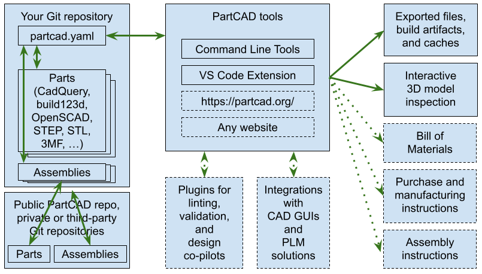

Design
######

=========================
Standards and conventions
=========================

Packages
--------

All data in PartCAD is bundled into 'packages'.
Packages are organized in a hierarchical structure where some packages may
"import" a list of other packages.
The top-level package is called "/". If a package called "/package" imports a
child package called "sub-package" then such package will be called
"/package/sub-package".

The package is described using the configuration file ``partcad.yaml`` placed
in the package folder.

Sketches
--------

PartCAD uses 2D sketches to create 3D models (e.g. via `extrude`) and to maintain
various metadata (such as the geometry of interfaces between parts,
arbitrary part metadata like camera view angles and so on).

- Files

  - DXF
  - SVG

- Scripts

  - `build123d <https://github.com/gumyr/build123d>`_

Interfaces
----------

PartCAD uses interfaces to define how parts and assemblies connect to each other.

Each part may implement one or more interfaces, one or more instance of each.
Interfaces may hierarchically inherit ports and other properties from each other.
The information about compatibility between interfaces (mating)
is optionally maintained as well.

Whenever possible, PartCAD will be able to place parts and assemblies together
with no coordinates provided by the user, based on the defined ports, interfaces
and mating.

Parts
-----

PartCAD has an evergrowing list of ways to define the part model:

- Files

  - `STEP <https://en.wikipedia.org/wiki/ISO_10303>`_
  - `STL <https://en.wikipedia.org/wiki/STL_(file_format)>`_
  - `3MF <https://en.wikipedia.org/wiki/3D_Manufacturing_Format>`_

- Scripts

  - `OpenSCAD <https://en.wikipedia.org/wiki/OpenSCAD>`_
  - `CadQuery <https://github.com/CadQuery/cadquery>`_
  - `build123d <https://github.com/gumyr/build123d>`_

- AI-generated scripts

  - OpenSCAD
  - CadQuery
  - build123d (builder and algebra modes, under development)

Assemblies
----------

Assemblies are parametrized instructions on how to put parts and other
assemblies together.

PartCAD is expected to have an ever-growing list of ways to define assemblies
using existing parts.
However, at the moment, only one way is supported.
It is called ASSY: assembly YAML.
The idea behind ASSY is to create a simplistic way to enumerate parts,
define their parameters and define how parts connect.

Scenes
------

PartCAD does not yet implement scenes. But the idea is to be able to reproduce
the same features as worlds in Gazebo to the extent that PartCAD scenes can be
exported to and simulated in Gazebo, but without using XML while creating the
scene.

Monorepos
---------

When PartCAD is initialized, the current folder and its ``partcad.yaml`` become
the `current` package, but not the `root` package. The root package is
discovered by traversing the parent directories for as long as there is another
``partcad.yaml`` found there.

This allows to run PartCAD tools from any sub-directory in a monorepo project
while maintaining the same meaning of relative and absolute paths.

Paths
-----

PartCAD uses package paths to identify packages and parts declared in them.

The current package has the path ``""`` or ``"."``.
The root package has the path ``"/"``.
For any package ``"<package-path>"``, each sub-directory containing
``partcad.yaml`` and each ``import``-ed dependency becomes
``"<package-path>/<sub-package>"``.

The complete path of a part or assembly is the combination of the package path
and the item name: ``<package-path>:<part-name>`` or
``<package-path>:<assembly-name>``.

For parametrized parts, the parameter values can be appended to the part name
after ``;``:

  .. code-block:: shell

    # Instead of:
    pc inspect \
        -p length=30 \
        -p size=M4-0.7 \
        /pub/std/metric/cqwarehouse:fastener/hexhead-din931

    # Use this:
    pc inspect /pub/std/metric/cqwarehouse:fastener/hexhead-din931;length=30,size=M4-0.7

=====================
The public repository
=====================

The public PartCAD repository is created and maintained by the community
based on the PartCAD standards and conventions. It is hosted on
`GitHub <https://github.com/openvmp/partcad-index>`_.

The top levels of the package hierarchy are expected to be maintained by the
PartCAD community.
Lower levels of the hierarchy are expected to be maintained by vendors and
other communities. PartCAD community does not aim to achieve the
uniqueness of parts and assemblies. Moreover, everyone is invited to provide
their alternative models as long as they provide a different level of model
quality or different level of package quality management processes, and as long
the package data properly reflects the quality that the maintainer provides and
commits to maintain. This way PartCAD users have a choice of which model to
use based on their specific needs.

=====
Tools
=====

PartCAD tools can operate with public and private repositories for as
long as they are maintained following the PartCAD standards and conventions.

Command line tools
------------------

PartCAD CLI tools get installed using the PyPI module ``partcad-cli``.
The main tool is called ``pc``.
The CLI tools are supposed to provide the complete set of PartCAD features.

Visual Studio Code extension
----------------------------

PartCAD extension for ``vscode`` is designed to be the primary tool to

========================
Libraries and frameworks
========================

Python
------

The `partcad` Python module is the first PartCAD library. Its development is
prioritized due to the popularity and the value proposition of such Python
frameworks such as CadQuery and build123d.

Other languages
---------------

PartCAD does not aim to stop at supporting Python. Native libraries in other
languages are planned and all contributors wishing to join the project are
welcome.
