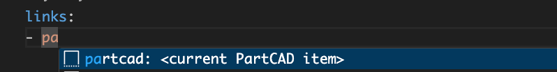
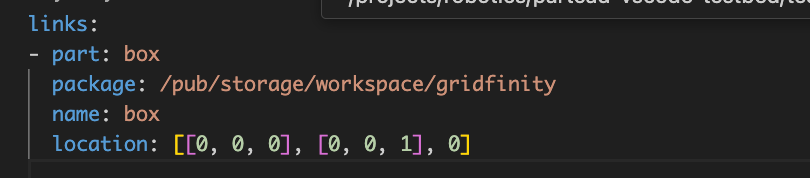

Tutorial
########

============
Command Line
============

Create a package
----------------

First, the current directory needs to be initialized as a PartCAD package.

  .. code-block:: shell

    # Initialize the new PartCAD package in the current folder
    pc init

If there is no ``-p`` flag passed to ``pc init``
then the dependency on the public PartCAD repository is added automatically.

Alternatively, manually create ``partcad.yaml`` with the following content:

  .. code-block:: yaml

    # partcad.yaml
    import:
      # Public PartCAD repository (reference it explicitly if required)
      pub:
        type: git
        url: https://github.com/openvmp/partcad-index.git

Now launch ``pc list`` to see the list of packages currently available in
the public PartCAD repository.

  .. code-block:: shell

    # Recursively iterate over all dependencies of the current package
    pc list

Manage dependencies
-------------------

PartCAD has to be provided with a configuration file which may declare parts and
assemblies, but also declares all repositories that PartCAD is allowed to query.

PartCAD has no implicit dependencies built-in,
so a dependency on the public PartCAD repository needs to be added
if PartCAD is supposed to query it.

In the newly created package, comment out the "pub" dependency (prepend ``#``)
and see how the output of ``pc list`` changes.

Add a part
----------

Let's add a part defined using an OpenSCAD script.

First, create the OpenSCAD script which defines a cube of size 10mm.

  .. code-block:: shell

    # Create "test.scad"
    echo "translate (v= [0,0,0])  cube (size = 10);" > test.scad

Now let's add a declaration of this part to ``partcad.yaml``.

  .. code-block:: shell

    pc add-part scad test.scad

Inspect the part
----------------

Once a part is created, it can be inspected in ``OCP CAD Viewer``.

  .. code-block:: shell

    pc inspect :test

Export the part
---------------

Now the part can be exported:

  .. code-block:: shell

    pc render -t stl :test

=================
VS Code Extension
=================

Start new workspace
-------------------

Open Visual Studio Code and create a new empty workspace.

Activate Python
---------------

If necessary, install the Python extension.
Activate a Python environment (3.10 or above).

Install the extension
---------------------

Install the
`PartCAD <https://marketplace.visualstudio.com/items?itemName=OpenVMP.partcad>`_
extension from the VS Code marketplace.

Install PartCAD
---------------

Switch to the PartCAD workbench
(look for the PartCAD logo at the left edge of the screen).
There is the PartCAD Explorer view on the left.
Click ``Install PartCAD`` in the Explorer view if this button is shown
to install PartCAD in the activated Python environment.

Create a package
----------------

Once PartCAD is initialized, it won't detect any PartCAD package in the empty
workspace.
Click ``Initialize Package`` to create ``partcad.yaml``.

Browse
------

Browse the imported packages in the Explorer view. Click on the parts and
assemblies to see them in the ``OCP CAD Viewer`` view that will appear on the
right.

For example, navigate to ``/pub/std/metric/cqwarehouse`` and click on some part
(e.g. ``fastener/hexhead-din931``).
The PartCAD Inspector view displays the part parameters.
The parameter values can be changed and the part gets redrawn on ``Update``.

Create a part
-------------

Click ``Add a CAD script`` in the Explorer view toolbar.
Select ``build123d`` from the dropdown list.
Then select ``Example 3: Bead`` as the template to use.
An editor view with the newly created script will be shown.

Inspect the part
----------------

When you edit Python or OpenSCAD files that are used in the current
PartCAD package, saving the file makes it displayed automatically.
Press ``Save`` (Ctrl-S or Cmd-S) to save the script and trigger an automatic
inspection of the part. The ``OCP CAD Viewer`` view will appear on the right.

Import parts part
-----------------

In case you want to use existing PartCAD parts in the design of your part,
then follow the following steps.

First, select the part you want to use in the PartCAD Explorer view.
Then, add the following to the ``build123d`` script created during the previous
steps of this tutorial:

  .. code-block:: python

    import partcad as pc

    other_part = pc.get_

Please, note, that after "``pc.get_"`` a code completion suggestion appears.
Use the suggested code completion option to insert the code that adds
the selected part to this ``build123d`` script.

Here is an example of how to use the newly added solid:

  .. code-block:: python

    ...
    # After "with BuildPart"
    art = Compound([art, other_part])
    # Before "show_object"
    ...

Create an assembly
------------------

This is what PartCAD (or, at least, its VS Code Extension) is actually for.

Click ``Add an assembly file to the current package`` in the PartCAD Explorer
view. After that select an existing assembly file (`*.assy`) or enter a
filename for the new file to be created.

ASSY (Assembly YAML) files use the YAML syntax.
The list of parts has to be added as children under the ``links`` node.
Here is how an empty assembly file looks like:

  .. code-block:: yaml

    links:

Add a part to the assembly
--------------------------

Select the desired part or assembly in PartCAD Explorer.
After that navigate to the next line under "``links:``" and type "- pa"
(which is what you do when you want to add a child item with the name "part")
and, then, select the code completion suggestion from PartCAD.

This will add the selected part or assembly to the assembly file.

Inspect the assembly
--------------------

When you edit ASSY files in the current PartCAD package,
the assembly is displayed automatically on save.
Press ``Save`` (Ctrl-S or Cmd-S) to save the assembly file and trigger an
automatic inspection of the assembly. The ``OCP CAD Viewer`` view will appear on
the right if it's not open yet.
