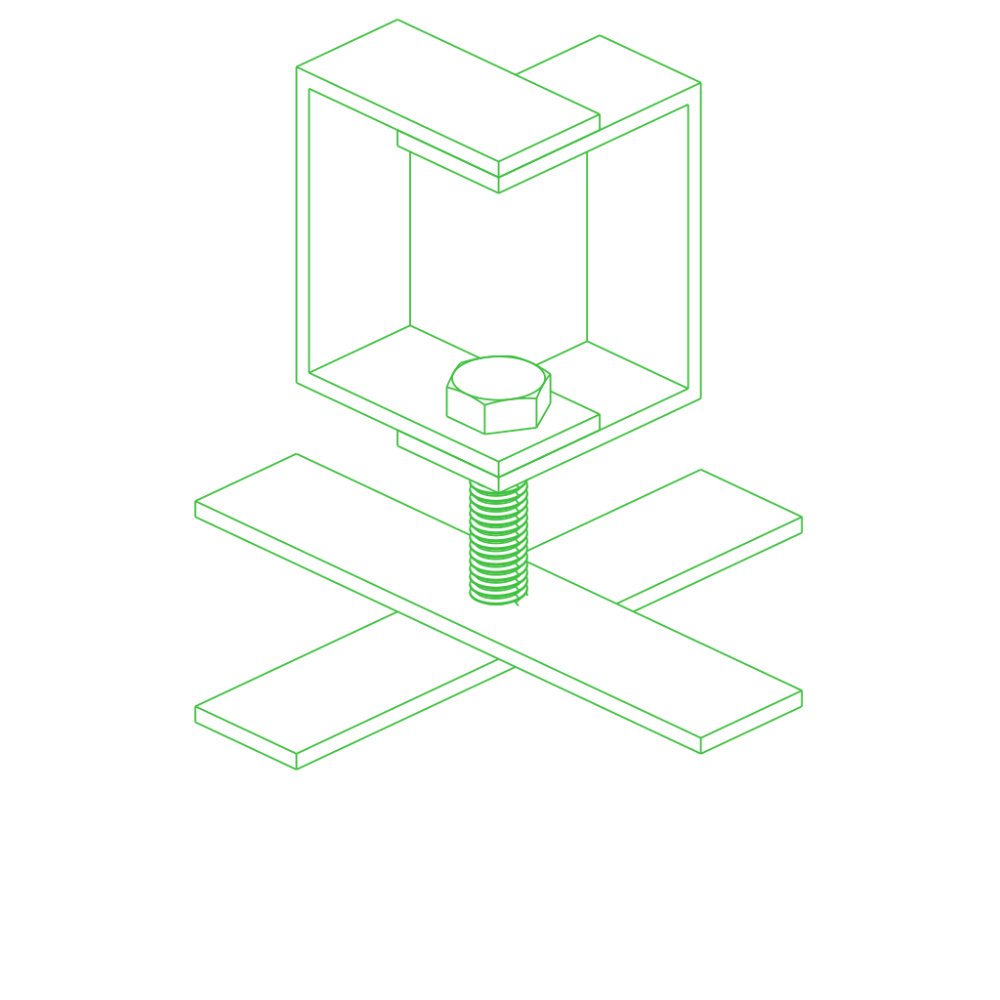

# /pub/examples/partcad/produce_assembly_assy

Assembly YAML examples

## Usage
```shell
pc inspect primitive
pc inspect logo
pc inspect logo_embedded
```


## Assemblies

### logo
<table><tr>
<td valign=top><a href="logo.assy"></a></td>
<td valign=top>PartCAD logo</td>
</tr></table>

### logo_embedded
<table><tr>
<td valign=top><a href="logo_embedded.assy"></a></td>
<td valign=top>PartCAD logo using embedded assemblies</td>
</tr></table>

### partcad_logo (alias to logo)
<table><tr>
<td valign=top><a href="partcad_logo.assy"></a></td>
<td valign=top>PartCAD logo</td>
</tr></table>

### partcad_logo_short (alias to logo)
<table><tr>
<td valign=top><a href="partcad_logo_short.assy"></a></td>
<td valign=top>PartCAD logo</td>
</tr></table>

### primitive
<a href="primitive.assy"></a>

<br/><br/>

*Generated by [PartCAD](https://partcad.org/)*
