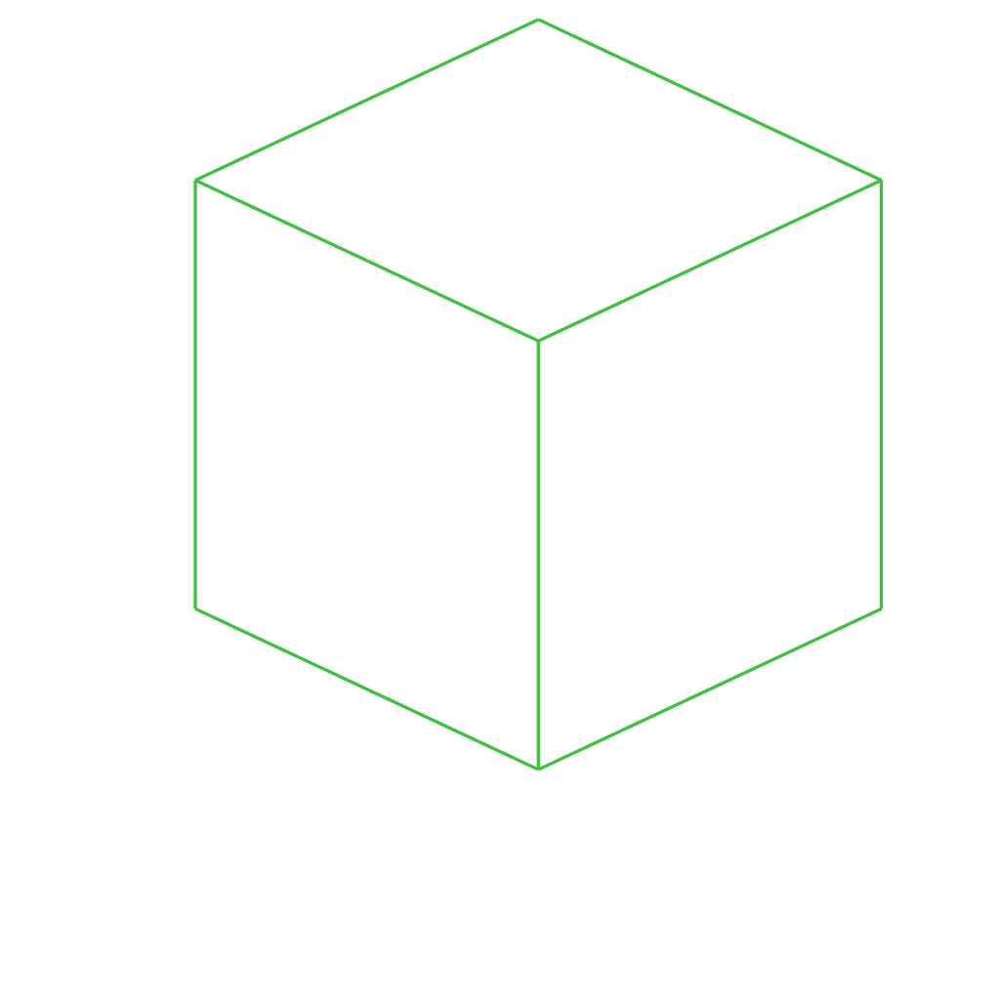

# /pub/examples/partcad/produce_part_3mf

PartCAD example project to demonstrate parts defined using 3MF files

## Usage
```shell
pc inspect cube
```


## Parts

### cube
<table><tr>
<td valign=top><a href="cube.3mf"></a></td>
<td valign=top>A cube defined in 3MF</td>
</tr></table>

<br/><br/>

*Generated by [PartCAD](https://partcad.org/)*
