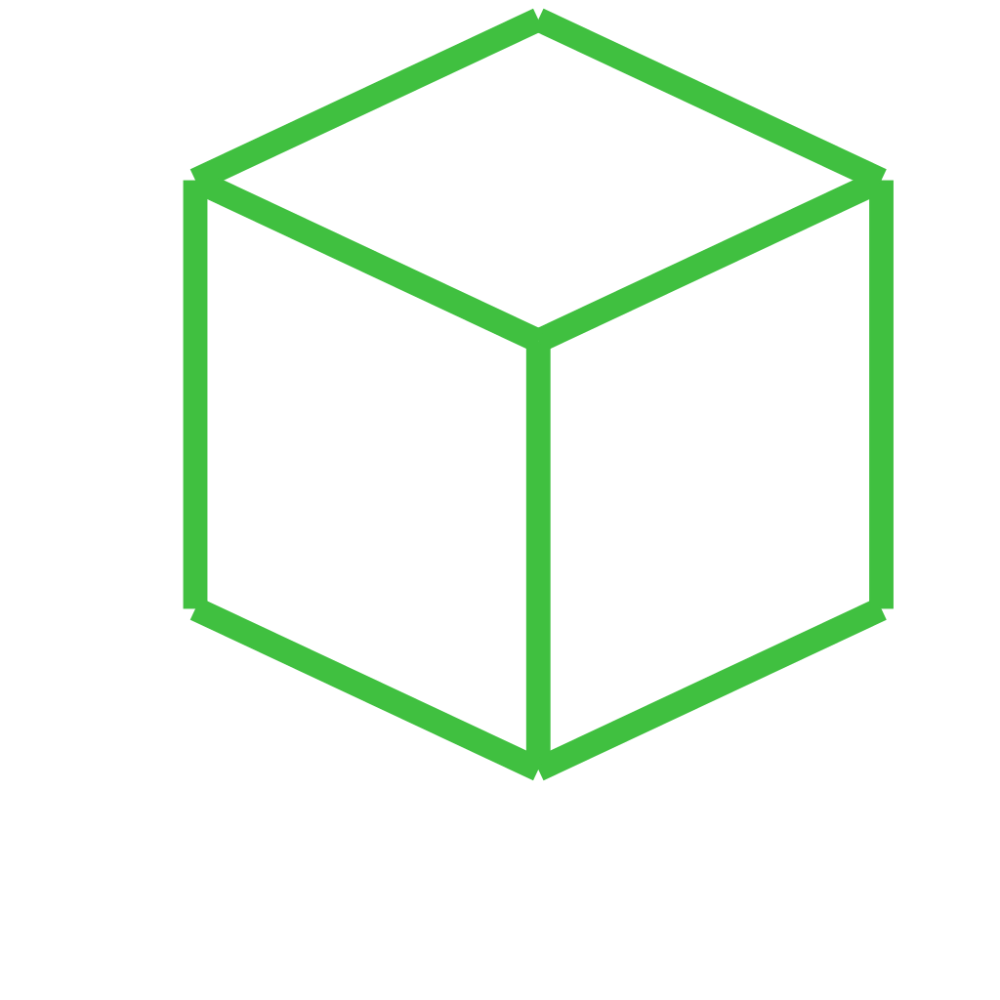

# /produce_part_build123d_primitive

PartCAD example project which demonstrates parts defined using build123d.

## Usage
```shell
pc inspect cube
```


## Parts

### cube
<table><tr>
<td valign=top></td>
<td valign=top>Sample part defined using build123d</td>
</tr></table>

*Generated by [PartCAD](https://partcad.org/)*
