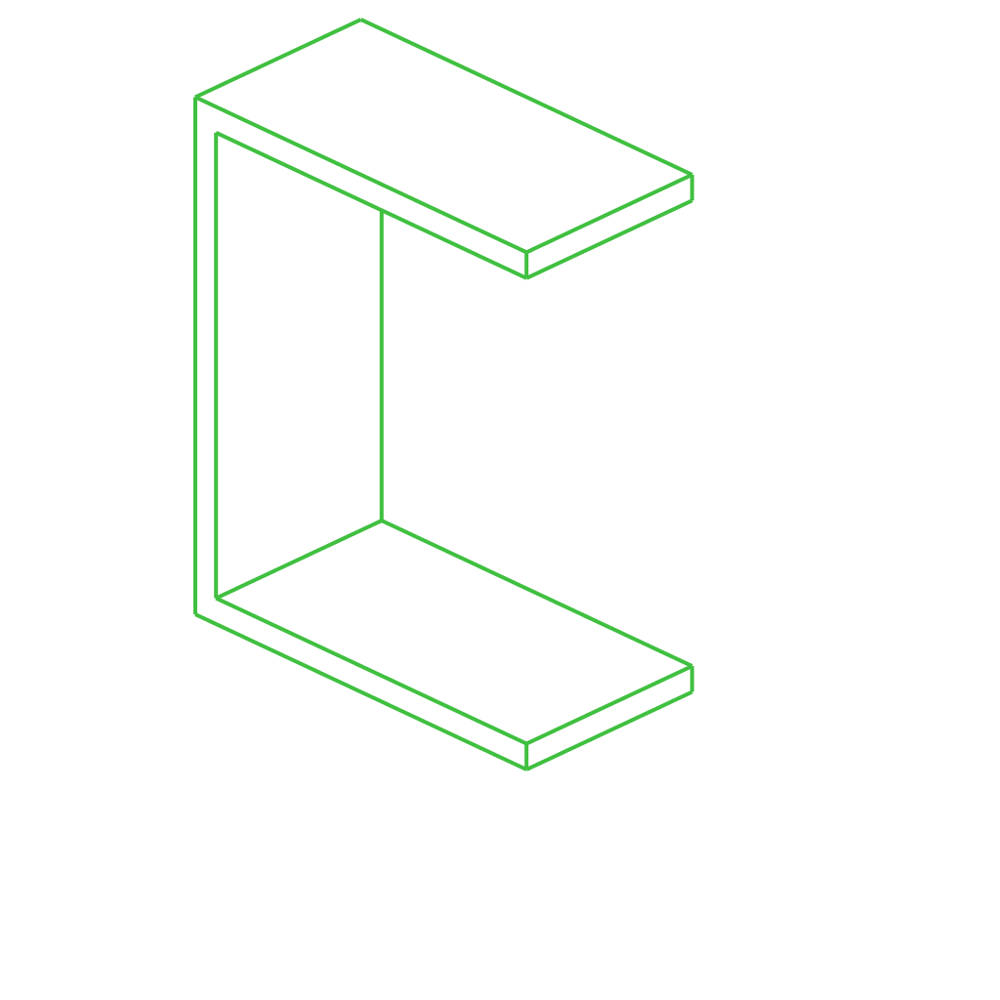

# /produce_part_cadquery_logo

PartCAD example project which implements its logo.

## Usage
```shell
pc inspect head_half
pc inspect bone
```


## Parts

### head_half
<table><tr>
<td valign=top></td>
<td valign=top>Bracket used as one side of the head on PartCAD logo</td>
</tr></table>

### bone
<table><tr>
<td valign=top></td>
<td valign=top>Plate used as one of the bones on PartCAD logo</td>
</tr></table>

---
*Generated by [PartCAD](https://partcad.org/).*
