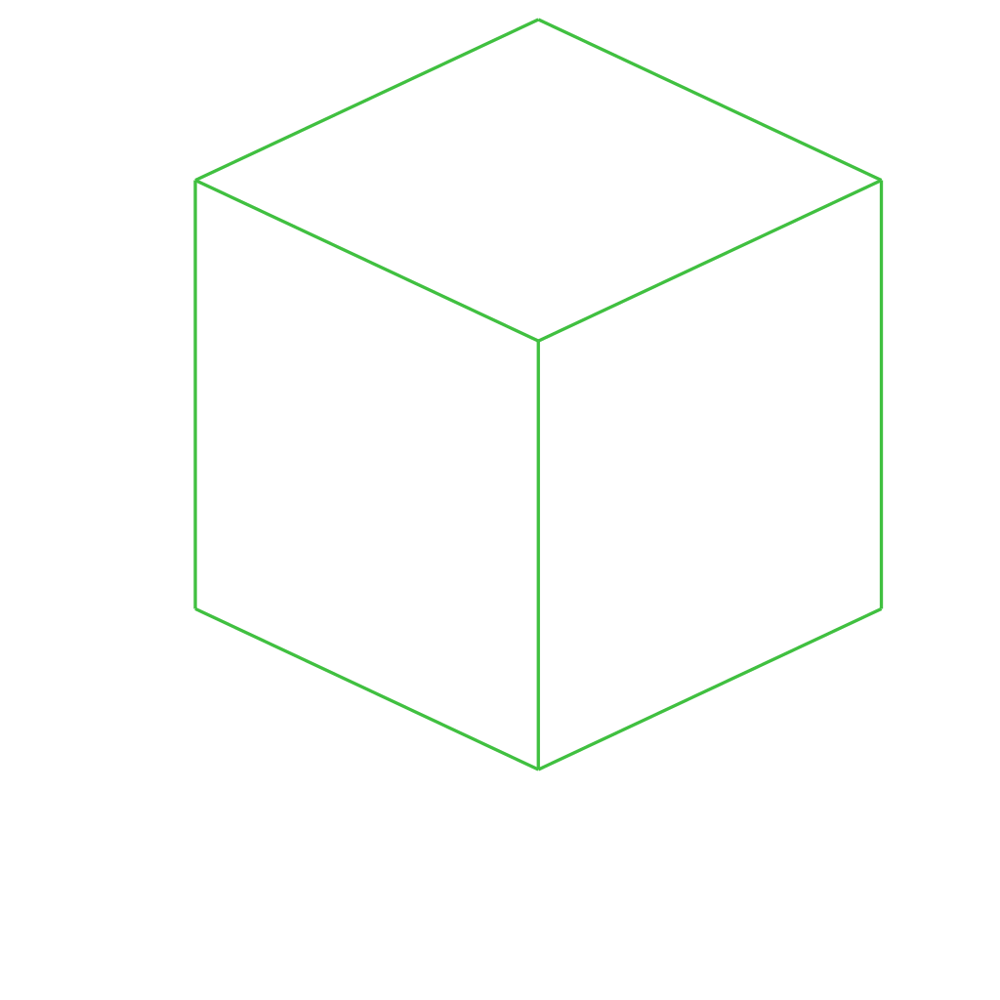

# /pub/examples/partcad/produce_part_cadquery_primitive

PartCAD example project which demonstrates parts defined using CadQuery.

## Usage
```shell
pc inspect cube
pc inspect brick
pc inspect cylinder
```


## Parts

### cube
<table><tr>
<td valign=top></td>
<td valign=top>This is a cube from examples</td>
<td valign=top>Parameters:<br/><ul><li>width: 10.0</li><li>length: 10.0</li><li>height: 10.0</li></ul></td>
<td valign=top>Aliases:<br/><ul><li>box</li></ul></td>
</tr></table>

### brick
<table><tr>
<td valign=top></td>
<td valign=top>This is a cube from examples</td>
<td valign=top>Parameters:<br/><ul><li>width: 20.0</li><li>length: 10.0</li><li>height: 7.5</li></ul></td>
</tr></table>

### cylinder
<table><tr>
<td valign=top></td>
<td valign=top>This is a cylinder from examples</td>
</tr></table>

*Generated by [PartCAD](https://partcad.org/)*
