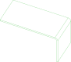

# //pub/examples/partcad/produce_part_sheet_metal

This example demonstrates parts that are made by bending a flat piece of sheet metal. One drawing holds all of it -- the outline the blank is cut to, and the two lines it may be bent along -- and each part says which of those lines it is folded at. Fold the blank at the first, at the second, or at both, and you have three different parts out of one blank and one drawing.

## Usage
```shell
pc inspect blank
pc inspect angle_up
pc inspect angle_down
pc inspect bracket
pc test -f cam-sheet-metal
```

Each part's `instructions` are a reading of the one drawing, and each reading
is a sketch of its own -- its own geometry, its own cache entry, its own
file:

```shell
pc inspect -s 'panel;include=BEND_UP'
pc inspect -s 'panel;include=BEND_DOWN'
pc inspect -s 'panel;include=BEND_UP,BEND_DOWN'
```


## Parts

### angle_down
<table><tr>
<td valign=top><a href="angle_down.py"></a></td>
<td valign=top>The same blank folded at `BEND_DOWN` alone, into an L with a short leg hanging down. Its declaration differs from `angle_up`'s in nothing but which layer its `instructions` select; the two bend lines are in different places, so the parts do not come out alike.
</td>
<td valign=top>Parameters:<br/><ul>
<li>tolerance: 0.1</li>
</ul>
</td>
</tr></table>

### angle_up
<table><tr>
<td valign=top><a href="angle_up.py"></a></td>
<td valign=top>The blank folded at `BEND_UP` alone, into an L with a short leg standing up. `source` names what goes into the brake and `instructions` the one bend line it is folded at.
</td>
<td valign=top>Parameters:<br/><ul>
<li>tolerance: 0.1</li>
</ul>
</td>
</tr></table>

### blank
<table><tr>
<td valign=top><a href="blank.extrude"></a></td>
<td valign=top>The flat piece that goes into the brake, extruded from the outline layer of the drawing. It is cut flat -- laser, waterjet, punch, router -- so its own manufacturing method is `subtractive`: the outline, and any holes and cut-outs a real part would have, are made here and not while it is bent.
</td>
<td valign=top>Parameters:<br/><ul>
<li>tolerance: 0.1</li>
</ul>
</td>
</tr></table>

### bracket
<table><tr>
<td valign=top><a href="bracket.py"></a></td>
<td valign=top>The same blank again, folded at both bend lines -- up at the first and down at the second -- into a Z. Nothing about the outline is restated in any of the three: it belongs to the blank, and these declarations are only what the brake does to it.
</td>
<td valign=top>Parameters:<br/><ul>
<li>tolerance: 0.1</li>
</ul>
</td>
</tr></table>

## Sketches

### panel
<table><tr>
<td valign=top><a href="panel.dxf"></a></td>
<td valign=top>The drawing, on three layers. `OUTLINE` is the flat pattern the blank is cut to; `BEND_UP` and `BEND_DOWN` hold one bend line each, annotated in the file's extended data (XDATA) with the angle, the inner radius and the direction of the bend along it. Which layers a reader gets is the `include` parameter's to say, so this is one sketch and not three.
</td>
</tr></table>

<br/><br/>

*Generated by [PartCAD](https://partcad.org/)*
