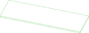
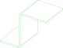
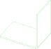

# //pub/examples/partcad/produce_part_sheet_metal

This example demonstrates parts that are made by bending a flat piece of sheet metal. One drawing holds all of it -- the outline the blank is cut to, and the lines it may be bent along -- and each part reads the layers it needs out of that one drawing. The same blank folded at two lines is a Z; folded at the one in the middle it is an L.

## Usage
```shell
pc inspect blank
pc inspect bracket
pc inspect corner
pc test -f cam-sheet-metal
```

The drawing's bend lines carry their angle, inner radius and direction in
the file's extended data (XDATA), which `pc test` reads off the sketch. Each
reference is a sketch of its own, with its own geometry and its own file:

```shell
pc inspect -s 'panel;include=BEND_UP,BEND_DOWN'
pc inspect -s 'panel;include=BEND_MID'
pc render -s -t svg 'panel;include=OUTLINE'
```


## Parts

### blank
<table><tr>
<td valign=top><a href="blank.extrude"></a></td>
<td valign=top>The flat piece that goes into the brake, extruded from the outline layer of the drawing. It is cut flat -- laser, waterjet, punch, router -- so its own manufacturing method is `subtractive`: the outline, and any holes and cut-outs a real part would have, are made here and not while it is bent.
</td>
<td valign=top>Parameters:<br/><ul>
<li>tolerance: 0.1</li>
</ul>
</td>
</tr></table>

### bracket
<table><tr>
<td valign=top><a href="bracket.py"></a></td>
<td valign=top>The blank, bent at two lines into a Z. `source` names what goes into the brake and `instructions` the bend lines of the same drawing, selected by their layers. Nothing about the outline is restated here: it belongs to the blank, and this declaration is only what the brake does to it.
</td>
<td valign=top>Parameters:<br/><ul>
<li>tolerance: 0.1</li>
</ul>
</td>
</tr></table>

### corner
<table><tr>
<td valign=top><a href="corner.py"></a></td>
<td valign=top>The same blank, bent at one line into an L. It differs from `bracket` in nothing but which layer its `instructions` select, which is what makes one drawing worth having instead of three.
</td>
<td valign=top>Parameters:<br/><ul>
<li>tolerance: 0.1</li>
</ul>
</td>
</tr></table>

## Sketches

### panel
<table><tr>
<td valign=top><a href="panel.dxf"></a></td>
<td valign=top>The drawing, on four layers. `OUTLINE` is the flat pattern; `BEND_UP`, `BEND_DOWN` and `BEND_MID` each hold one line, annotated in the file's extended data (XDATA) with the angle, the inner radius and the direction of the bend along it -- the direction is what the annotation says, not what the layer is called. Which layers a reader gets is the `include` parameter's to say, so this is one sketch and not four.
</td>
</tr></table>

<br/><br/>

*Generated by [PartCAD](https://partcad.org/)*
